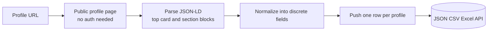
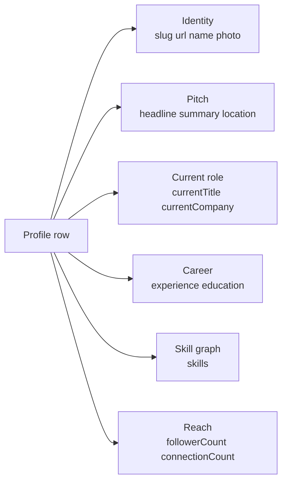

# LinkedIn Profile Scraper (No Login Required)

Pull structured profile facts from any public LinkedIn member URL. No cookies. No login. No Sales Navigator seat. Each row ships the member name, headline, location, current company, current title, public summary, top experience, top education, top skills, and profile photo. Pay per profile.

**Built for** B2B sales teams, recruiters, agencies, founders, and CRM enrichment pipelines that need clean structured contact records for prospecting, account research, and lead scoring.

**Keywords this actor ranks for:** linkedin profile scraper, linkedin people scraper, linkedin scraper no cookie, linkedin profile api, scrape linkedin profile without login, linkedin contact enrichment, linkedin lead scraper, linkedin headline scraper, linkedin experience scraper, linkedin education scraper, linkedin skills scraper, linkedin no login.

---

## Why this actor

| Other LinkedIn profile scrapers | **This actor** |
|---|---|
| Need your session cookie | Zero cookies, zero login |
| Risk your account on every run | Touches only public profile pages |
| Single big text blob | Name, headline, location, current title, current company, summary all parsed into discrete fields |
| Experience and education skipped | Top experience and education entries shipped per row |
| No skills surfaced | Top public skills shipped as an array |

---

## How it works



The actor hits the public `linkedin.com/in/{slug}` page through a residential proxy and pulls JSON-LD plus Open Graph meta plus DOM selectors. No cookie passes through the actor at any stage.

---

## What you get per row



Pipe straight into a CRM, an account scoring model, or an SDR sequencing tool.

---

## Quick start

**Enrich a list of contacts**

```json
{
  "profileUrls": [
    "https://www.linkedin.com/in/williamhgates",
    "https://www.linkedin.com/in/satyanadella",
    "https://www.linkedin.com/in/jeffweiner08"
  ]
}
```

**Sales prospecting (skip skills to keep rows lean)**

```json
{
  "profileUrls": ["https://www.linkedin.com/in/williamhgates"],
  "includeExperience": true,
  "includeEducation": true,
  "includeSkills": false
}
```

**Recruiter sourcing (full career graph)**

```json
{
  "profileUrls": [
    "https://www.linkedin.com/in/satyanadella",
    "https://www.linkedin.com/in/sundarpichai"
  ],
  "includeExperience": true,
  "includeEducation": true,
  "includeSkills": true
}
```

---

## Sample output

```json
{
  "slug": "satyanadella",
  "url": "https://www.linkedin.com/in/satyanadella",
  "name": "Satya Nadella",
  "headline": "Chairman and CEO at Microsoft",
  "location": "Redmond, Washington, United States",
  "currentTitle": "Chairman and CEO",
  "currentCompany": "Microsoft",
  "summary": "As chairman and CEO of Microsoft, I define my mission...",
  "photoUrl": "https://media.licdn.com/dms/image/...",
  "followerCount": 11000000,
  "connectionCount": 500,
  "experience": [
    {
      "title": "Chairman and CEO",
      "company": "Microsoft",
      "dateRange": "Feb 2014 - Present",
      "location": "Greater Seattle Area",
      "description": null
    }
  ],
  "education": [
    {
      "school": "The University of Chicago Booth School of Business",
      "degree": "MBA",
      "field": null,
      "dateRange": null
    }
  ],
  "skills": ["Cloud Computing", "Enterprise Software", "Leadership"],
  "scrapedAt": "2026-05-08T10:00:00.000Z"
}
```

---

## Who uses this

| Role | Use case |
|---|---|
| B2B sales | Enrich a target prospect list with title, company, location before outreach |
| RevOps | Backfill missing contact-level fields in a CRM without paying a data vendor seat |
| Recruiter | Score candidates by experience and education before reaching out |
| Founder | Research target hires and advisors before booking a call |
| Investor | Pull founder and exec backgrounds for diligence packets |
| ABM lead | Cluster contacts by current title and seniority for tiered plays |

---

## Input reference

| Field | Type | What it does |
|---|---|---|
| `profileUrls` | string[] | LinkedIn member URLs or bare slugs. Required. |
| `includeExperience` | boolean | Keep the experience array on each row. Default true. |
| `includeEducation` | boolean | Keep the education array on each row. Default true. |
| `includeSkills` | boolean | Keep the skills array on each row. Default true. |
| `concurrency` | integer | Profiles processed in parallel. Six is the safe default. |
| `proxyConfiguration` | object | Apify proxy. Residential is required at any meaningful volume. |

---

## API call

```bash
curl -X POST \
  "https://api.apify.com/v2/acts/YOUR_USER~linkedin-profile-scraper/runs?token=YOUR_TOKEN" \
  -H "Content-Type: application/json" \
  -d '{
    "profileUrls": [
      "https://www.linkedin.com/in/williamhgates",
      "https://www.linkedin.com/in/satyanadella"
    ]
  }'
```

---

## Pricing

The first three profiles per run are free so you can validate output before paying. After that, each profile row is charged. No surprise add on charges.

---

## FAQ

### Do I need a LinkedIn account or cookie?

No. The actor only touches public profile pages. Your account is never touched.

### What fields ship if a profile is partly hidden?

LinkedIn varies how much it shows anonymous viewers. Name, headline, location, current title, current company, profile photo, and summary ship reliably. Experience and education depth depends on what the public page renders.

### Can I pass bare usernames instead of full URLs?

Yes. `williamhgates` and `/in/williamhgates` are accepted alongside the full `https://www.linkedin.com/in/williamhgates` form.

### How fresh is the data?

Each run hits the live profile page, so headline, current role, and recent experience reflect what LinkedIn renders at scrape time. Schedule weekly runs to track changes over time.

### Why is `connectionCount` capped at 500?

LinkedIn publicly displays connection counts as "500+" once a member crosses that threshold. The parsed value reflects exactly what LinkedIn shows.

### Is scraping LinkedIn allowed?

This actor reads HTML any anonymous web visitor can see. Respect LinkedIn's terms and rate limit sensibly. Do not redistribute data you have no lawful basis to process.

---

## Related actors

- **LinkedIn Company Profile Scraper** — pull industry, headcount, HQ, and founded year for the company a contact works at
- **LinkedIn Profile & Company Post Tracker** — scrape posts from any profile or company without a cookie
- **LinkedIn Hiring Tracker & Salary Intelligence** — parsed salary, tech stack, and seniority on every job row
- **LinkedIn Pulse Articles Scraper** — long form articles by author or topic
- **Lead Enrichment Pipeline** — multi source enrichment for a list of company domains
