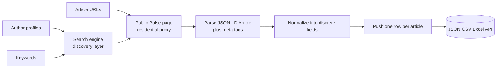
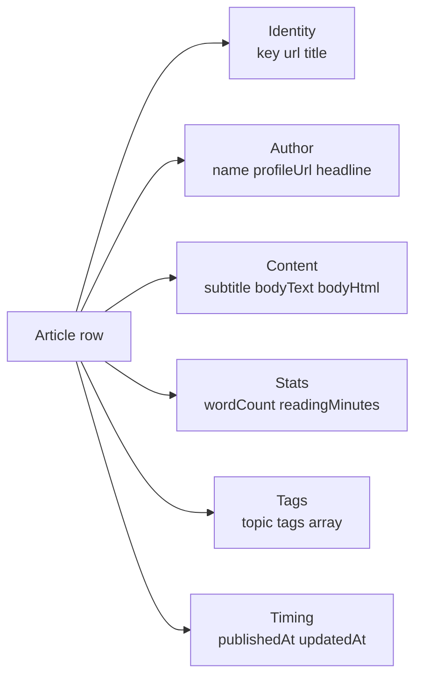

# LinkedIn Pulse Articles Intelligence (No Login Required)

Pull long-form Pulse articles from any LinkedIn author or by topic. No cookies. No login. No Sales Navigator seat. Each row ships the full article body, title, author, published date, cover image, topic tags, word count, and engagement counts. Pay per article.

**Built for** content marketers, ghostwriters, competitive intelligence teams, and analysts who need clean structured access to LinkedIn long form content for benchmarking, research, and lead generation.

**Keywords this actor ranks for:** linkedin pulse intelligence, linkedin article api, linkedin long form content intelligence, linkedin pulse to json, linkedin author tracker, linkedin thought leadership tracker, linkedin content benchmarking, linkedin article intelligence no cookie, pull linkedin pulse, linkedin newsletter alternative, linkedin content monitoring, content competitive intel.

---

## Why this actor

| Other LinkedIn article scrapers | **This actor** |
|---|---|
| Need your session cookie | Zero cookies, zero login |
| Risk your account on every run | Touches only public surfaces with residential proxy |
| Single text blob per article | Title, subtitle, body, author, date, tags all parsed into discrete fields |
| Only accept direct URLs | Discover by author profile, by keyword, or paste URLs |
| Drop word count and reading time | Both included on every row |

---

## How it works



Discovery happens through search engines that already index public LinkedIn Pulse URLs. Each article is then fetched with a real Chrome browser fingerprint behind a residential proxy, the actor parses the JSON-LD Article schema first, then falls back to Open Graph meta tags and DOM extraction.

---

## What you get per row



---

## Quick start

**Track every article from one author**

```json
{
  "profileUrls": ["https://www.linkedin.com/in/satyanadella/"],
  "maxArticles": 50
}
```

**Topic discovery (find Pulse articles on a topic)**

```json
{
  "keywords": ["AI strategy", "devrel playbook"],
  "maxArticles": 25
}
```

**Enrich a known article list**

```json
{
  "articleUrls": [
    "https://www.linkedin.com/pulse/your-article-slug-author-handle"
  ]
}
```

---

## Sample output

```json
{
  "key": "ai-electricity-our-time-satya-nadella",
  "url": "https://www.linkedin.com/pulse/ai-electricity-our-time-satya-nadella/",
  "discoveredVia": { "kind": "profile", "value": "profile:satyanadella" },
  "title": "AI is the new electricity",
  "subtitle": null,
  "author": {
    "name": "Satya Nadella",
    "profileUrl": "https://www.linkedin.com/in/satyanadella/",
    "headline": "Chairman and CEO at Microsoft"
  },
  "publishedAt": "2026-04-21T14:00:00.000Z",
  "updatedAt": null,
  "bodyText": "Every era has a foundational technology...",
  "bodyHtml": "<p>Every era has a foundational technology...</p>",
  "wordCount": 1820,
  "readingMinutes": 8,
  "coverImage": "https://media.licdn.com/dms/image/...",
  "tags": ["Artificial Intelligence", "Leadership", "Strategy"],
  "engagement": { "reactions": 12400, "comments": 318 },
  "scrapedAt": "2026-05-08T10:00:00.000Z"
}
```

---

## Who uses this

| Role | Use case |
|---|---|
| Content marketer | Benchmark long form performance across a peer set |
| Ghostwriter | Pull every published article from a target executive to study voice |
| Competitive intel | Track what a competitor's CEO is publishing in real time |
| Analyst | Topic monitoring across a keyword list to spot emerging narratives |
| PR team | Track executive thought leadership output across a portfolio |
| Researcher | Build a long form dataset on a topic without paying a media monitoring vendor |

---

## Input reference

| Field | Type | What it does |
|---|---|---|
| `articleUrls` | string[] | Direct Pulse article URLs. |
| `profileUrls` | string[] | Author profiles to discover articles by. |
| `keywords` | string[] | Topics to discover articles for via public search. |
| `maxArticles` | integer | Cap per profile or keyword. 0 means everything we can discover. |
| `includeBody` | boolean | Keep the full body text and HTML on each row. Default true. |
| `concurrency` | integer | Pages processed in parallel. Six is the safe default. |
| `proxyConfiguration` | object | Apify proxy. Residential is required at any meaningful volume. |

---

## API call

```bash
curl -X POST \
  "https://api.apify.com/v2/acts/YOUR_USER~linkedin-pulse-articles-scraper/runs?token=YOUR_TOKEN" \
  -H "Content-Type: application/json" \
  -d '{
    "profileUrls": ["https://www.linkedin.com/in/satyanadella/"],
    "maxArticles": 25
  }'
```

---

## Pricing

The first 3 articles per run are free so you can validate output before paying. After that, each article row is charged. No surprise add on charges.

---

## FAQ

### Do I need a LinkedIn account or cookie?

No. The actor only touches LinkedIn's public Pulse pages from a residential proxy with a real Chrome fingerprint. Your account is never touched.

### How does discovery work without my cookie?

A search engine site query finds public LinkedIn Pulse URLs from the target author or topic. Public Pulse URLs are designed to be indexed which is why articles show up in Google. The actor pulls each article from LinkedIn's public Pulse page after that.

### Why do I need residential proxy?

LinkedIn aggressively blocks datacenter IPs on Pulse pages. Residential proxy is the only configuration that consistently returns the article body to anonymous viewers. Apify residential proxy is preconfigured by default.

### How fresh is the data?

Each run hits the live article page so reaction counts, comment counts, and updated dates reflect what LinkedIn renders at pull time.

### Is pulling LinkedIn allowed?

This actor reads HTML any anonymous web visitor can see. Respect LinkedIn's terms and rate limit sensibly. Do not redistribute author or commenter identities you have no lawful basis to process.

---

## Related actors

- **LinkedIn Profile & Company Post Tracker** , pull posts from any profile or company without a cookie
- **LinkedIn Company Profile Intelligence** , name, industry, headcount range, HQ, specialties on every company row
- **LinkedIn Hiring Tracker & Salary Intelligence** , parsed salary, tech stack, and seniority on every job row
- **HN Lead Monitor** , Hacker News mentions and high intent leads
- **Reddit Brand Monitor & Lead Finder** , subreddit mentions and high intent leads
