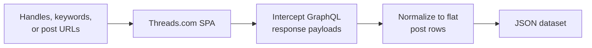
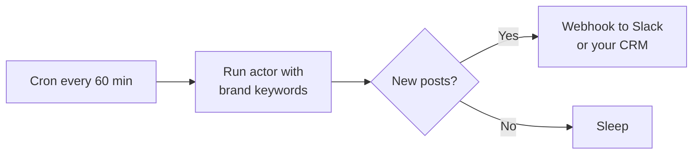

# Threads Intelligence — Brand Mentions, Keyword Alerts & Influencer Discovery

Monitor Meta Threads for brand mentions, keyword alerts, and creator activity. Every row carries text, like and reply counts, mentions, hashtags, media URLs, and the post timestamp. Inputs: handles, search terms, or specific post URLs. Built for social listening teams, PR, competitive intel, and influencer marketers. Pay per post.

**Ranks for:** Threads scraper, Threads API alternative, Threads brand monitoring, Threads keyword alerts, Threads influencer discovery, Meta Threads social listening, Threads mention tracking.

---

## How it works



The actor opens each profile, search results page, or post permalink in a real Chromium with a generated fingerprint, then captures the GraphQL responses Threads' own front end consumes. Posts are deduped by code so multi page results from infinite scroll do not double count.

---

## Who uses this

| Role | Use case |
|---|---|
| **PR and brand teams** | Catch every Threads mention of your brand, product, or executives. |
| **Competitive intel** | Track competitor product launches, customer complaints, and feature buzz. |
| **Influencer marketers** | Discover creators in a topic by ranking by likes and replies. |
| **Crisis ops** | Surface sudden spikes around a keyword to the on call channel. |
| **Researchers** | Build datasets of public Threads conversations on any topic. |

---

## Quick start

**Pull recent posts from a handle:**

```json
{
  "usernames": ["zuck"],
  "maxItemsPerSource": 25
}
```

**Brand monitoring across keywords:**

```json
{
  "searchTerms": ["acme corp", "@acme", "acme launch"],
  "minLikes": 5,
  "maxItemsPerSource": 100
}
```

**Mix handles and keywords in one run:**

```json
{
  "usernames": ["mosseri", "zuck"],
  "searchTerms": ["instagram launch"],
  "verifiedOnly": true
}
```

**Hydrate specific post URLs:**

```json
{
  "postUrls": [
    "https://www.threads.com/@zuck/post/CzHTBfJv2TK"
  ]
}
```

---

## Sample output

```json
{
  "id": "3141592653589793238",
  "code": "CzHTBfJv2TK",
  "url": "https://www.threads.com/@zuck/post/CzHTBfJv2TK",
  "author": {
    "username": "zuck",
    "displayName": "Mark Zuckerberg",
    "verified": true,
    "followerCount": 10500000,
    "profilePicUrl": "https://scontent.cdninstagram.com/..."
  },
  "text": "Excited to share what we have been building...",
  "createdAt": "2026-04-28T17:32:11.000Z",
  "likeCount": 42118,
  "replyCount": 3104,
  "repostCount": 812,
  "quoteCount": 401,
  "mentions": ["instagram", "mosseri"],
  "hashtags": ["threads", "launch"],
  "mediaUrls": [
    "https://scontent.cdninstagram.com/.../image1.jpg"
  ],
  "isReply": false,
  "language": "en",
  "source": "username:zuck",
  "sourceType": "username",
  "scrapedAt": "2026-05-03T13:45:00.000Z"
}
```

---

## Input modes

| Field | Use it for |
|---|---|
| `usernames` | Pull recent posts from a creator. Returns the user's feed of original posts and reposts. |
| `searchTerms` | Brand and topic monitoring. Returns top matching posts across all of Threads. |
| `postUrls` | Hydrate a known post permalink with current engagement counts. |

You can mix all three in a single run. The `dedupe` flag prevents the same post showing up twice when a creator post also matches a keyword search.

---

## Schedule it

Run hourly to catch every new mention of your brand. The dedupe key value store ensures the same post is not pushed twice across runs unless engagement counts changed.



---

## Pricing

The first 50 posts per run are free. After that, $0.002 per post pushed. Search and profile fetches are not metered, so a low signal keyword search only costs for the matches it returns.

---

## FAQ

### Where does the data come from?

Public Threads pages on threads.com, rendered through a real Chromium with fingerprint injection. The actor reads the same GraphQL payloads the Threads web UI consumes.

### Do I need a Meta account or token?

No. Only public posts are returned and no login is performed.

### How fresh is the data?

Real time. Each run hits the live Threads page so you see the same engagement counts the public web shows.

### Can I get private or follower only posts?

No. Only publicly visible posts are scraped. Posts behind a private account or marked follower only are skipped.

### How many posts can I pull per handle?

The actor scrolls the profile to trigger lazy loading. The default 3 scroll passes typically yields 25 to 40 recent posts. Increase `scrollPasses` for deeper history at the cost of run time.

### Will it work for non English posts?

Yes. Text is captured as Unicode and the `language` field comes from Threads' own language detection.

### Can I run this on a schedule?

Yes. Use the Apify scheduler. Hourly catches new brand mentions. Daily is enough for creator activity tracking.

### What happens if Threads soft blocks the request?

The actor uses fingerprinted Chrome and rotates Apify proxy sessions. If a single source is blocked the run continues with the others and the failed request is logged.

### Is this affiliated with Meta?

No. This is a third party Apify actor that consumes public Threads pages. Meta is not involved.

---

## Related actors

- **Instagram Scraper** — public Instagram profiles, posts, and reel metrics
- **TikTok Scraper** — TikTok video and creator stats
- **YouTube Scraper** — YouTube video metadata and comment threads
- **LinkedIn Profile Posts Scraper** — recent posts from any public LinkedIn profile
- **Reddit Lead Monitor** — keyword alerts for Reddit threads and comments
