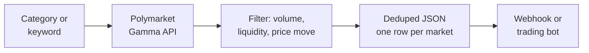
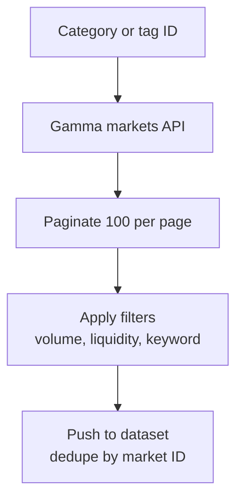

# Polymarket Scraper: Track Prediction Markets by Category, Keyword, and Volume

Scrape Polymarket prediction markets by category (politics, crypto, sports, tech), keyword, min 24h volume, liquidity, and price move. Export question, outcomes, prices, volume, liquidity, and end date to JSON, CSV, or Excel. Deduped across runs. Uses the official Polymarket Gamma API. Pay per item.

**Searches this actor ranks for:** Polymarket scraper, Polymarket API, Polymarket data feed, prediction market tracker, Polymarket price alert, scrape Polymarket markets, Polymarket odds monitor, prediction market JSON feed, Polymarket volume scanner.

---

## How it works in 30 seconds



Pick a category or keyword. Set a volume or liquidity floor. Get a clean JSON row for every matching Polymarket market, outcome prices included.

---

## Who this Polymarket scraper is for

| You are a... | You use this to... |
|---|---|
| **Prediction market trader** | Catch new markets in your category before volume piles in and the edge disappears. |
| **Crypto quant** | Feed Polymarket odds into a model alongside CEX prices, or build an arb scanner vs Kalshi. |
| **Election analyst** | Track every political market, price move, and volume surge in one deduped JSON stream. |
| **Journalist** | Monitor the "wisdom of the crowd" on breaking news. Every price on Polymarket is a number you can quote. |
| **Fintech builder** | Back a prediction market widget with clean API data, no licensing fee. |
| **Researcher** | Pull datasets for forecasting, polling, or market efficiency studies. |

---

## How to scrape Polymarket step by step



1. You pass a category shortcut (`politics`, `crypto`, `sports`, `tech`) or a raw tag ID.
2. The actor calls `gamma-api.polymarket.com/markets` with the tag, volume floor, and sort.
3. Results paginate at 100 per page; the actor walks until it hits your cap.
4. Client side filters apply: keyword search, 24h volume, liquidity, price change, time to resolution.
5. Matches push to the Apify dataset with outcome prices, volume, liquidity, and direct URL.

Schedule every 5 minutes for near real time price tracking. Set `dedupe: false` if you want a fresh snapshot every run.

---

## Quick start

**Every active political market with over $10k daily volume:**

```json
{
  "categories": ["politics"],
  "minVolume24h": 10000,
  "sortBy": "volume24hr"
}
```

**Trump related markets across every category:**

```json
{
  "searchQueries": ["trump"],
  "status": "active",
  "minLiquidity": 5000
}
```

**Markets moving 10+ points in the last week:**

```json
{
  "categories": ["politics", "crypto"],
  "minPriceChangePct": 10,
  "minVolume24h": 5000,
  "dedupe": false
}
```

From the command line:

```bash
curl -X POST "https://api.apify.com/v2/acts/scrapemint~polymarket-market-monitor/run-sync-get-dataset-items?token=YOUR_TOKEN" \
  -H "Content-Type: application/json" \
  -d '{"categories":["politics"],"minVolume24h":10000}'
```

---

## Category shortcuts

| Shortcut | Polymarket tag |
|---|---|
| `politics` | Politics (2) |
| `crypto` | Crypto (21) |
| `sports` | Sports (1) |
| `technology` / `tech` | Technology (22) |
| `music` | Music (100) |
| `entertainment` | Awards (18) |
| `elections` | USA Election (24) |
| `basketball` | Basketball (28) |
| `football` | Football (10) |
| `blockchain` | Blockchain (20) |

Need another tag? Pass the raw ID in `tagIds`. Browse all tags at `gamma-api.polymarket.com/tags`.

---

## Polymarket scraper vs the alternatives

| | Polymarket web UI | Dune dashboards | **This actor** |
|---|---|---|---|
| Pricing | Free, manual | Free to $420 / mo | Pay per item, first 50 free |
| Keyword filter | No | SQL only | Yes |
| Price move alert | No | You build it | Built in |
| Dedup across runs | Your memory | Snapshot only | Yours, in key value store |
| Schedule | N/A | Daily refresh | Every 1 minute |
| Output | Browser | Dashboard | JSON, CSV, Excel, webhook |

---

## Sample output

One market record:

```json
{
  "kind": "market",
  "id": "540816",
  "conditionId": "0x9c1a953fe92c8357f1b646ba25d983aa83e90c525992db14fb726fa895cb5763",
  "slug": "will-trump-win-the-2028-election",
  "question": "Will Trump win the 2028 election?",
  "url": "https://polymarket.com/market/will-trump-win-the-2028-election",
  "outcomes": [
    { "name": "Yes", "price": 0.12 },
    { "name": "No", "price": 0.88 }
  ],
  "lastTradePrice": 0.12,
  "bestBid": 0.12,
  "bestAsk": 0.13,
  "spread": 0.01,
  "volume24hr": 42815.23,
  "volumeTotal": 1250412.88,
  "liquidity": 88431.12,
  "oneWeekPriceChange": -0.03,
  "startDate": "2025-11-10T14:00:00Z",
  "endDate": "2028-11-07T12:00:00Z",
  "active": true,
  "closed": false,
  "acceptingOrders": true
}
```

Every field drops straight into a trading bot, Google Sheet, Slack channel, or Notion database.

---

## Pricing

First 50 items per run are free. After that you pay per extracted market. A 200 market snapshot lands well under $1 on the Apify free plan.

---

## FAQ

**How do I scrape Polymarket markets?**
Paste a category (`politics`, `crypto`, `sports`) or search keyword. The actor calls the public Gamma API, applies your volume and liquidity floors, and returns one JSON row per matching market with outcome prices.

**Does Polymarket have a public API?**
Yes. The Gamma API at `gamma-api.polymarket.com` is public and requires no authentication for reads. This actor wraps the `/markets` and `/events` endpoints with pagination, client side filters, and dedup.

**What is the difference between a market and an event?**
A **market** is one question with binary or categorical outcomes (e.g., "Will Trump win 2028?" Yes/No). An **event** is a group of related markets under one theme (e.g., "2028 US Presidential Election" grouping 20+ candidate markets). Set `itemType` to `markets` or `events`.

**Can I track price moves over time?**
Yes. Set `dedupe: false` and schedule the actor every few minutes. You get a fresh snapshot per run with `lastTradePrice`, `bestBid`, `bestAsk`, and `oneWeekPriceChange` fields. Feed that into a time series store.

**How do I filter for liquid markets only?**
Set `minLiquidity: 5000` and `minVolume24h: 1000`. This drops thin markets with no resting size or dead order flow.

**Does it dedupe across runs?**
Yes. Market IDs are stored under `SEEN_IDS` in a named key value store. Every run skips seen IDs. Turn off with `dedupe: false` for price tracking.

**Can I monitor a candidate or specific topic?**
Yes. Use `searchQueries` with terms like `trump`, `bitcoin`, `fed`, `super bowl`. The actor matches against the question and description fields. Combine with `categories` to narrow by topic.

**How fast is it after a new market lists?**
Gamma indexes new markets within seconds of deployment. Schedule every 1 to 5 minutes and you catch new listings near real time.

**Is scraping Polymarket allowed?**
Yes. The Gamma API is public and designed for programmatic read access. This actor uses the official endpoints. No headless browser, no HTML scraping.

---

## Related Scrapemint actors

- **SEC Form 4 Insider Trading Tracker** for every insider buy and sell
- **SEC 8-K Event Tracker** for earnings, exec changes, and M&A filings
- **GitHub Issue Monitor** for devtool category mentions and bug reports
- **Stack Overflow Lead Monitor** for dev question tracking by tag
- **Hacker News Scraper** for stories and comments by keyword
- **Reddit Lead Monitor** for subreddit and brand mention tracking
- **Product Hunt Launch Tracker** for competitor launch monitoring

Stack these to cover every public financial, prediction, and developer signal surface one desk touches.
