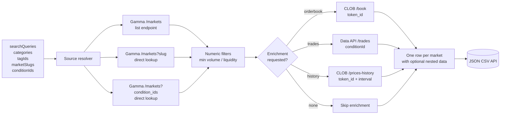
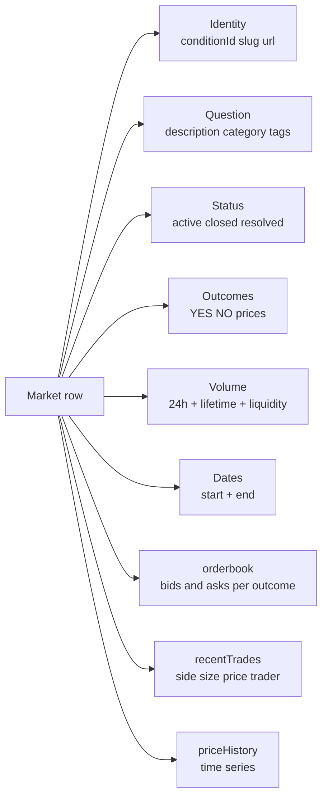

# Polymarket Trade Intelligence: Markets, Order Book, Price History

Bulk pull Polymarket prediction markets at scale. Filter by category, keyword, tag, or fetch direct slugs and condition IDs. Each row ships with the full market metadata: question, outcomes, current YES and NO prices, 24h and lifetime volume, on book liquidity, end date, plus optional CLOB order book depth, recent trades, and a YES price history time series. JSON, CSV, or Excel. No third party API key. Pay per row.

**Built for** quant teams modeling event probabilities, hedge funds piping prediction signals into trading models, sports analytics shops correlating Polymarket prices with sportsbook lines, political research desks tracking election odds, crypto traders watching token launch markets, content teams powering odds widgets, and AI builders training event probability models on a clean cross market dataset.

**Keywords this actor ranks for:** polymarket intelligence, polymarket api, prediction market data, polymarket order book, polymarket trades, polymarket price history, prediction market dataset, polymarket json, polymarket csv, polymarket condition id, polymarket gamma api, polymarket clob api, election odds api, sports prediction markets, crypto prediction markets, event probabilities api.

---

## Why this actor

| Other prediction market tools | **This actor** |
|---|---|
| Require a paid API key (Kalshi, PredictIt third party feeds) | Hits the public Polymarket Gamma + CLOB APIs directly. No third party key. |
| Surface only the headline price | One row per market with full metadata: outcomes, prices, 24h volume, lifetime volume, liquidity, start and end dates, tags, image |
| No order book depth | Optional CLOB book per outcome with bids and asks at configurable depth |
| No trade feed | Optional recent trades per market with side, size, price, timestamp, and trader wallet |
| Single point in time only | Optional YES price history time series at 1h, 6h, 1d, 1w, 1m, or max windows |
| Slug input only | Search query, category, tag ID, slug, and condition ID inputs all work in the same run |
| No deduplication | Per condition ID dedupe across runs, persisted in a key value store |

---

## How it works



The Gamma API serves the same JSON the Polymarket web client consumes. Markets ship with `conditionId`, `slug`, `outcomes`, `outcomePrices`, `volume24hr`, `liquidity`, `endDate`, and the two `clobTokenIds` (one ERC1155 token per outcome). Order book + price history live on the CLOB API keyed by token ID. Trades live on the Polymarket data API keyed by condition ID. Everything stitches into a single row.

---

## What you get per row



Toggle `includeOrderbook` and every outcome ships a `bids` and `asks` array trimmed to `orderbookDepth` levels. Toggle `includeRecentTrades` and each row carries up to `recentTradesLimit` of the most recent fills with side, size, price, timestamp, and trader wallet. Toggle `includePriceHistory` and the YES outcome gets a time series at the chosen interval.

---

## Quick start

**Top 25 active markets across politics + sports right now**

```json
{
  "categories": ["politics", "sports"],
  "status": "active",
  "sortBy": "volume24hr",
  "maxItemsTotal": 25
}
```

**Search by keyword, drop thin markets**

```json
{
  "searchQueries": ["fed rate cut", "bitcoin", "election"],
  "minVolume24h": 1000,
  "minLiquidity": 5000,
  "maxItemsTotal": 50
}
```

**Direct market with full enrichment**

```json
{
  "marketSlugs": ["russia-ukraine-ceasefire-before-gta-vi-554"],
  "includeOrderbook": true,
  "orderbookDepth": 20,
  "includeRecentTrades": true,
  "recentTradesLimit": 100,
  "includePriceHistory": true,
  "priceHistoryInterval": "1w"
}
```

**Pull every active crypto market into a dataset**

```json
{
  "categories": ["crypto"],
  "status": "active",
  "sortBy": "liquidity",
  "maxItemsTotal": 500,
  "maxItemsPerSource": 500
}
```

**Build a research dataset across closed markets**

```json
{
  "categories": ["elections"],
  "status": "closed",
  "minTotalVolume": 10000,
  "includePriceHistory": true,
  "priceHistoryInterval": "max",
  "maxItemsTotal": 200
}
```

---

## Sample output row

```json
{
  "conditionId": "0x9c1a953fe92c8357f1b646ba25d983aa83e90c525992db14fb726fa895cb5763",
  "slug": "russia-ukraine-ceasefire-before-gta-vi-554",
  "question": "Russia Ukraine Ceasefire before GTA VI?",
  "category": "politics",
  "tags": ["politics", "geopolitics"],
  "endDate": "2026-07-31T12:00:00Z",
  "active": true,
  "closed": false,
  "outcomes": ["Yes", "No"],
  "outcomePrices": [0.535, 0.465],
  "volume24h": 3210.37,
  "totalVolume": 1626624.45,
  "liquidity": 65737.39,
  "url": "https://polymarket.com/event/russia-ukraine-ceasefire-before-gta-vi-554",
  "clobTokenIds": ["8501497159...", "2527312495..."],
  "orderbook": {
    "Yes": {
      "timestamp": "2026-04-30T03:09:51.054Z",
      "bids": [{"price": 0.53, "size": 1500.0}, {"price": 0.52, "size": 800.5}],
      "asks": [{"price": 0.54, "size": 2200.0}, {"price": 0.55, "size": 950.0}]
    }
  },
  "recentTrades": [
    {"side": "BUY", "outcome": "Yes", "price": 0.535, "size": 250.0, "timestamp": "2026-04-30T02:48:00Z", "trader": "0x3b5a..."}
  ],
  "priceHistory": [
    {"timestamp": "2026-04-29T00:00:03Z", "yesPrice": 0.535},
    {"timestamp": "2026-04-29T01:00:04Z", "yesPrice": 0.535}
  ],
  "scrapedAt": "2026-04-30T03:09:51.123Z"
}
```

---

## Pricing

Pay per row, no subscription. First 2 rows per run are free so you can verify the schema before scaling up. After that you pay per market row delivered to the dataset, regardless of which enrichment fields are attached.

| Run shape | Free rows | Paid rows | Cost |
|---|---|---|---|
| 20 row dry run | 20 | 0 | $0.00 |
| 100 row research pull | 20 | 80 | $0.40 |
| 500 row category sweep | 20 | 480 | $2.40 |
| 2000 row dataset build | 20 | 1980 | $9.90 |

Apify platform usage (proxy + compute) is billed separately and charged at cost.

---

## Common questions

**Where do I find a market slug?**
The Polymarket URL after `/event/` is the slug. For example `https://polymarket.com/event/will-trump-win-2024` -> slug is `will-trump-win-2024`.

**Where do I find a condition ID?**
Open the market, then check the network tab for the Gamma API response. The `conditionId` field is a 0x prefixed hex string. You can also find it via the slug input on this actor and read it off the first row.

**Why is `priceHistory` only for YES?**
The two outcome tokens sum to 1 by construction (NO price = 1 - YES price). Pulling YES alone halves the API cost.

**Is the order book live?**
Yes. The CLOB book is the live order book the Polymarket front end uses. The `timestamp` field on each book snapshot reflects when CLOB returned the data.

**How fresh is the data?**
Gamma metadata is real time. Order book is real time. Trades are within a second of execution. Price history is sampled by Polymarket within the requested window.

**Can I pull every market in one run?**
Yes, set `maxItemsTotal` to 0 (unlimited) and pick one or more categories. Expect a few minutes per thousand rows when no enrichment is enabled.

---

## Related actors

- **Polymarket Market Monitor** filters and alerts on price moves, volume surges, and end date approaches across the same markets. Use it for automated watchlists; use this intelligence for bulk extraction and dataset builds.
- **Sports Odds Intelligence** pulls live odds from DraftKings, Pinnacle, FanDuel, and other sportsbooks. Pair with this intelligence to compare prediction market prices to sportsbook lines on the same event.
- **Sports Odds Movement Tracker** alerts on sharp line moves across books in real time.
- **Crypto Whale Token Launch Tracker** surfaces new token launches and large whale moves.
- **SEC Form 4 Insider Tracker** and **SEC 8-K Event Tracker** for equity and corporate event signals that often correlate with politics and macro Polymarket markets.

---

## Disclaimer

This actor uses the public Polymarket Gamma, CLOB, and data APIs. Polymarket may change endpoint shapes or rate limits at any time without notice; if a request shape changes the actor degrades gracefully and logs a warning rather than failing the run. Polymarket access is not available in every jurisdiction; comply with your local regulations.
