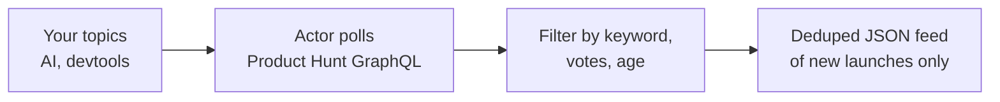
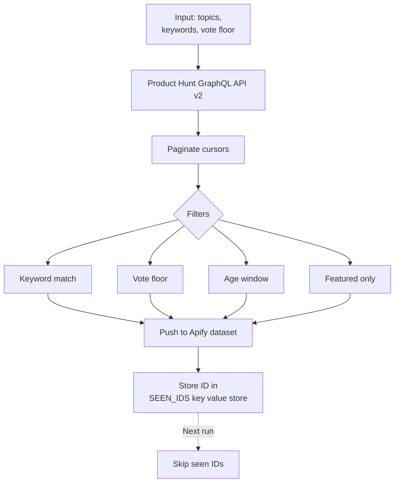
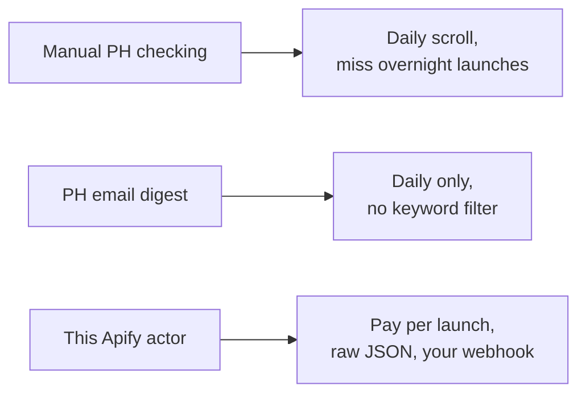

# Product Hunt Scraper: Monitor Daily Launches by Topic and Keyword

Scrape Product Hunt for new launches that match your topics, keywords, vote floor, and age window. Export launch ID, name, tagline, full description, maker profiles, vote count, comment count, topics, and timestamps to JSON, CSV, or Excel. Deduped across runs so you only see new launches. Uses the official PH GraphQL API. Pay per launch.

**Keywords this actor is built for:** Product Hunt scraper, PH launch tracker, Product Hunt API, competitor launch monitor, Product Hunt GraphQL, scrape Product Hunt launches, PH daily launch export, Product Hunt topic feed.

---

## What you get in 30 seconds



Paste a topic slug. Set a vote floor. Get a clean JSON feed of new Product Hunt launches every run. That is the whole product.

---

## Who this Product Hunt scraper is for

| You are a... | You use this to... |
|---|---|
| **Founder** | Alert when any competitor ships, so you update your landing page before the traffic wave |
| **VC analyst** | Daily pull of every AI or devtools launch hitting 50+ votes, routed to your deal flow sheet |
| **Devtool marketer** | Catch launches in your category and comment first, when threads still have the most eyes |
| **Growth marketer** | Track PH plus Show HN cross posts for weekly growth loop analysis |
| **Market researcher** | Export every launch in a topic across a year for positioning and pricing teardowns |

---

## How it works



1. Drop in your PH developer token (free, made in 30 seconds at `producthunt.com/v2/oauth/applications`).
2. Pass topic slugs like `artificial-intelligence`, `developer-tools`, or `productivity`.
3. Actor calls PH's official GraphQL API v2 with cursor pagination.
4. Results get filtered by keyword, vote floor, comment count, and age.
5. Matching launches land in the dataset.
6. Every launch ID is stored in a key value store so future runs skip duplicates.

Schedule every hour on Apify Scheduler and you get a deduped stream of new launches in your topics. Developer tokens never expire and do not count against any paid PH tier.

---

## Quick start

**Watch AI and devtools topics for launches mentioning "agent" or "mcp", last 7 days:**

```json
{
  "developerToken": "YOUR_PH_DEVELOPER_TOKEN",
  "topics": ["artificial-intelligence", "developer-tools"],
  "keywords": ["agent", "mcp"],
  "sortBy": "NEWEST",
  "postedWithin": "DAY_7"
}
```

**Track featured launches with 100+ votes in the last 24 hours:**

```json
{
  "developerToken": "YOUR_PH_DEVELOPER_TOKEN",
  "topics": ["productivity", "saas"],
  "sortBy": "VOTES",
  "postedWithin": "HOUR_24",
  "minVotes": 100,
  "featuredOnly": true
}
```

**One off market pull of every Chrome extension launch:**

```json
{
  "developerToken": "YOUR_PH_DEVELOPER_TOKEN",
  "topics": ["chrome-extensions"],
  "sortBy": "VOTES",
  "postedWithin": "ANY",
  "maxLaunchesPerTopic": 500,
  "dedupe": false
}
```

Or run it from the command line:

```bash
curl -X POST "https://api.apify.com/v2/acts/scrapemint~producthunt-launch-tracker/run-sync-get-dataset-items?token=YOUR_TOKEN" \
  -H "Content-Type: application/json" \
  -d '{"developerToken":"YOUR_PH_TOKEN","topics":["artificial-intelligence"],"postedWithin":"DAY_7"}'
```

---

## This scraper vs the alternatives



| Feature | Manual checking | PH email digest | This actor |
|---|---|---|---|
| Pricing | Free, costs time | Free, limited | Pay per launch, first 30 per run free |
| Keyword filter | Search the page by hand | None | Unlimited |
| Topic targeting | Tab hopping | Top level only | Any topic slug, any combination |
| Scheduling | You | Daily fixed time | Every 10 minutes |
| Dedup across runs | Your memory | Not applicable | Yes, in your key value store |
| Maker profiles | Click each launch | Not included | Yes, full maker object with username and headline |
| Output | Browser tab | Email | JSON, CSV, Excel, webhook, API |

---

## Sample output

One launch record:

```json
{
  "launchId": "post_1234567",
  "name": "Relay Agents",
  "tagline": "Open source MCP server for CRM automations",
  "description": "Relay is an MCP server you run locally or on Fly that...",
  "slug": "relay-agents",
  "url": "https://www.producthunt.com/posts/relay-agents",
  "website": "https://relay.dev",
  "thumbnailUrl": "https://ph-files.imgix.net/abc123.png",
  "votesCount": 412,
  "commentsCount": 38,
  "reviewsCount": 0,
  "createdAt": "2026-04-19T07:01:00Z",
  "featuredAt": "2026-04-19T07:00:00Z",
  "topics": [
    { "name": "Artificial Intelligence", "slug": "artificial-intelligence" },
    { "name": "Developer Tools", "slug": "developer-tools" }
  ],
  "makers": [
    { "name": "Lana Chen", "username": "lanachen", "url": "https://www.producthunt.com/@lanachen", "headline": "Building Relay" }
  ],
  "matchedKeywords": ["mcp", "agent"],
  "sourceTopic": "artificial-intelligence"
}
```

Every field ready to drop into a CRM, a Slack channel, an Airtable, or a Notion database.

---

## Pricing

First 30 launches per run are free. After that you pay per extracted launch. No seat licenses. No tier gating. A 200 launch run lands under $1 on the Apify free plan.

---

## FAQ

**Do I need a Product Hunt account?**
Yes, a free one. The developer token takes 30 seconds to make at `producthunt.com/v2/oauth/applications`. Tokens do not expire and do not count against any paid tier.

**Can I track all of Product Hunt, not just specific topics?**
Yes. Leave `topics` empty and the actor queries the global posts feed.

**Does it return maker profiles?**
Yes. Each launch record includes a `makers` array with username, URL, headline, and PH ID. Useful for founder outreach and VC deal flow.

**Does it return full descriptions?**
Yes. The long form description is in the `description` field. The `tagline` is the one line pitch on the card. Both are searchable by your keyword filter.

**How fresh is the data?**
PH's GraphQL API updates in real time. Launches appear the moment they post, before they hit the homepage.

**Does it dedupe?**
Yes. Launch IDs are stored under `SEEN_IDS`. Every run skips seen IDs. Set `dedupe: false` to disable.

**Useful topic slugs?**
`artificial-intelligence`, `developer-tools`, `productivity`, `saas`, `marketing`, `design-tools`, `chrome-extensions`, `no-code`, `fintech`, `e-commerce`. Find any slug by opening its page on PH, the URL ends with it.

**Can I use this for VC deal flow?**
Yes. Set `minVotes: 50` and `postedWithin: "DAY_7"`, schedule weekly, pipe the webhook into Airtable or Notion.

---

## Related Scrapemint actors

- **GitHub Issue Monitor** for issue and PR tracking by keyword and repo
- **Stack Overflow Lead Monitor** for dev question tracking by tag
- **Hacker News Scraper** for stories and comments matching keywords
- **Reddit Lead Monitor** for subreddit and keyword mention tracking
- **Upwork Opportunity Alert** for freelance lead generation
- **App Store Review Scraper** for mobile apps on iOS and Android
- **Trustpilot Brand Reputation** for DTC and ecommerce brands
- **Google Reviews Intelligence** for local businesses
- **Amazon Review Intelligence** for product review mining

Stack these to cover every public launch and conversation surface one brand touches.
