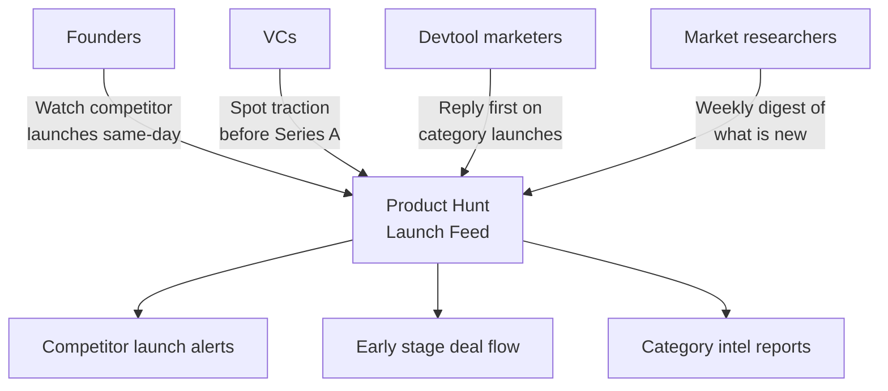
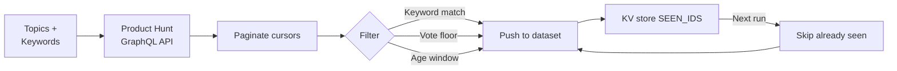
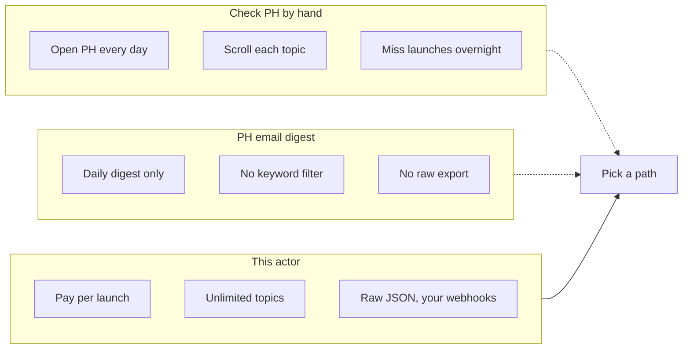

# Product Hunt Scraper and Daily Launch Tracker

Watch Product Hunt for new launches that match your topics, keywords, vote floor, and age window. Export launch ID, name, tagline, full description, maker profile, vote count, comment count, topics, and timestamps. Dedupes across runs so you only ever see new launches.

Built for founders tracking competitor launches, VCs hunting early stage traction signals, devtool marketers catching category mentions, and market researchers capturing the weekly "what is new in AI" stream without scrolling Product Hunt at 9am every day.

---

## Who uses this Product Hunt scraper



| Role | What this Product Hunt scraper unlocks |
|---|---|
| **Founder** | Alert when any competitor ships, so you update your landing page before the traffic wave |
| **VC analyst** | Daily pull of every AI or devtools launch hitting 50+ votes, auto routed to your deal flow sheet |
| **Devtool marketer** | Catch launches in your category and comment first, when threads still have the most eyes |
| **Growth marketer** | Track "Show HN + Product Hunt" cross posts for weekly growth loop analysis |
| **Market researcher** | Export every launch in a topic across a year for positioning and pricing teardowns |

---

## How the Product Hunt scraper works



Pass your Product Hunt developer token, a list of topic slugs (like `artificial-intelligence`, `developer-tools`, `productivity`), and optional keyword filters. The actor calls Product Hunt's official GraphQL API, paginates cursors, filters locally by your keywords, vote count, comment count, and age, then pushes matching launches to the dataset.

Every launch ID it pushes is stored in the key value store under `SEEN_IDS`. On the next run, already seen IDs are skipped. Schedule the actor every hour and you get a deduped feed of new launches in your topics, nothing else.

Token setup is a one time thing: go to producthunt.com/v2/oauth/applications, click "Add an application", name it anything, click "Create Token", paste the long string into this actor. Tokens never expire.

---

## Product Hunt tools vs this scraper



| Feature | PH email digest | This actor |
|---|---|---|
| Pricing | Free, limited | Pay per launch, first 30 per run free |
| Keyword filter | None | Unlimited |
| Topic targeting | Top level only | Any topic slug, any combination |
| Scheduling | Daily fixed time | Apify Scheduler every 10 minutes |
| Dedup across runs | No | Yes, in your own key value store |
| Output | Email | JSON, CSV, Excel, API, or webhook |
| Maker profiles | No | Yes, full maker object with username and headline |

---

## Quick start

Watch Product Hunt AI and devtools topics for launches that mention "agent" or "mcp", last 7 days:

```bash
curl -X POST "https://api.apify.com/v2/acts/scrapemint~producthunt-launch-tracker/run-sync-get-dataset-items?token=YOUR_TOKEN" \
  -H "Content-Type: application/json" \
  -d '{
    "developerToken": "YOUR_PH_DEVELOPER_TOKEN",
    "topics": ["artificial-intelligence", "developer-tools"],
    "keywords": ["agent", "mcp"],
    "sortBy": "NEWEST",
    "postedWithin": "DAY_7",
    "minVotes": 0,
    "dedupe": true
  }'
```

Track every featured launch with 100+ votes in the last 24 hours, across productivity and SaaS topics:

```json
{
  "developerToken": "YOUR_PH_DEVELOPER_TOKEN",
  "topics": ["productivity", "saas"],
  "sortBy": "VOTES",
  "postedWithin": "HOUR_24",
  "minVotes": 100,
  "featuredOnly": true
}
```

Pull every launch in the Chrome extensions topic regardless of age (one off market research):

```json
{
  "developerToken": "YOUR_PH_DEVELOPER_TOKEN",
  "topics": ["chrome-extensions"],
  "sortBy": "VOTES",
  "postedWithin": "ANY",
  "maxLaunchesPerTopic": 500,
  "dedupe": false
}
```

---

## What one launch record looks like

```json
{
  "launchId": "post_1234567",
  "name": "Relay Agents",
  "tagline": "Open source MCP server for CRM automations",
  "description": "Relay is an MCP server you run locally or on Fly that...",
  "slug": "relay-agents",
  "url": "https://www.producthunt.com/posts/relay-agents",
  "website": "https://relay.dev",
  "thumbnailUrl": "https://ph-files.imgix.net/abc123.png",
  "votesCount": 412,
  "commentsCount": 38,
  "reviewsCount": 0,
  "createdAt": "2026-04-19T07:01:00Z",
  "featuredAt": "2026-04-19T07:00:00Z",
  "topics": [
    { "name": "Artificial Intelligence", "slug": "artificial-intelligence" },
    { "name": "Developer Tools", "slug": "developer-tools" }
  ],
  "makers": [
    { "name": "Lana Chen", "username": "lanachen", "url": "https://www.producthunt.com/@lanachen", "headline": "Building Relay" }
  ],
  "matchedKeywords": ["mcp", "agent"],
  "sourceTopic": "artificial-intelligence",
  "scrapedAt": "2026-04-19T19:30:00Z"
}
```

Every row: launch ID, name, tagline, full description, slug, PH URL, maker website, thumbnail, vote count, comment count, review count, created timestamp, featured timestamp (null if not featured), topics array, makers array, and matched keywords.

---

## Pricing

First 30 launches per run are free. After that you pay per launch extracted. No seat licenses. No tier gating. A 200 launch run lands under $1 on the Apify free plan.

---

## FAQ

**Do I need a Product Hunt account?**
Yes, a free one. You need a developer token, which is made in 30 seconds at producthunt.com/v2/oauth/applications. Tokens do not expire and do not count against any paid tier.

**Can I track all of Product Hunt, not just specific topics?**
Yes. Leave `topics` empty and the actor queries the global posts feed.

**Does it return maker profiles?**
Yes. Each launch record includes a `makers` array with each maker's username, URL, headline, and Product Hunt ID. Useful for founder outreach and VC deal flow.

**Does it return product descriptions?**
Yes. The full long form description is in the `description` field, not just the tagline. The `tagline` is the one line pitch on the card. Both are searchable by your keyword filter.

**How fresh is the data?**
Product Hunt's GraphQL API updates in real time. Launches appear in the API the moment they post, even before they hit the homepage.

**Does it dedupe?**
Yes. Launch IDs are stored in the key value store under `SEEN_IDS`. Every run skips IDs already seen. Set `dedupe: false` to disable.

**What are some useful topic slugs?**
`artificial-intelligence`, `developer-tools`, `productivity`, `saas`, `marketing`, `design-tools`, `chrome-extensions`, `no-code`, `fintech`, `e-commerce`. Find any topic slug by opening its page on Product Hunt, the URL ends with the slug.

**Can I use this for VC deal flow?**
Yes. Filter by `minVotes: 50` and `postedWithin: DAY_7`, schedule weekly, pipe the webhook into Airtable or Notion. Every launch with early traction in your thesis topics hits your pipeline without a scraping intern.

---

## Related actors by Scrapemint

- **Hacker News Scraper** for stories and comments matching keywords
- **Reddit Lead Monitor** for subreddit and keyword mention tracking
- **Upwork Opportunity Alert** for freelance lead generation
- **App Store Review Scraper** for mobile apps on iOS and Android
- **Trustpilot Brand Reputation** for DTC and ecommerce brands
- **Google Reviews Intelligence** for local businesses
- **Amazon Review Intelligence** for product reviews and listings
- **Indeed Company Review Intelligence** for employer branding

Stack these to cover every public launch and conversation surface one brand touches.
