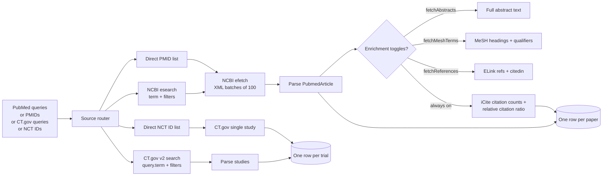
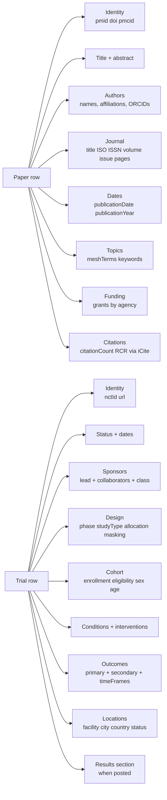

# Pharma Research & Clinical Trial Monitor: PubMed + ClinicalTrials.gov

Pull biomedical literature and clinical trial records at scale. Mixes PubMed papers and ClinicalTrials.gov studies in one run. PMIDs, DOIs, full abstracts, MeSH terms, author affiliations, ORCIDs, journal metadata, NCT IDs, trial phases, sponsors, enrollment, primary outcomes, posted results, and live citation counts via NCBI iCite. One row per record. Pay per row.

**Built for** pharma competitive intelligence teams, biotech analysts watching pipeline shifts, regulatory affairs staff tracking submissions, medical writers building systematic reviews, KOL mappers profiling investigators, CRO BD teams scouting active sites, science journalists tracing claims, AI teams training biomedical LLMs, and grant writers building reference packs.

**Keywords this actor ranks for:** pubmed api, pubmed scraper, clinicaltrials.gov api, biomedical literature search, drug pipeline monitor, clinical trial scraper, MeSH term extractor, NCT ID lookup, KOL mapping, pharma competitive intelligence, FDA pipeline tracker, oncology trial monitor, biomedical citation api, pharma BI feed.

---

## Why this actor

| Other tools | **This actor** |
|---|---|
| PubMed E-utilities raw: free but XML parsing, rate limits, no trial data | Both data sources in one normalized JSON row |
| ClinicalTrials.gov UI export: 1000 row cap, manual click | Unbounded, programmatic, paginates for you |
| TrialTrove / Citeline: $20K plus per seat per year | Pay per row, no minimum |
| Cortellis: enterprise contract only | Pay per row, no contract |
| BiopharmaCatalyst: free but no historical depth, US only | Global, full history, posted results included |
| Roll your own scraper: maintain 3 parsers, handle rate limits | Maintained selectors plus iCite enrichment built in |

---

## How it works



PubMed records flow through E-utilities (esearch returns PMIDs, efetch returns XML). ClinicalTrials.gov records come from the v2 REST API (JSON, paginated by token). Both sources are public and free at the API level. iCite citation counts are pulled from the NIH OPB API and joined to PubMed rows automatically.

---

## What you get per row



PMIDs and NCT IDs are stable identifiers. The actor dedupes across runs by both, so a daily cron pulls only new records.

---

## Quick start

**Track new oncology trials this week**

```json
{
  "clinicalTrialsQueries": ["non small cell lung cancer"],
  "studyStatus": ["RECRUITING", "NOT_YET_RECRUITING"],
  "phases": ["PHASE2", "PHASE3"],
  "dateFrom": "2026-04-29",
  "maxRecords": 200
}
```

**Daily PubMed feed for a therapeutic area**

```json
{
  "pubmedQueries": ["GLP-1 receptor agonist obesity"],
  "publicationTypes": ["Clinical Trial", "Randomized Controlled Trial", "Meta-Analysis"],
  "dateFrom": "2026-04-01",
  "fetchAbstracts": true,
  "fetchMeshTerms": true,
  "maxRecords": 100
}
```

**KOL mapping by topic, with citation impact**

```json
{
  "pubmedQueries": ["CAR-T cell therapy"],
  "publicationTypes": ["Review", "Clinical Trial"],
  "dateFrom": "2024-01-01",
  "fetchAbstracts": true,
  "fetchMeshTerms": true,
  "fetchReferences": false,
  "maxRecords": 500
}
```

**Direct NCT ID enrichment for a watchlist**

```json
{
  "nctIds": ["NCT05123456", "NCT04999111", "NCT05432109"],
  "fetchTrialResults": true
}
```

**Build a reference pack from a list of PMIDs**

```json
{
  "pmids": ["38523054", "39122189", "37956789"],
  "fetchAbstracts": true,
  "fetchMeshTerms": true,
  "fetchReferences": true
}
```

**Cross domain pull: papers + trials in one run**

```json
{
  "pubmedQueries": ["lecanemab alzheimer"],
  "clinicalTrialsQueries": ["lecanemab"],
  "fetchAbstracts": true,
  "fetchTrialResults": true,
  "maxRecords": 250
}
```

---

## Sample output

PubMed paper row:

```json
{
  "type": "pubmed",
  "pmid": "38523054",
  "doi": "10.1056/NEJMoa2304146",
  "pmcid": "PMC10923512",
  "title": "Lecanemab in Early Alzheimer's Disease",
  "abstract": "BACKGROUND: The accumulation of soluble and insoluble aggregated amyloid-beta...",
  "authors": [
    {
      "name": "Christopher H van Dyck",
      "lastName": "van Dyck",
      "foreName": "Christopher H",
      "affiliations": ["Yale School of Medicine, New Haven, CT"],
      "orcid": "0000-0002-1234-5678"
    }
  ],
  "journal": "The New England Journal of Medicine",
  "journalIso": "N Engl J Med",
  "issn": "1533-4406",
  "volume": "388",
  "issue": "1",
  "pages": "9-21",
  "publicationYear": 2023,
  "publicationDate": "2023-Jan-5",
  "publicationTypes": ["Journal Article", "Randomized Controlled Trial"],
  "meshTerms": [
    { "term": "Alzheimer Disease", "ui": "D000544", "major": true, "qualifiers": ["drug therapy"] },
    { "term": "Amyloid beta-Peptides", "ui": "D016229", "major": false, "qualifiers": [] }
  ],
  "keywords": ["amyloid", "monoclonal antibody"],
  "grants": [
    { "grantId": "U01 AG006781", "agency": "NIA NIH HHS", "country": "United States" }
  ],
  "language": "eng",
  "url": "https://pubmed.ncbi.nlm.nih.gov/38523054/",
  "citationCount": 1842,
  "relativeCitationRatio": 24.3,
  "fieldCitationRate": 12.1,
  "scrapedAt": "2026-05-06T10:30:00.000Z"
}
```

Clinical trial row:

```json
{
  "type": "clinical_trial",
  "nctId": "NCT03887455",
  "title": "A Study to Confirm Safety and Efficacy of Lecanemab in Participants With Early Alzheimer's Disease",
  "url": "https://clinicaltrials.gov/study/NCT03887455",
  "status": "ACTIVE_NOT_RECRUITING",
  "startDate": "2019-03-22",
  "primaryCompletionDate": "2022-09-29",
  "completionDate": "2027-10-15",
  "studyType": "INTERVENTIONAL",
  "phases": ["PHASE3"],
  "enrollment": 1795,
  "enrollmentType": "ACTUAL",
  "primaryPurpose": "TREATMENT",
  "leadSponsor": "Eisai Inc.",
  "leadSponsorClass": "INDUSTRY",
  "collaborators": ["Biogen"],
  "conditions": ["Alzheimer Disease", "Early Alzheimer's Disease"],
  "interventions": [
    { "type": "DRUG", "name": "Lecanemab", "description": "10 mg/kg biweekly IV", "otherNames": ["BAN2401"] }
  ],
  "primaryOutcomes": [
    { "measure": "Change from Baseline in CDR-SB at 18 Months", "timeFrame": "Baseline to 18 months" }
  ],
  "locations": [
    { "facility": "Yale School of Medicine", "city": "New Haven", "state": "Connecticut", "country": "United States", "status": "ACTIVE_NOT_RECRUITING" }
  ],
  "locationCount": 234,
  "hasResults": true,
  "scrapedAt": "2026-05-06T10:30:00.000Z"
}
```

---

## Who uses this

| Role | Use case |
|---|---|
| Pharma CI team | Daily feed of new trials in a therapeutic area, with sponsor and phase, mapped against your portfolio |
| Biotech analyst | Track when a competitor's trial moves from Phase 2 to Phase 3, or posts results |
| Regulatory affairs | Pull every paper citing a specific MeSH term in the last quarter for an FDA submission |
| Medical writer | Build a systematic review reference pack from a query, export with full abstracts and DOIs |
| KOL mapper | Find the top 50 authors by citation impact in a niche, cross referenced to their trial sites |
| CRO BD | Identify active investigators by location and condition for site recruitment |
| Science journalist | Verify a viral health claim against the primary trial result and citing literature |
| AI / LLM team | Build biomedical training corpora with structured MeSH terms, abstracts, and outcome data |
| Grant writer | Pull recent funded papers in your topic, complete with NIH grant IDs and agency names |
| Patent attorney | Prior art sweep across PubMed papers and trial registrations on a drug candidate |

---

## Input reference

| Field | Type | What it does |
|---|---|---|
| `pubmedQueries` | string[] | PubMed Entrez queries. Supports MeSH and field tags: `"breast cancer"[MeSH]`, `pembrolizumab[Title]`. |
| `clinicalTrialsQueries` | string[] | Free text queries against ClinicalTrials.gov. Matches title, conditions, interventions, sponsor. |
| `pmids` | string[] | Direct PubMed IDs to fetch. Skips search. |
| `nctIds` | string[] | Direct ClinicalTrials.gov NCT numbers to fetch. |
| `dateFrom` / `dateTo` | string | ISO date window. PubMed: publication date. CT.gov: lastUpdatePostDate. |
| `publicationTypes` | string[] | PubMed publication type filter. Common: Clinical Trial, Meta-Analysis, Review. |
| `studyStatus` | enum[] | Trial recruitment status filter. |
| `phases` | enum[] | Trial phase filter. |
| `studyTypes` | enum[] | Interventional, observational, expanded access. |
| `fetchAbstracts` | boolean | Include full abstract text in PubMed rows. On by default. |
| `fetchMeshTerms` | boolean | Parse MeSH headings with UIs and qualifiers. On by default. |
| `fetchReferences` | boolean | Per paper, fetch reference list and citing PMID list via ELink. Off by default. |
| `fetchTrialResults` | boolean | Include posted results section for completed trials. On by default. |
| `maxRecords` | integer | Hard cap on rows per run. 0 means unlimited. |
| `maxPerQuery` | integer | Cap per individual query before moving to the next. |
| `ncbiApiKey` | string | NCBI API key for 10 req/s instead of 3 req/s. Recommended for runs over 500 records. |
| `email` | string | Identifying email for the User-Agent header. NCBI requests this. |
| `dedupe` | boolean | Skip PMIDs and NCT IDs already pushed in previous runs. |
| `navigationDelayMs` | integer | Pause between API calls. Default 350 ms keeps you under the 3 req/s limit. |

---

## API call

```bash
curl -X POST \
  "https://api.apify.com/v2/acts/YOUR_USER~pubmed-clinical-trials-intelligence/runs?token=YOUR_TOKEN" \
  -H "Content-Type: application/json" \
  -d '{
    "pubmedQueries": ["semaglutide cardiovascular"],
    "clinicalTrialsQueries": ["semaglutide"],
    "studyStatus": ["RECRUITING", "ACTIVE_NOT_RECRUITING"],
    "phases": ["PHASE3", "PHASE4"],
    "dateFrom": "2026-01-01",
    "fetchAbstracts": true,
    "maxRecords": 100
  }'
```

---

## Pricing

The first 20 rows per run are free so you can validate the schema before paying. After that, $0.005 per row pushed. PubMed papers and clinical trial rows are charged at the same rate. iCite citation counts, MeSH terms, references, and posted trial results are included at no extra per row charge.

---

## FAQ

### Do I need an NCBI API key?

Optional but recommended for runs over 500 records. Without a key, NCBI throttles at 3 requests per second. With a free key from your NCBI account, you get 10 per second. The actor handles backoff either way.

### Will this hit rate limits?

The default `navigationDelayMs` of 350 ms paces requests under NCBI's no key limit. ClinicalTrials.gov v2 has no published rate limit and accepts 100 records per page. If you see 429 errors, raise `navigationDelayMs` to 700 ms or add an API key.

### Why not use BioPython or Entrez Direct?

Both are excellent for one off pulls on your laptop. This actor adds three things: ClinicalTrials.gov in the same row schema, iCite citation counts joined automatically, and dedupe across daily runs. Run it on a cron and you get an incremental feed instead of a one shot dump.

### How current is the data?

PubMed indexes new papers within hours of journal publication. ClinicalTrials.gov updates as sponsors post changes (sometimes daily, sometimes monthly per study). Both APIs return the live record at request time.

### Can I track when a trial changes phase or status?

Yes. Schedule the actor on a daily cron with the same query and `dedupe: false`. Each row carries `scrapedAt`, `lastUpdatePostedDate`, and `status`. Diff between snapshots to catch phase transitions, status flips, and enrollment changes.

### What is iCite RCR?

Relative Citation Ratio. NIH's field normalized citation impact metric. RCR of 1.0 is average for the paper's field and year. RCR of 5.0 means the paper is cited 5x more than average peers. Better than raw citation count for cross field comparisons.

### Can I get the full text of a paper?

The actor returns metadata and the structured abstract. Full text lives behind the publisher or in PubMed Central. For PMC papers, the row includes a `pmcid`. Pipe `pmcid` into Apify's Website Content Crawler against `https://www.ncbi.nlm.nih.gov/pmc/articles/{pmcid}/` for the full body.

### Does fetchReferences work for every paper?

Only papers indexed with a structured reference list in PubMed have references via ELink. Coverage is strongest in PMC open access journals and weaker in older or non English titles. Empty `references` array means PubMed does not have the reference list, not that the paper has no references.

### How does this dedupe?

Two key value store keys: `seen-pmids` and `seen-nct-ids`. Every successful push adds the ID. Next run skips IDs already in the set. Turn `dedupe` off to refresh stale rows or rebuild the dataset from scratch.

### Will this scrape PubMed Central full text?

No. PMC full text is XML behind a separate API and the licensing varies per article. Use Website Content Crawler against the `pmcid` URL when full text is needed.

---

## Related actors

- **Google Scholar Scraper**. Broader academic coverage including humanities, social sciences, and working papers. Pair when your topic spans biomedical and adjacent fields.
- **Google Patents Scraper**. Same temporal and prior art shape applied to patent literature. Pairs naturally for IP teams covering pharma assets.
- **SEC 8-K Event Tracker**. Catch material events from public biotech sponsors. Pair with this actor to align trial readouts to investor disclosures.
- **SEC Form 4 Insider Tracker**. Insider trading signal around clinical milestones.
- **Website Content Crawler**. Pipe `pmcid` URLs or trial NCT URLs into the crawler for full text and supplementary documents.
- **HN Lead Monitor**. Catch new mentions of a trial sponsor or drug name on Hacker News.
- **Reddit Lead Monitor**. Same applied to patient and clinician subreddits, useful for KOL discovery and patient sentiment.
