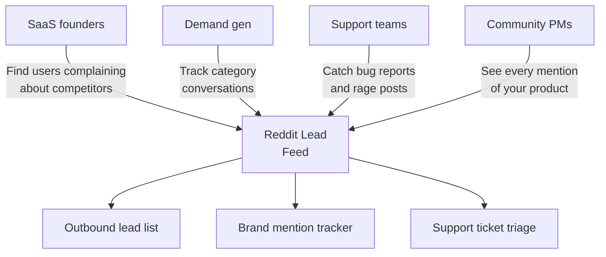
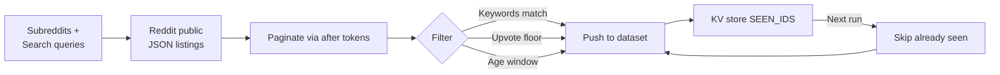
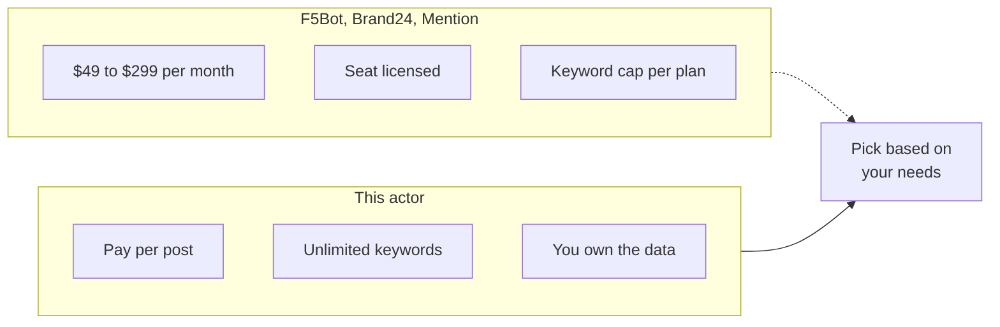

# Reddit Scraper and Subreddit Lead Monitor

Watch any subreddit or search query for new posts that match your keywords, upvote floor, and age window. Export post ID, title, body, author, flair, permalink, upvotes, comment count, and timestamp. Dedupe across runs so you only ever see new matches.

Built for SaaS founders, demand gen marketers, community managers, customer support teams, and brand monitors who need Reddit data without the Reddit API OAuth dance or a $200 per month mention tool.

---

## Who uses this Reddit monitor



| Role | What this Reddit scraper unlocks |
|---|---|
| **SaaS founder** | Every post in r/SaaS, r/startups, r/Entrepreneur that mentions your category, fed into a lead list |
| **Demand gen marketer** | Category conversations surfaced daily, so your SDR team reaches out within hours |
| **Support team** | Rage posts and bug reports against your product caught before they hit 500 upvotes |
| **Community manager** | Mentions of your brand on every subreddit, not just the one you run |
| **Market researcher** | Raw user language for positioning, onboarding copy, and interview prep |

---

## How the Reddit scraper works



Pass a list of subreddits and, optionally, a list of keywords. The actor hits Reddit's public JSON endpoints (the same ones the web UI uses), paginates through listings, filters locally for your keywords, upvotes, comments, and post age, then pushes matching posts to the dataset.

Every post ID it pushes is stored in the key value store under `SEEN_IDS`. On the next run, already-seen IDs are skipped. Schedule this actor every 15 minutes and you get a deduped feed of new matching posts, nothing else.

No OAuth, no client ID, no developer app. The public JSON endpoints require nothing.

---

## Reddit mention tools vs this scraper



| Feature | Reddit mention SaaS | This actor |
|---|---|---|
| Pricing | $49 to $299 per month, flat | Pay per post, first 50 per run free |
| Keyword cap | 3 to 50 per plan tier | Unlimited |
| Subreddit targeting | Global only, hard to scope | Any subreddit or list of subreddits |
| Data ownership | Vendor hosts behind a login | Raw JSON in your Apify account |
| Scheduling | Built in, hourly at best | Apify Scheduler every 1 minute |
| Dedup across runs | Yes, but vendor controlled | Yes, stored in your key value store |
| Export format | CSV or email digest | JSON, CSV, Excel, or API |

---

## Quick start

Watch r/SaaS and r/startups for posts mentioning "scraper" or "scraping tool", posted in the last 24 hours:

```bash
curl -X POST "https://api.apify.com/v2/acts/scrapemint~reddit-lead-monitor/run-sync-get-dataset-items?token=YOUR_TOKEN" \
  -H "Content-Type: application/json" \
  -d '{
    "subreddits": ["SaaS", "startups"],
    "keywords": ["scraper", "scraping tool"],
    "sortBy": "new",
    "maxAgeHours": 24,
    "minUpvotes": 0,
    "dedupe": true
  }'
```

Track brand mentions across all of Reddit, last 7 days, only posts with 10+ upvotes:

```json
{
  "searchQueries": ["YourBrandName", "yourbrand.com"],
  "sortBy": "new",
  "maxAgeHours": 168,
  "minUpvotes": 10,
  "maxPostsTotal": 500
}
```

Watch a single subreddit on the "hot" sort, no keyword filter, just the top of the feed:

```json
{
  "subreddits": ["Entrepreneur"],
  "sortBy": "hot",
  "maxPostsPerSource": 50
}
```

---

## What one post record looks like

```json
{
  "postId": "1c8xyzq",
  "fullId": "t3_1c8xyzq",
  "subreddit": "SaaS",
  "subredditPrefixed": "r/SaaS",
  "title": "Looking for a cheap Reddit scraper, any recs?",
  "selftext": "Our mention tool costs $299 a month and I only need...",
  "author": "bootstrapdev",
  "url": "https://www.reddit.com/r/SaaS/comments/1c8xyzq/...",
  "permalink": "https://www.reddit.com/r/SaaS/comments/1c8xyzq/looking_for_a_cheap_reddit_scraper/",
  "domain": "self.SaaS",
  "flair": "Question",
  "upvotes": 42,
  "upvoteRatio": 0.96,
  "numComments": 18,
  "score": 42,
  "createdAt": "2026-04-19T10:14:00.000Z",
  "isSelf": true,
  "over18": false,
  "matchedKeywords": ["scraper"],
  "sourceKind": "subreddit",
  "sourceValue": "SaaS",
  "scrapedAt": "2026-04-19T19:30:00.000Z"
}
```

Every row: post ID, subreddit, title, body, author, permalink, upvotes, comment count, flair, created timestamp, matched keywords, and which subreddit or query surfaced it.

---

## Pricing

First 50 posts per run are free. After that you pay per post extracted. No seat licenses. No tier gating. A 500 post run lands under $1 on the Apify free plan.

---

## FAQ

**Can this scrape any subreddit?**
Yes, any public subreddit. Private subreddits require you to be logged in, which this actor does not support.

**How many posts per subreddit?**
Reddit lists up to 1000 posts per sort. This actor paginates up to `maxPostsPerSource` (default 100). Raise it to 1000 for full listing depth.

**How do I track brand mentions across all of Reddit?**
Use `searchQueries` instead of `subreddits`. Add your brand name, domain, and common misspellings. The actor hits Reddit's global search endpoint.

**Is scraping Reddit legal?**
Reddit exposes the same JSON endpoints publicly that its web UI uses. No authentication required. The Reddit user agreement allows read access for non commercial and commercial use alike, subject to rate limits.

**Does it dedupe so I do not get the same post twice?**
Yes. Post IDs are stored in the key value store under `SEEN_IDS`. Every run skips IDs already seen. Set `dedupe: false` to disable.

**Can I run it on a schedule?**
Yes. Use the Apify Scheduler to run every 15 minutes, every hour, or on your own cron. Pair it with a webhook to push new matches straight to Slack or your CRM.

**What about comments?**
This actor pulls posts, not comments. A separate Reddit Comment Monitor actor handles comment level monitoring.

**Does it work for NSFW subreddits?**
Set `includeNSFW: true`. Off by default for business use cases.

---

## Related actors by Scrapemint

- **Upwork Opportunity Alert** for freelance lead generation
- **Trustpilot Brand Reputation** for DTC and ecommerce brands
- **Google Reviews Intelligence** for local businesses
- **Yelp Review Intelligence** for restaurants and service businesses
- **TripAdvisor Review Intelligence** for hotels and attractions
- **Amazon Review Intelligence** for product reviews and listings
- **App Store Review Scraper** for mobile apps on iOS and Android
- **Indeed Company Review Intelligence** for employer branding

Stack these to cover every public conversation surface one brand touches.
