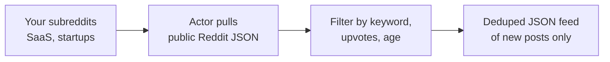
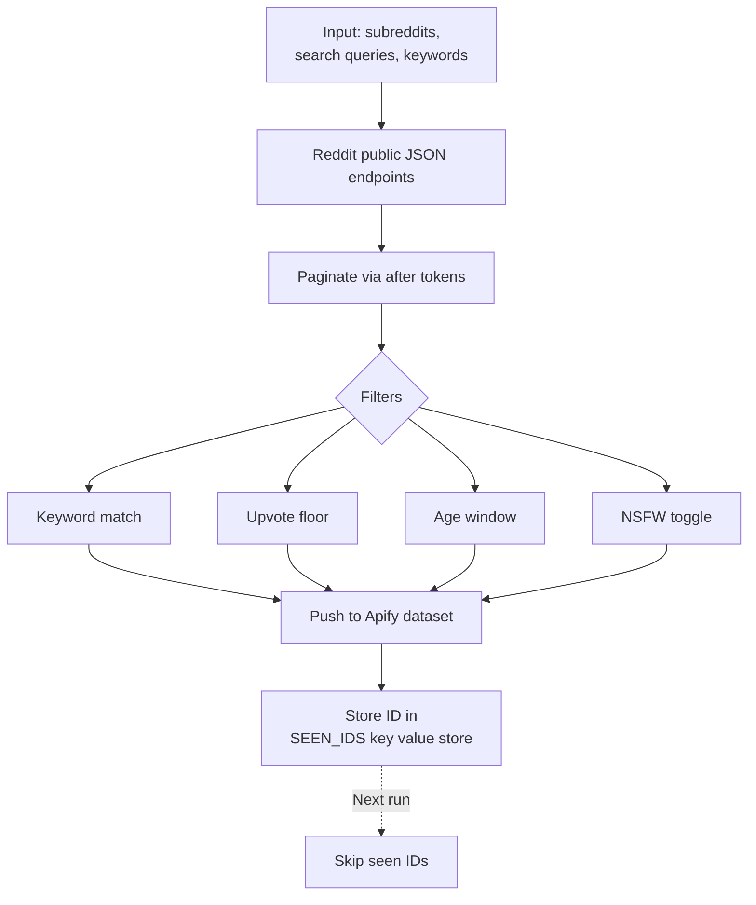
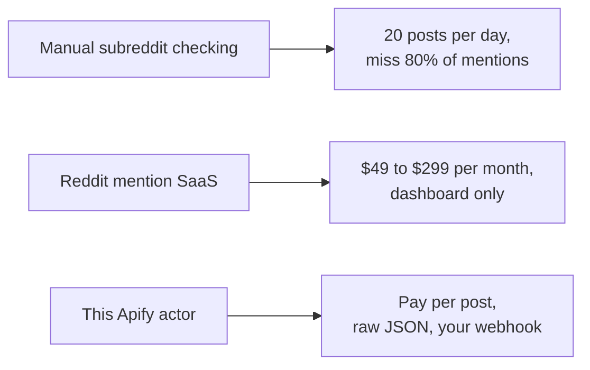

# Reddit Scraper: Track Subreddits, Keywords, and Brand Mentions

Scrape any subreddit or search query for new posts that match your keywords, upvote floor, and age window. Export post ID, title, body, author, flair, permalink, upvotes, comment count, and timestamp to JSON, CSV, or Excel. Deduped across runs so you only see new posts. No OAuth. No API key. Pay per post.

**Keywords this actor is built for:** Reddit scraper, subreddit monitor, Reddit lead generation, Reddit mention tracker, Reddit API data, scrape Reddit posts, Reddit JSON export, Reddit brand monitoring.

---

## What you get in 30 seconds



Paste a subreddit. Add a keyword filter. Get a clean JSON feed of new matching Reddit posts every run. That is the whole product.

---

## Who this Reddit scraper is for

| You are a... | You use this to... |
|---|---|
| **SaaS founder** | Find every post in r/SaaS, r/startups, r/Entrepreneur that mentions your category, turn it into warm outbound |
| **Demand gen marketer** | Track category conversations daily so your SDR team reaches out within hours |
| **Support team** | Catch bug reports and rage posts before they hit 500 upvotes |
| **Community manager** | Monitor mentions of your brand across every subreddit, not just the one you run |
| **Market researcher** | Mine raw user language for positioning, onboarding copy, and interview prep |

---

## How it works



1. Pass subreddits, search queries, or both.
2. Actor hits Reddit's public JSON endpoints, the same ones the web UI uses.
3. Results get filtered by keyword, upvote floor, comment count, and post age.
4. Matching posts land in the dataset.
5. Every post ID is stored in a key value store so future runs skip duplicates.

Schedule every 15 minutes on Apify Scheduler and you get a deduped stream of new matching posts. No OAuth. No developer app. The public endpoints require nothing.

---

## Quick start

**Watch r/SaaS and r/startups for posts about scrapers in the last 24 hours:**

```json
{
  "subreddits": ["SaaS", "startups"],
  "keywords": ["scraper", "scraping tool"],
  "sortBy": "new",
  "maxAgeHours": 24
}
```

**Brand mention tracker across all of Reddit, posts with 10+ upvotes:**

```json
{
  "searchQueries": ["YourBrandName", "yourbrand.com"],
  "sortBy": "new",
  "maxAgeHours": 168,
  "minUpvotes": 10,
  "maxPostsTotal": 500
}
```

**Single subreddit on hot sort, no keyword filter:**

```json
{
  "subreddits": ["Entrepreneur"],
  "sortBy": "hot",
  "maxPostsPerSource": 50
}
```

Or run it from the command line:

```bash
curl -X POST "https://api.apify.com/v2/acts/scrapemint~reddit-lead-monitor/run-sync-get-dataset-items?token=YOUR_TOKEN" \
  -H "Content-Type: application/json" \
  -d '{"subreddits":["SaaS"],"keywords":["scraper"],"maxAgeHours":24}'
```

---

## This scraper vs the alternatives



| Feature | Manual checking | Mention SaaS | This actor |
|---|---|---|---|
| Pricing | Free, costs time | $49 to $299 per month | Pay per post, first 2 per run free |
| Keyword cap | Unlimited if you click them all | 3 to 50 per tier | Unlimited |
| Subreddit targeting | Tab hopping | Global only | Any subreddit or list |
| Data ownership | Copy paste | Vendor hosted | Raw JSON in your Apify account |
| Scheduling | You | Hourly | Every 1 minute |
| Dedup across runs | Your memory | Vendor owned | Yes, in your key value store |
| Output | Browser tab | CSV or email | JSON, CSV, Excel, webhook, API |

---

## Sample output

One post record:

```json
{
  "postId": "1c8xyzq",
  "subreddit": "SaaS",
  "subredditPrefixed": "r/SaaS",
  "title": "Looking for a cheap Reddit scraper, any recs?",
  "selftext": "Our mention tool costs $299 a month and I only need...",
  "author": "bootstrapdev",
  "permalink": "https://www.reddit.com/r/SaaS/comments/1c8xyzq/...",
  "flair": "Question",
  "upvotes": 42,
  "upvoteRatio": 0.96,
  "numComments": 18,
  "createdAt": "2026-04-19T10:14:00.000Z",
  "matchedKeywords": ["scraper"],
  "sourceKind": "subreddit",
  "sourceValue": "SaaS"
}
```

Every field ready to drop into a CRM, a Slack channel, or a Notion database.

---

## Pricing

First 2 posts per run are free. After that you pay per extracted post. No seat licenses. No tier gating. A 500 post run lands under $1 on the Apify free plan.

---

## FAQ

**Do I need a Reddit account or API key?**
No. The actor uses Reddit's public JSON endpoints, the same ones the web UI uses. No OAuth, no client ID, no developer app.

**Can it scrape any subreddit?**
Yes, any public subreddit. Private subreddits require you to be logged in, which this actor does not support.

**How many posts per subreddit can I pull?**
Reddit lists up to 1000 posts per sort. This actor paginates up to `maxPostsPerSource` (default 100). Raise it to 1000 for full listing depth.

**How do I track brand mentions across all of Reddit?**
Use `searchQueries` with your brand name, domain, and common misspellings. The actor hits Reddit's global search.

**Does it dedupe?**
Yes. Post IDs are stored under `SEEN_IDS`. Every run skips IDs already seen. Set `dedupe: false` to disable.

**Can I run it on a schedule?**
Yes. Apify Scheduler goes down to 1 minute. Pair with a webhook to push new matches to Slack, Discord, or your CRM.

**What about comments?**
This actor pulls posts. Comment level monitoring is handled by a separate actor.

**Does it work for NSFW subreddits?**
Set `includeNSFW: true`. Off by default.

**Is scraping Reddit allowed?**
The JSON endpoints are public by design, the same ones the web UI uses. Read access is allowed under the user agreement, subject to rate limits.

---

## Related Scrapemint actors

- **GitHub Issue Monitor** for issue and PR tracking by keyword and repo
- **Stack Overflow Lead Monitor** for dev question tracking by tag
- **Hacker News Scraper** for stories and comments matching keywords
- **Product Hunt Launch Tracker** for competitor launch monitoring
- **Upwork Opportunity Alert** for freelance lead generation
- **Trustpilot Brand Reputation** for DTC and ecommerce brands
- **Google Reviews Intelligence** for local businesses
- **Amazon Review Intelligence** for product review mining
- **Indeed Company Review Intelligence** for employer branding

Stack these to cover every public conversation surface one brand touches.
