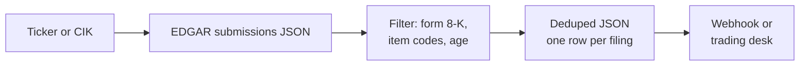
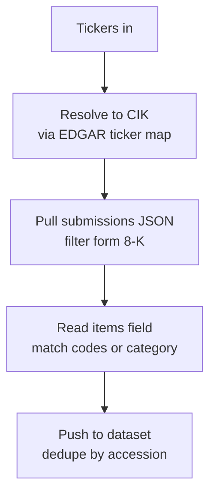

# SEC 8-K Tracker: Earnings, Exec Changes, M&A, and Cyber Events from EDGAR

Track SEC 8-K material event filings by ticker, CIK, or 8-K item code. Every 8-K (earnings release, executive departure, M&A, cyber incident, bankruptcy, impairment) lands in your Apify dataset as a clean JSON row. Deduped across runs. Official SEC EDGAR API. Pay per item.

**Searches this actor ranks for:** SEC 8-K tracker, 8-K filing alert, earnings announcement scraper, insider exec change tracker, SEC cyber incident feed, M&A filing monitor, EDGAR 8-K API, bankruptcy filing alert, material event scanner.

---

## How it works in 30 seconds



Paste a ticker. Pick the 8-K items you care about. Get a clean JSON row every time that company files one. That is the whole product.

---

## Who this 8-K tracker is for

| You are a... | You use this to... |
|---|---|
| **Retail trader** | Catch earnings releases (item 2.02) the second they hit EDGAR, minutes before most news feeds. |
| **Event driven hedge fund** | Monitor watchlist names for exec departures (5.02), M&A (1.01, 2.01), or impairments (2.06). |
| **Comms team** | Get alerted when a peer files a cyber incident (1.05) so you can brief your team. |
| **Legal and compliance** | Audit a portfolio for material agreement filings and accountant changes (4.01, 4.02). |
| **Fintech builder** | Back a corporate events widget with official SEC data, zero licensing fee. |
| **Journalist** | Break news on exec reshuffles, restatements, and 10b5 1 plan exits before the wire. |

---

## How to scrape SEC 8-K filings



1. Pass tickers or CIKs.
2. Tickers resolve to CIKs via `company_tickers.json`.
3. The actor pulls `data.sec.gov/submissions/CIK{10digit}.json` and filters for form `8-K` (and optionally `8-K/A`).
4. Each filing's `items` field is matched against your item codes or category shortcut.
5. Matches push to the dataset with filing URL, item descriptions, and issuer metadata.

Schedule every 5 minutes for an earnings-hour feed. EDGAR is rate limited at 10 requests per second and requires a contact email in the User-Agent.

---

## Quick start

**Every earnings release for 3 megacaps:**

```json
{
  "tickers": ["AAPL", "NVDA", "TSLA"],
  "categories": ["earnings"],
  "maxAgeHours": 168,
  "userAgent": "MyDesk research@mydesk.com"
}
```

**Exec changes and M&A in your portfolio:**

```json
{
  "tickers": ["PLTR", "HOOD", "COIN", "NET"],
  "categories": ["exec_changes", "ma"],
  "maxAgeHours": 720
}
```

**Cyber incidents and bankruptcies across any filer:**

```json
{
  "tickers": ["OKTA", "CRWD", "ZS"],
  "items": ["1.03", "1.05"],
  "maxAgeHours": 8760
}
```

Run from the command line:

```bash
curl -X POST "https://api.apify.com/v2/acts/scrapemint~sec-8k-event-tracker/run-sync-get-dataset-items?token=YOUR_TOKEN" \
  -H "Content-Type: application/json" \
  -d '{"tickers":["NVDA"],"categories":["earnings","exec_changes"],"maxAgeHours":72}'
```

---

## 8-K item codes cheat sheet

| Item | Meaning | Use it for |
|---|---|---|
| **1.01** | Entry into material definitive agreement | M&A, partnerships, big contracts |
| **1.03** | Bankruptcy or receivership | Distressed names |
| **1.05** | Material cybersecurity incidents | Breach alerts (SEC rule since 2023) |
| **2.01** | Completion of acquisition or disposition | M&A close |
| **2.02** | Results of operations (earnings) | Every quarterly earnings drop |
| **2.06** | Material impairments | Asset writedowns |
| **3.01** | Delisting or listing rule failure | Compliance risk |
| **4.01** | Change in accountant | Audit risk |
| **4.02** | Non reliance on previously issued statements | Restatement, a serious flag |
| **5.01** | Change in control | Takeover completed |
| **5.02** | Departure or appointment of directors and officers | Exec turnover |
| **7.01** | Regulation FD disclosure | Material news to the public |
| **8.01** | Other events | Catch all, read the body |

Category shortcuts: `earnings`, `exec_changes`, `ma`, `material_agreements`, `cyber`, `bankruptcy`, `delisting`, `impairments`, `accountant`, `control`, `regulation_fd`, `other`.

---

## 8-K tracker vs the alternatives

| | Yahoo Finance | Bloomberg Terminal | **This actor** |
|---|---|---|---|
| Pricing | Free, delayed | ~$25k per seat per year | Pay per item, first 30 free |
| Source | Aggregated feeds | EDGAR + wires | EDGAR direct, official API |
| Item code filter | No | Yes | Yes |
| Category shortcut | No | Premium filter | Built in |
| Webhook | No | Terminal only | Any URL |
| Dedup | N/A | Terminal state | Yours, in key value store |
| Schedule | N/A | Live | Every 1 minute |
| Output | HTML | Their terminal | JSON, CSV, Excel |

---

## Sample output

```json
{
  "accessionNumber": "0000320193-26-000051",
  "form": "8-K",
  "filingDate": "2026-04-18",
  "reportDate": "2026-04-17",
  "acceptanceDateTime": "2026-04-18T16:31:02.000Z",
  "filingUrl": "https://www.sec.gov/Archives/edgar/data/320193/000032019326000051/aapl-20260417.htm",
  "indexUrl": "https://www.sec.gov/Archives/edgar/data/320193/000032019326000051/",
  "issuer": {
    "cik": "320193",
    "name": "Apple Inc.",
    "ticker": "AAPL",
    "exchange": "Nasdaq",
    "sic": "3571",
    "sicDescription": "Electronic Computers"
  },
  "itemCodes": ["2.02", "9.01"],
  "items": [
    { "code": "2.02", "description": "Results of operations and financial condition (earnings)" },
    { "code": "9.01", "description": "Financial statements and exhibits" }
  ],
  "scrapedAt": "2026-04-18T16:35:00Z"
}
```

Every field drops straight into a trading bot, Slack channel, or Notion database.

---

## Pricing

First 30 filings per run are free. After that you pay per extracted filing. A 200 filing run lands well under $1 on the Apify free plan.

---

## FAQ

**What is an SEC 8-K filing?**
A form companies file to report material events between quarterly reports. Earnings (2.02), executive departures (5.02), mergers (1.01), cyber incidents (1.05), and bankruptcy (1.03) all require an 8-K within four business days.

**How do I get an earnings alert feed?**
Set `categories` to `["earnings"]` and list your tickers. The actor catches every item 2.02 filing. Schedule every 5 minutes during earnings weeks for close-to-realtime alerts.

**What is item 1.05?**
The SEC cybersecurity disclosure rule that took effect in December 2023. Public companies must file an 8-K within four business days of determining a cybersecurity incident is material. This actor tags every 1.05 filing automatically.

**How do I track exec changes?**
Use `categories: ["exec_changes"]` or `items: ["5.02"]`. You get every appointment, departure, and compensation arrangement for directors and named officers.

**Can I differentiate a CEO departure from a CFO hire?**
Item 5.02 covers both. The actor returns the filing URL so you can pull the primary document (HTML) for the full text. A follow on LLM step works well here.

**Does it dedupe across runs?**
Yes. Accession numbers are stored under `SEEN_IDS` in a named key value store. Every run skips seen accessions. Set `dedupe: false` to disable.

**Why do I need a User-Agent with an email?**
SEC EDGAR requires it. Without a valid email the endpoints return HTTP 403.

**How fast is it after an 8-K is filed?**
EDGAR surfaces new filings in the submissions JSON within seconds of acceptance. Schedule every minute and you are usually within 60 to 90 seconds of the filing timestamp.

**Is scraping SEC EDGAR allowed?**
Yes. EDGAR is public and explicitly permits programmatic access if you set a descriptive User-Agent and respect the 10 req/sec limit. This actor uses the official JSON endpoints.

---

## Related Scrapemint actors

- **SEC Form 4 Insider Trading Tracker** for every insider buy and sell
- **GitHub Issue Monitor** for devtool category mentions and bug reports
- **Stack Overflow Lead Monitor** for dev question tracking by tag
- **Hacker News Scraper** for stories and comments by keyword
- **Reddit Lead Monitor** for subreddit and brand mention tracking
- **Product Hunt Launch Tracker** for competitor launch monitoring
- **Upwork Opportunity Alert** for freelance lead generation
- **Trustpilot Brand Reputation** for DTC and ecommerce brands

Stack these to cover every public financial, developer, and customer conversation surface one portfolio touches.
