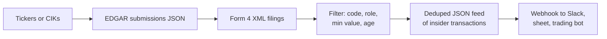
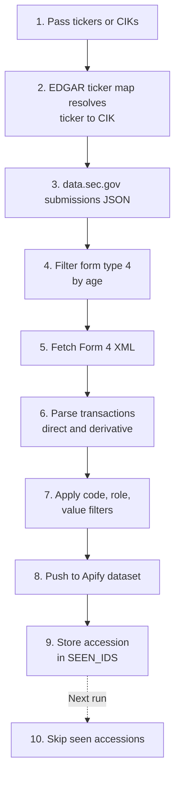
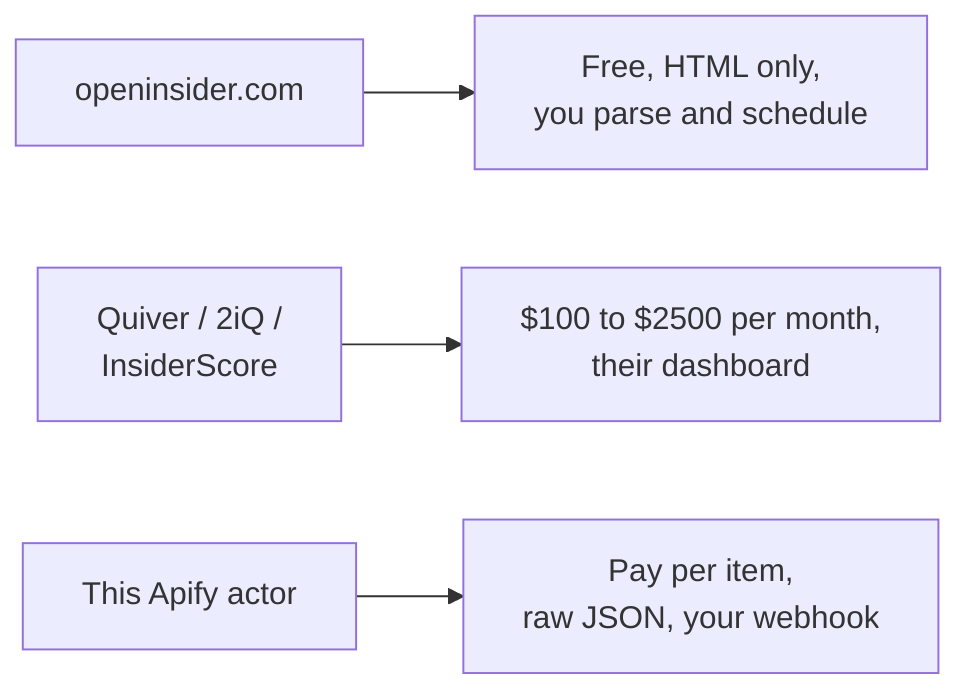

# SEC Form 4 Insider Trading Tracker: Every Insider Buy and Sell from EDGAR

Track SEC Form 4 insider trading filings by ticker, CIK, transaction code, insider role, min value, and age. Export every insider stock transaction (buys, sells, grants, option exercises) to JSON, CSV, or Excel. Deduped across runs. Uses the official SEC EDGAR APIs. Pay per item.

**Searches this actor is built for:** SEC Form 4 scraper, insider trading tracker, insider buying alert, SEC EDGAR Form 4 API, insider transactions by ticker, insider trading JSON feed, Form 4 webhook, insider sell alert, 10b5 1 tracker, insider cluster buy scanner.

---

## How it works in 30 seconds



Paste a ticker. Pick filters. Get a clean JSON row for every insider transaction inside every Form 4 filed by that company. That is the whole product.

---

## Who this insider trading tracker is for

| You are a... | You use this to... |
|---|---|
| **Retail trader** | Catch cluster buys from directors and officers, often a stronger signal than one big purchase. |
| **Quant researcher** | Build a clean insider transaction dataset straight from EDGAR without paying Quiver, 2iQ, or InsiderScore. |
| **Newsletter writer** | Pipe the feed into a daily digest on notable open market purchases over $100k. |
| **Hedge fund analyst** | Monitor portfolio names for unusual insider selling or 10b5 1 plan exits. |
| **Compliance team** | Audit a watchlist for Form 4 filings that hit specific codes or dollar thresholds. |
| **Fintech builder** | Back an insider buying widget with official SEC data, no licensing fee, no rate limit per user. |

---

## How to scrape SEC Form 4 filings step by step



1. You pass tickers or CIKs.
2. Tickers resolve to CIKs via `company_tickers.json`.
3. The actor pulls `data.sec.gov/submissions/CIK{10digit}.json` for each company and filters for form type `4`.
4. Each matching filing is fetched as raw XML from `sec.gov/Archives/edgar/data/...`.
5. The XML is parsed into per transaction rows for both non derivative (direct stock) and derivative (options, RSUs, warrants) sections.
6. Filters apply: transaction code, insider role, min shares, min dollar value, age.
7. Matches land in your Apify dataset, one row per transaction.
8. Accession numbers go into a key value store so next run skips duplicates.

Schedule every hour on Apify Scheduler for a live insider trading feed. SEC EDGAR is rate limited at 10 requests per second per User-Agent and requires a contact email in the User-Agent string.

---

## Quick start

**Watch 3 megacaps for any insider activity this week:**

```json
{
  "tickers": ["AAPL", "NVDA", "TSLA"],
  "maxAgeHours": 168,
  "userAgent": "MyCompany Research you@yourcompany.com"
}
```

**Only open market purchases over $100k from officers and directors:**

```json
{
  "tickers": ["PLTR", "HOOD", "COIN"],
  "transactionCodes": ["P"],
  "reporterRoles": ["officer", "director"],
  "minTransactionValue": 100000,
  "userAgent": "MyDesk research@mydesk.com"
}
```

**Direct transactions only, skip option grants and RSU vesting:**

```json
{
  "tickers": ["META"],
  "transactionCodes": ["P", "S"],
  "includeDerivative": false,
  "maxAgeHours": 720
}
```

Run it from the command line:

```bash
curl -X POST "https://api.apify.com/v2/acts/scrapemint~sec-form4-insider-tracker/run-sync-get-dataset-items?token=YOUR_TOKEN" \
  -H "Content-Type: application/json" \
  -d '{"tickers":["NVDA"],"transactionCodes":["P","S"],"maxAgeHours":72}'
```

---

## Form 4 transaction codes cheat sheet

| Code | Meaning | Signal |
|---|---|---|
| **P** | Open market or private purchase | Insider bought with own money. Highest signal. |
| **S** | Open market or private sale | Insider sold. Often scheduled via 10b5 1. |
| **A** | Grant or award | Company gave shares. Not a buy decision. |
| **F** | Tax withholding on vesting | Paid tax by selling shares. Not a real sell. |
| **M** | Option exercise | Converted options to stock. |
| **D** | Disposition | Shares left the insider's account, various causes. |
| **G** | Bona fide gift | Transfer, not economic. |
| **X** | In or at the money option exercise | Converted valuable options. |
| **J** | Other acquisition or disposition | Footnote required, read carefully. |

The full code list is returned in every item's `transaction.codeDescription` field.

---

## Insider trading tracker vs the alternatives



| Feature | openinsider.com | SaaS dashboards | This actor |
|---|---|---|---|
| Pricing | Free, HTML only | $100 to $2500 per month | Pay per item, first 30 free |
| Source | EDGAR via scrape | EDGAR + enrichment | EDGAR direct, official API |
| Dedup across runs | You build it | Vendor owned | Yours, in key value store |
| Derivative breakout | Mixed | Yes | Yes, separate kind field |
| Role filter | Limited | Yes | Yes, client side |
| Schedule | You | Hourly | Every 1 minute |
| Output | HTML table | Their UI | JSON, CSV, Excel, webhook |
| Ticker to CIK | You resolve | Auto | Auto, via EDGAR map |

---

## Sample output

One transaction record:

```json
{
  "transactionId": "0000320193-26-000042#non_derivative#0",
  "accessionNumber": "0000320193-26-000042",
  "filingDate": "2026-04-18",
  "filingUrl": "https://www.sec.gov/Archives/edgar/data/320193/000032019326000042/wk-form4.xml",
  "kind": "non_derivative",
  "issuer": {
    "cik": "320193",
    "name": "Apple Inc.",
    "ticker": "AAPL"
  },
  "insider": {
    "cik": "0001051401",
    "name": "COOK TIMOTHY D",
    "title": "Chief Executive Officer",
    "isDirector": true,
    "isOfficer": true,
    "isTenPercentOwner": false,
    "isOther": false
  },
  "transaction": {
    "date": "2026-04-17",
    "code": "S",
    "codeDescription": "Open market or private sale",
    "shares": 50000,
    "pricePerShare": 218.42,
    "totalValue": 10921000,
    "sharesOwnedAfter": 3280411,
    "directOrIndirect": "D",
    "securityTitle": "Common Stock"
  },
  "scrapedAt": "2026-04-18T14:22:00Z"
}
```

Every field is ready to drop into a trading bot, a Google Sheet, a Slack channel, or a Notion database.

---

## Pricing

First 30 transactions per run are free. After that you pay per extracted transaction. No seats. A 200 item run lands well under $1 on the Apify free plan.

---

## FAQ

**How do I track insider trading by ticker?**
Paste the ticker into `tickers`. The actor resolves it to a CIK via EDGAR's public `company_tickers.json` map, pulls the company's filing history, filters for Form 4, and parses each XML filing into per transaction rows.

**What is an SEC Form 4 filing?**
Form 4 is the statement a company insider files within two business days of an equity transaction: officer, director, or 10% owner. Every Form 4 contains one or more direct stock or derivative security transactions. This actor turns each transaction into its own row.

**Why do I need a User-Agent with an email?**
SEC EDGAR requires it. Their fair access policy says every request must identify the requester with a contact email. Without a valid email the endpoints return HTTP 403. Default is set but replace it with your own.

**How fast is EDGAR?**
Rate limit is 10 requests per second per User-Agent. This actor sleeps 120ms between requests to stay polite. A 3 company run with 10 recent Form 4s each finishes in under 10 seconds.

**What is the difference between code P and code A?**
**P** is an open market purchase with the insider's own money, the strongest bullish signal. **A** is a grant or award, meaning the company handed the insider shares as compensation. An **A** is not a conviction buy.

**How do I filter option exercises out of my buy feed?**
Set `transactionCodes` to `["P"]`. You will only see open market purchases. Exclude `A`, `M`, `F`, `X` to skip grants, option exercises, and tax withholdings.

**Does it track 10b5 1 plan sales?**
Form 4 does not have a dedicated 10b5 1 flag, but plan sales show up as code `S` with a footnote. This actor returns the transaction code and amounts. You can layer your own rule (e.g., recurring same sized sale on a fixed date) on top of the feed.

**Does it dedupe across runs?**
Yes. Accession numbers are stored under `SEEN_IDS` in a named key value store. Every run skips seen accessions. Set `dedupe: false` to disable.

**Can I monitor a private company with a CIK but no ticker?**
Yes. Pass the CIK in `ciks`. Works for any EDGAR filer including private companies with registered securities.

**Is scraping SEC EDGAR allowed?**
Yes. EDGAR is a public government system and explicitly permits programmatic access if you set a descriptive User-Agent with contact info and respect the 10 req/sec limit. This actor uses the official JSON and XML endpoints, no HTML scraping.

---

## Related Scrapemint actors

- **GitHub Issue Monitor** for devtool category mentions and bug reports
- **Stack Overflow Lead Monitor** for dev question tracking by tag
- **Hacker News Scraper** for stories and comments by keyword
- **Reddit Lead Monitor** for subreddit and brand mention tracking
- **Product Hunt Launch Tracker** for competitor launch monitoring
- **Upwork Opportunity Alert** for freelance lead generation
- **Trustpilot Brand Reputation** for DTC and ecommerce brands
- **Google Reviews Intelligence** for local businesses
- **Amazon Review Intelligence** for product review mining

Stack these to cover every public financial, developer, and customer conversation surface one portfolio touches.
