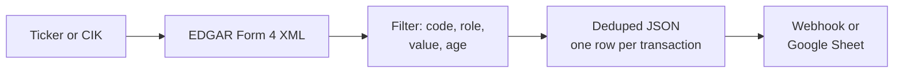
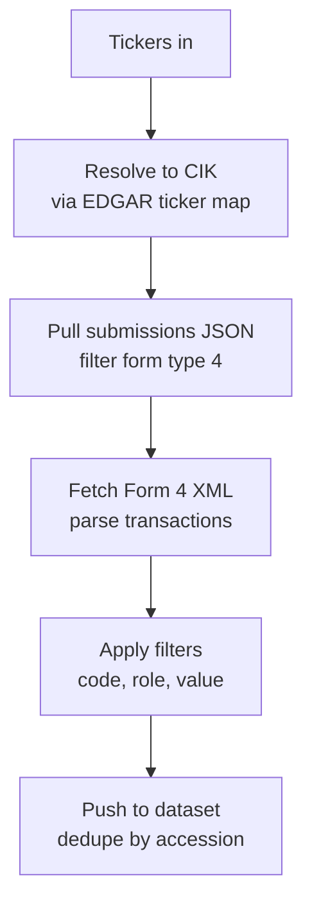

# SEC Form 4 Insider Trading Tracker: Every Insider Buy and Sell from EDGAR

Track SEC Form 4 insider trading filings by ticker, CIK, transaction code, insider role, min value, and age. Every insider stock transaction (buys, sells, grants, option exercises) lands in your Apify dataset as a clean JSON row. Deduped across runs. Built on the official SEC EDGAR APIs. Pay per item.

**Searches this actor ranks for:** SEC Form 4 scraper, insider trading tracker, insider buying alert, SEC EDGAR Form 4 API, insider transactions by ticker, insider trading JSON feed, Form 4 webhook, cluster buy scanner, insider sell alert.

---

## How it works in 30 seconds



Paste a ticker. Pick filters. Get a clean JSON row for every insider transaction inside every Form 4. That is the whole product.

---

## Who this insider trading tracker is for

| You are a... | You use this to... |
|---|---|
| **Retail trader** | Catch cluster buys from directors and officers, often a stronger signal than one big purchase. |
| **Quant researcher** | Build a clean insider transaction dataset straight from EDGAR without paying Quiver or 2iQ. |
| **Newsletter writer** | Pipe the feed into a daily digest of notable open market purchases over $100k. |
| **Hedge fund analyst** | Monitor portfolio names for unusual insider selling or 10b5 1 plan exits. |
| **Fintech builder** | Back an insider buying widget with official SEC data, no licensing fee. |

---

## How to scrape SEC Form 4 filings



1. Pass tickers or CIKs.
2. Tickers resolve to CIKs via `company_tickers.json`.
3. The actor pulls `data.sec.gov/submissions/CIK{10digit}.json` and filters for form type `4`.
4. Each filing's XML is parsed into per transaction rows (direct stock and derivative).
5. Filters apply, matches push to the dataset, accession numbers go to a key value store for next run.

Schedule every hour on Apify Scheduler for a live feed. EDGAR is rate limited at 10 requests per second and requires a contact email in the User-Agent.

---

## Quick start

**Any insider activity on 3 megacaps this week:**

```json
{
  "tickers": ["AAPL", "NVDA", "TSLA"],
  "maxAgeHours": 168,
  "userAgent": "MyCompany Research you@yourcompany.com"
}
```

**Open market purchases over $100k from officers and directors:**

```json
{
  "tickers": ["PLTR", "HOOD", "COIN"],
  "transactionCodes": ["P"],
  "reporterRoles": ["officer", "director"],
  "minTransactionValue": 100000
}
```

**Direct stock only, skip option grants and RSU vesting:**

```json
{
  "tickers": ["META"],
  "transactionCodes": ["P", "S"],
  "includeDerivative": false
}
```

Run it from the command line:

```bash
curl -X POST "https://api.apify.com/v2/acts/scrapemint~sec-form4-insider-tracker/run-sync-get-dataset-items?token=YOUR_TOKEN" \
  -H "Content-Type: application/json" \
  -d '{"tickers":["NVDA"],"transactionCodes":["P","S"],"maxAgeHours":72}'
```

---

## Form 4 transaction codes cheat sheet

| Code | Meaning | Signal |
|---|---|---|
| **P** | Open market purchase | Insider bought with own money. Highest signal. |
| **S** | Open market sale | Insider sold. Often scheduled via 10b5 1. |
| **A** | Grant or award | Company gave shares. Not a buy decision. |
| **F** | Tax withholding on vesting | Not a real sell. |
| **M** | Option exercise | Converted options to stock. |
| **X** | In or at the money option exercise | Converted valuable options. |
| **G** | Bona fide gift | Transfer, not economic. |

The full description for every code is returned in `transaction.codeDescription`.

---

## Insider trading tracker vs the alternatives

| | openinsider.com | Quiver / 2iQ | **This actor** |
|---|---|---|---|
| Pricing | Free, HTML only | $100 to $2500 / month | Pay per item, first 30 free |
| Source | EDGAR via scrape | EDGAR + enrichment | EDGAR direct, official API |
| Output | HTML table | Their dashboard | JSON, CSV, Excel, webhook |
| Dedup | You build it | Vendor owned | Yours, in key value store |
| Schedule | You | Hourly | Every 1 minute |
| Derivative breakout | Mixed | Yes | Yes, separate `kind` field |

---

## Sample output

```json
{
  "transactionId": "0000320193-26-000042#non_derivative#0",
  "accessionNumber": "0000320193-26-000042",
  "filingDate": "2026-04-18",
  "filingUrl": "https://www.sec.gov/Archives/edgar/data/320193/000032019326000042/wk-form4.xml",
  "kind": "non_derivative",
  "issuer": { "cik": "320193", "name": "Apple Inc.", "ticker": "AAPL" },
  "insider": {
    "name": "COOK TIMOTHY D",
    "title": "Chief Executive Officer",
    "isDirector": true,
    "isOfficer": true
  },
  "transaction": {
    "date": "2026-04-17",
    "code": "S",
    "codeDescription": "Open market or private sale",
    "shares": 50000,
    "pricePerShare": 218.42,
    "totalValue": 10921000,
    "securityTitle": "Common Stock"
  }
}
```

Every field drops straight into a trading bot, Google Sheet, Slack channel, or Notion database.

---

## Pricing

First 30 transactions per run are free. After that you pay per extracted transaction. A 200 item run lands well under $1 on the Apify free plan.

---

## FAQ

**How do I track insider trading by ticker?**
Paste the ticker into `tickers`. The actor resolves it to a CIK via EDGAR's public ticker map, pulls the filing history, and parses every Form 4 into transaction rows.

**What is an SEC Form 4 filing?**
A statement that a company insider (officer, director, or 10% owner) must file within two business days of any equity transaction. Each filing contains one or more direct or derivative security transactions.

**What is the difference between code P and code A?**
**P** is an open market purchase with the insider's own money, the strongest bullish signal. **A** is a grant or award: the company handed shares over as compensation. An **A** is not a conviction buy.

**How do I filter option exercises out of my buy feed?**
Set `transactionCodes` to `["P"]`. You only see open market purchases. Exclude `A`, `M`, `F`, `X` to skip grants, exercises, and tax withholdings.

**Why do I need a User-Agent with an email?**
SEC EDGAR requires it. Without a valid email the endpoints return HTTP 403. Default is set but replace it with your own.

**Does it dedupe across runs?**
Yes. Accession numbers are stored under `SEEN_IDS` in a named key value store. Every run skips seen accessions. Set `dedupe: false` to disable.

**Can I monitor a private company with a CIK but no ticker?**
Yes. Pass the CIK in `ciks`. Works for any EDGAR filer.

**Is scraping SEC EDGAR allowed?**
Yes. EDGAR is public and explicitly permits programmatic access if you set a descriptive User-Agent and respect the 10 req/sec limit. This actor uses the official JSON and XML endpoints. No HTML scraping.

---

## Related Scrapemint actors

- **GitHub Issue Monitor** for devtool category mentions and bug reports
- **Stack Overflow Lead Monitor** for dev question tracking by tag
- **Hacker News Scraper** for stories and comments by keyword
- **Reddit Lead Monitor** for subreddit and brand mention tracking
- **Product Hunt Launch Tracker** for competitor launch monitoring
- **Upwork Opportunity Alert** for freelance lead generation
- **Trustpilot Brand Reputation** for DTC and ecommerce brands
- **Amazon Review Intelligence** for product review mining

Stack these to cover every public financial, developer, and customer conversation surface one portfolio touches.
