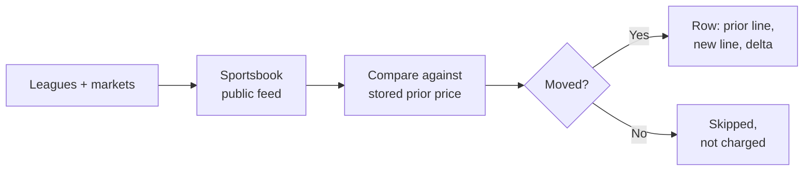

# Sports Odds Movement Tracker: Line Moves with Prior and New Price

Track sports betting line movement. Every run compares the current price of each line against the price your last run saw, and returns one row per line that actually moved, with the prior line, the new line and the size of the move.

No API key. No account. No third party signup. The actor reads a sportsbook's own public feed directly.

**Searches this actor ranks for:** line movement tracker, sports odds scraper, betting line movement, odds movement API, steam move detector, reverse line movement, NFL line movement, MLB odds tracker, live odds feed.

---

## How it works in 30 seconds



The first run on a league is a baseline: it records prices, returns nothing and charges nothing. Every run after that returns what changed.

---

## The move is measured in probability, not in cents

A price going from -110 to -120 and a price going from +200 to +190 are both "ten cents" and are nothing like the same change in belief. The first is a shift of about 2.2 implied probability points. The second is about 1.1. Ranking moves by American cents puts the wrong one at the top.

So `delta.impliedProbabilityPoints` is the number to sort and filter on. The American and decimal prices are on every row too, because that is what a bettor reads.

| Field | What it tells you |
|---|---|
| `priorLine` | Price, American, decimal and handicap your last run saw |
| `newLine` | The same four, now |
| `delta.impliedProbabilityPoints` | Size of the move, signed |
| `delta.direction` | `shortening` (price shorter, more likely) or `drifting` |
| `delta.handicapMoved` | True when the spread or total itself moved, not just the juice |
| `delta.minutesSincePrior` | How long the move took |

---

## One row

```json
{
  "sport": "baseball",
  "league": "mlb",
  "home": "Chicago Cubs",
  "away": "Toronto Blue Jays",
  "kickoff": "2026-08-06T18:20:00.000Z",
  "live": true,
  "market": "spreads",
  "marketLabel": "Runline",
  "outcome": "Toronto Blue Jays",
  "book": "bovada",
  "isNewLine": false,
  "priorLine": { "price": -110, "american": -110, "decimal": 1.9091, "point": -2.5 },
  "newLine":   { "price": -125, "american": -125, "decimal": 1.8000, "point": -2.5 },
  "delta": {
    "impliedProbabilityPoints": 3.19,
    "direction": "shortening",
    "priorImpliedProbability": 0.5238,
    "newImpliedProbability": 0.5556,
    "handicapMoved": false,
    "priorObservedAt": "2026-08-06T20:51:41.097Z",
    "minutesSincePrior": 4.4
  },
  "eventUrl": "https://www.bovada.lv/baseball/mlb/toronto-blue-jays-chicago-cubs-202608061420",
  "timestamp": "2026-08-06T20:56:07.515Z"
}
```

---

## Quick start

Watch MLB moneyline and totals, only moves of at least 1 probability point:

```json
{
  "leagues": ["mlb"],
  "markets": ["h2h", "totals"],
  "minMoveProbPoints": 1
}
```

Watch in play games, catching every change:

```json
{
  "leagues": ["nfl", "nba"],
  "liveOnly": true,
  "minMoveProbPoints": 0
}
```

Run it on a schedule. The gap between runs is the window each move is measured over, so a run every 5 minutes reports 5 minute moves and a run every hour reports hourly ones.

---

## Leagues

MLB, NFL, NCAAF, NBA, NCAAB, WNBA and NHL. A league out of season returns no events, which is a normal result rather than an error.

---

## FAQ

### My first run returned nothing. Is it broken?

No, that is the design. A line has no prior price the first time it is seen, so there is no movement to report and nothing is charged. The next run has something to compare against. Set `includeNewLines` to true if you want those opening prices returned as well, with `priorLine` null.

### Do I need an API key?

No. Earlier versions required a key from a third party odds API. That is gone. The actor reads a sportsbook's own public feed, so there is nothing to sign up for and the `apiKey` field is ignored if you still pass it.

### Does a line that did not move get charged?

No. A line is only returned when the price moved, or when the handicap itself moved. Setting `minMoveProbPoints` to 0 means any change qualifies, not that unchanged lines are returned.

### Why does a spread sometimes show a zero point move?

Because the handicap moved rather than the price. A spread going from -2.5 to -1.5 at identical juice is a real move that a price delta alone would miss, so it is reported with `direction` set to `handicap only`.

### Are suspended markets included?

No, by default. A suspended market keeps its last price, so including it can report a frozen quote as a live move. Turn on `includeSuspended` if you want them anyway.

### How many books does this cover?

One. It reports that book's own prices honestly rather than claiming a consensus it does not have. If you want prices from two books side by side on the same game, with a best price per outcome, use the Sports Odds Scraper instead.

---

## Related actors by Scrapemint

- **Sports Odds Scraper** for current pregame lines from two books with best price per outcome
- **Sportsbook Odds Tracker** for one book's full pregame and live board
- **Sportsbook Player Props** for per player markets
