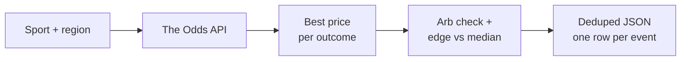
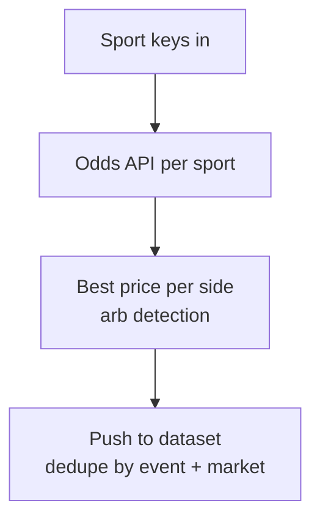

# Sports Odds Intelligence: Live Lines from DraftKings, FanDuel, Pinnacle, Bet365

Track live sports betting odds across 40+ sportsbooks. Pull moneyline (h2h), spread, and over/under lines for NFL, NBA, MLB, NHL, EPL, UFC, and more. Built in arbitrage detection and best price edge vs the consensus median. Deduped across runs. Powered by The Odds API. Pay per item.

**Searches this actor ranks for:** sports odds API, betting odds intelligence, line movement tracker, sports arbitrage finder, DraftKings odds feed, FanDuel API, Pinnacle odds, sportsbook comparison, NFL odds intelligence.

---

## How it works in 30 seconds



Pick a sport. Pick regions. Get every sportsbook's line per event, the best price per outcome, and an arb flag if a risk free bet exists.

---

## Who this sports odds intelligence is for

| You are a... | You use this to... |
|---|---|
| **Sharp bettor** | Shop lines across 40+ books in one JSON call. Bet the best price every time. |
| **Arbitrage trader** | Scan for risk free two way arbs. Actor flags them and computes profit %. |
| **Line shopper** | Alert when any book moves more than X% off the consensus median. |
| **Sports media** | Power an odds widget or matchup page with a live API, no deal with each book. |
| **Model builder** | Back test your NFL or NBA model against Pinnacle (sharp) and DraftKings (square) in one feed. |

---

## How to pull sports odds



1. Pass sport keys (`americanfootball_nfl`, `basketball_nba`, `soccer_epl`).
2. Actor calls `api.the-odds-api.com/v4/sports/{sport}/odds` with your regions and markets.
3. Best price per outcome is computed. Arb = sum of implied probabilities below 1.
4. Matches push to the dataset with every book's line and the best price winner.

Schedule every 60 seconds for live line movement (set `dedupe: false`). One request per sport per run.

---

## Quick start

**NFL moneyline across US books:**

```json
{
  "apiKey": "YOUR_ODDS_API_KEY",
  "sports": ["americanfootball_nfl"],
  "regions": ["us"],
  "markets": ["h2h"]
}
```

**Arbitrage scan across NBA and MLB:**

```json
{
  "apiKey": "YOUR_ODDS_API_KEY",
  "sports": ["basketball_nba", "baseball_mlb"],
  "regions": ["us", "uk"],
  "markets": ["h2h"],
  "arbOnly": true,
  "minArbPct": 0.5
}
```

**Soft lines on EPL spreads:**

```json
{
  "apiKey": "YOUR_ODDS_API_KEY",
  "sports": ["soccer_epl"],
  "regions": ["uk", "eu"],
  "markets": ["spreads"],
  "minBestEdgePct": 3
}
```

From the command line:

```bash
curl -X POST "https://api.apify.com/v2/acts/scrapemint~sports-odds-movement-tracker/run-sync-get-dataset-items?token=YOUR_APIFY_TOKEN" \
  -H "Content-Type: application/json" \
  -d '{"apiKey":"KEY","sports":["americanfootball_nfl"],"markets":["h2h"]}'
```

---

## Sport keys cheat sheet

| Sport | Key |
|---|---|
| **NFL** | `americanfootball_nfl` |
| **NBA** | `basketball_nba` |
| **MLB** | `baseball_mlb` |
| **NHL** | `icehockey_nhl` |
| **EPL** | `soccer_epl` |
| **UFC / MMA** | `mma_mixed_martial_arts` |
| **NCAAF** | `americanfootball_ncaaf` |
| **NCAAB** | `basketball_ncaab` |

Full list at `the-odds-api.com/sports-odds-data/sports-apis.html`.

---

## Sports odds intelligence vs the alternatives

| | OddsPortal | Action Network Pro | **This actor** |
|---|---|---|---|
| Pricing | Free, manual | $10 to $80 / mo | Pay per item, first 50 free |
| Books covered | 80+ UI only | 15 to 30 | 40+ |
| Arbitrage flag | Manual math | Premium tier | Built in |
| JSON output | No | No | Yes |
| Schedule | N/A | Their UI | Every 60 seconds |
| Webhook | No | No | Any URL |

---

## Sample output

```json
{
  "eventId": "abc123",
  "sportKey": "americanfootball_nfl",
  "commenceTime": "2026-04-21T23:00:00Z",
  "homeTeam": "Kansas City Chiefs",
  "awayTeam": "Las Vegas Raiders",
  "marketKey": "h2h",
  "marketLabel": "Moneyline",
  "bookCount": 8,
  "bestPrices": {
    "Kansas City Chiefs": { "bookmaker": "pinnacle", "price": -285, "decimal": 1.351 },
    "Las Vegas Raiders": { "bookmaker": "fanduel", "price": 255, "decimal": 3.550 }
  },
  "bestEdgePct": 2.14,
  "arbitrage": { "exists": false, "profitPct": -1.89, "sumImpliedProb": 1.019 }
}
```

Every field drops into a line shopper, a Sheet, a Slack channel, or a model backtester.

---

## Pricing

First 50 items per run are free. After that you pay per extracted event + market row. A 200 row snapshot lands well under $1. Bring your own free key from The Odds API (500 requests per month included).

---

## FAQ

**Do I need a sports odds API key?**
Yes. Get a free one at `the-odds-api.com`. The free tier gives 500 requests per month. This actor uses 1 request per sport per run.

**How does arbitrage detection work?**
For each event the actor picks the best price on every outcome, converts to decimal, computes 1 / decimal as implied probability, and sums. If the sum is below 1, a risk free bet exists. Returns the profit %.

**How often can I poll for line movement?**
As often as your Odds API quota allows. Every 60 seconds per sport is common for live. Set `dedupe: false` so every snapshot lands with a timestamp.

**Which bookmakers are covered?**
US: DraftKings, FanDuel, BetMGM, Caesars, Pinnacle, PointsBet, BetRivers, WilliamHill US, SuperBook. UK: Bet365, William Hill, Ladbrokes, Betfair, Betway. EU and AU also covered.

**Does it dedupe across runs?**
Yes. Event + market keys are stored under `SEEN_IDS`. Turn off for line movement tracking where you want every snapshot.

**Is pulling sports odds allowed?**
Yes when you use The Odds API, which aggregates bookmaker data under license. This actor never pulls a sportsbook directly.

---

## Related Scrapemint actors

- **Polymarket Market Monitor** for prediction market odds on politics, crypto, sports
- **SEC Form 4 Insider Trading Tracker** for every insider buy and sell
- **SEC 8-K Event Tracker** for earnings, exec changes, and M&A filings
- **GitHub Issue Monitor** for devtool category mentions and bug reports
- **Stack Overflow Lead Monitor** for dev question tracking by tag
- **Hacker News Intelligence** for stories and comments by keyword
- **Reddit Lead Monitor** for subreddit and brand mention tracking

Stack these to cover every public financial, prediction, and betting surface one desk touches.
