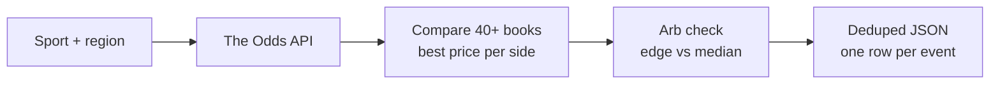
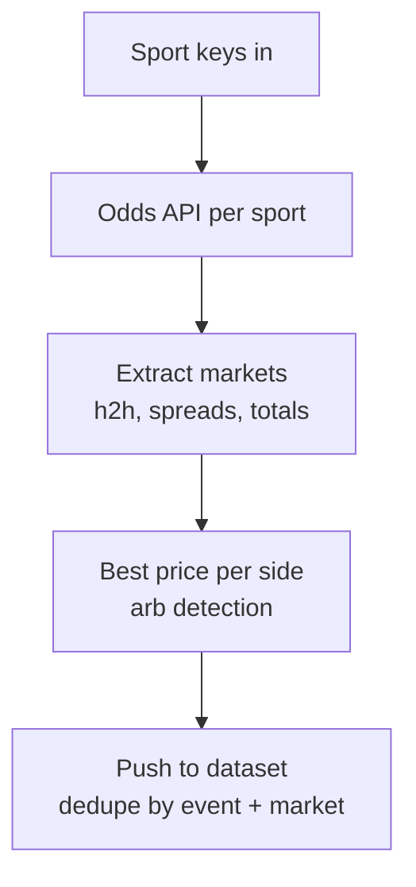

# Sports Odds Scraper: Live Lines from DraftKings, FanDuel, Pinnacle, Bet365

Track live sports betting odds across 40+ sportsbooks. Pull moneyline (h2h), spread, and over/under lines for NFL, NBA, MLB, NHL, EPL, UFC, and more. Detect arbitrage and best price edges. Deduped across runs. Powered by The Odds API. Pay per item.

**Searches this actor ranks for:** sports odds API, betting odds scraper, line movement tracker, sports arbitrage finder, DraftKings odds feed, FanDuel odds API, Pinnacle odds scraper, sportsbook comparison tool, live odds JSON feed, NFL odds scraper.

---

## How it works in 30 seconds



Pick a sport. Pick regions. Get every sportsbook's moneyline, spread, or total for every live event, plus the best price per outcome and an arbitrage flag.

---

## Who this sports odds scraper is for

| You are a... | You use this to... |
|---|---|
| **Sharp bettor** | Shop lines across 40+ books in one JSON call. Bet the best price on every side. |
| **Arbitrage trader** | Scan for risk free two way arbs. Actor flags them and computes the profit percentage. |
| **Line shopper** | Alert when any book moves more than X% off the consensus median. |
| **Sports media** | Power an odds widget or matchup page with a live API, no deal with each book. |
| **Model builder** | Back test your NFL or NBA model against Pinnacle (sharp) and DraftKings (square) in one feed. |
| **Tout or capper** | Publish best odds comparisons in your newsletter without a Bloomberg terminal for betting. |

---

## How to scrape sports odds



1. Pass sport keys (`americanfootball_nfl`, `basketball_nba`, `soccer_epl`).
2. The actor calls `api.the-odds-api.com/v4/sports/{sport}/odds` with your regions and markets.
3. Every bookmaker's line per event is extracted, then best price per outcome is computed.
4. Arbitrage check: if the sum of implied probabilities across best prices is below 1, there is a risk free bet. The actor returns the arb percentage.
5. Matches push to the dataset with every book's line and the best price winner.

Schedule every 60 seconds for live line movement tracking (set `dedupe: false`). One API request per sport per run.

---

## Quick start

**NFL moneyline across US books:**

```json
{
  "apiKey": "YOUR_ODDS_API_KEY",
  "sports": ["americanfootball_nfl"],
  "regions": ["us"],
  "markets": ["h2h"]
}
```

**Arbitrage scan across NBA and MLB:**

```json
{
  "apiKey": "YOUR_ODDS_API_KEY",
  "sports": ["basketball_nba", "baseball_mlb"],
  "regions": ["us", "uk"],
  "markets": ["h2h"],
  "arbOnly": true,
  "minArbPct": 0.5
}
```

**Soft lines on EPL spreads:**

```json
{
  "apiKey": "YOUR_ODDS_API_KEY",
  "sports": ["soccer_epl"],
  "regions": ["uk", "eu"],
  "markets": ["spreads"],
  "minBestEdgePct": 3
}
```

From the command line:

```bash
curl -X POST "https://api.apify.com/v2/acts/scrapemint~sports-odds-movement-tracker/run-sync-get-dataset-items?token=YOUR_APIFY_TOKEN" \
  -H "Content-Type: application/json" \
  -d '{"apiKey":"YOUR_ODDS_API_KEY","sports":["americanfootball_nfl"],"markets":["h2h"]}'
```

---

## Sport keys cheat sheet

| Sport | Key |
|---|---|
| **NFL** | `americanfootball_nfl` |
| **NCAAF** | `americanfootball_ncaaf` |
| **NBA** | `basketball_nba` |
| **NCAAB** | `basketball_ncaab` |
| **MLB** | `baseball_mlb` |
| **NHL** | `icehockey_nhl` |
| **EPL** | `soccer_epl` |
| **UEFA Champions League** | `soccer_uefa_champs_league` |
| **UFC / MMA** | `mma_mixed_martial_arts` |
| **Boxing** | `boxing_boxing` |
| **ATP Tennis** | `tennis_atp_french_open` |
| **PGA** | `golf_pga_championship_winner` |

Full list at `the-odds-api.com/sports-odds-data/sports-apis.html`.

---

## Sports odds scraper vs the alternatives

| | OddsPortal | Action Network Pro | **This actor** |
|---|---|---|---|
| Pricing | Free, manual | $10 to $80 / mo | Pay per item, first 50 free |
| Books covered | 80+ UI only | 15 to 30 | 40+ |
| Arbitrage flag | Manual math | Premium tier | Built in |
| JSON output | No | No | Yes |
| Webhook | No | No | Any URL |
| Schedule | N/A | Their UI | Every 60 seconds |
| Line movement history | Dashboard | Premium tier | Your time series store |

---

## Sample output

```json
{
  "eventId": "abc123",
  "sportKey": "americanfootball_nfl",
  "sportTitle": "NFL",
  "commenceTime": "2026-04-21T23:00:00Z",
  "homeTeam": "Kansas City Chiefs",
  "awayTeam": "Las Vegas Raiders",
  "marketKey": "h2h",
  "marketLabel": "Moneyline",
  "bookCount": 8,
  "bestPrices": {
    "Kansas City Chiefs": { "bookmaker": "pinnacle", "price": -285, "decimal": 1.351 },
    "Las Vegas Raiders": { "bookmaker": "fanduel", "price": 255, "decimal": 3.550 }
  },
  "bestEdgePct": 2.14,
  "arbitrage": { "exists": false, "profitPct": -1.89, "sumImpliedProb": 1.019 },
  "bookmakers": [
    { "bookmaker": "draftkings", "outcomes": [{ "name": "Kansas City Chiefs", "price": -300 }, { "name": "Las Vegas Raiders", "price": 245 }] },
    { "bookmaker": "fanduel", "outcomes": [{ "name": "Kansas City Chiefs", "price": -290 }, { "name": "Las Vegas Raiders", "price": 255 }] }
  ]
}
```

Every field drops into a line shopper, a Sheet, a Slack channel, or a model backtester.

---

## Pricing

First 50 items per run are free. After that you pay per extracted event + market row. A 200 row snapshot lands well under $1 on the Apify free plan. You also need a free key from The Odds API (500 requests per month included).

---

## FAQ

**Do I need a sports odds API key?**
Yes. Get a free one at `the-odds-api.com`. The free tier gives 500 requests per month. This actor uses 1 request per sport per run, so 10 sports scheduled hourly across a day equals 240 requests, well within free tier.

**How does arbitrage detection work?**
For each event the actor picks the best price on every outcome across all books, converts to decimal, computes 1 / decimal as implied probability, and sums. If the sum is below 1, a risk free bet exists. The actor returns the percentage profit.

**How often can I poll for live line movement?**
As often as your Odds API quota allows. Every 60 seconds per sport is common for live tracking. Set `dedupe: false` so every snapshot lands in the dataset with a timestamp.

**Which bookmakers are covered?**
US: DraftKings, FanDuel, BetMGM, Caesars, Pinnacle, PointsBet, BetRivers, Barstool, Unibet, WilliamHill US, WynnBet, SuperBook, Tipico. UK: Bet365, William Hill, Ladbrokes, Betfair, Betway. EU and AU also covered. Full list in The Odds API docs.

**Can I scrape player props?**
Not yet in this actor. Player props use a different endpoint (`/events/{eventId}/odds`) and are on the roadmap. This actor covers core markets: moneyline, spread, total, futures.

**Does it dedupe across runs?**
Yes. Event + market keys are stored under `SEEN_IDS`. Every run skips seen combos. Turn off for line movement tracking where you want every snapshot.

**Is scraping sports odds allowed?**
Yes when you use The Odds API, which aggregates bookmaker data under license. This actor never scrapes a sportsbook directly.

---

## Related Scrapemint actors

- **Polymarket Market Monitor** for prediction market odds on politics, crypto, sports
- **SEC Form 4 Insider Trading Tracker** for every insider buy and sell
- **SEC 8-K Event Tracker** for earnings, exec changes, and M&A filings
- **GitHub Issue Monitor** for devtool category mentions and bug reports
- **Stack Overflow Lead Monitor** for dev question tracking by tag
- **Hacker News Scraper** for stories and comments by keyword
- **Reddit Lead Monitor** for subreddit and brand mention tracking

Stack these to cover every public financial, prediction, and betting surface one desk touches.
