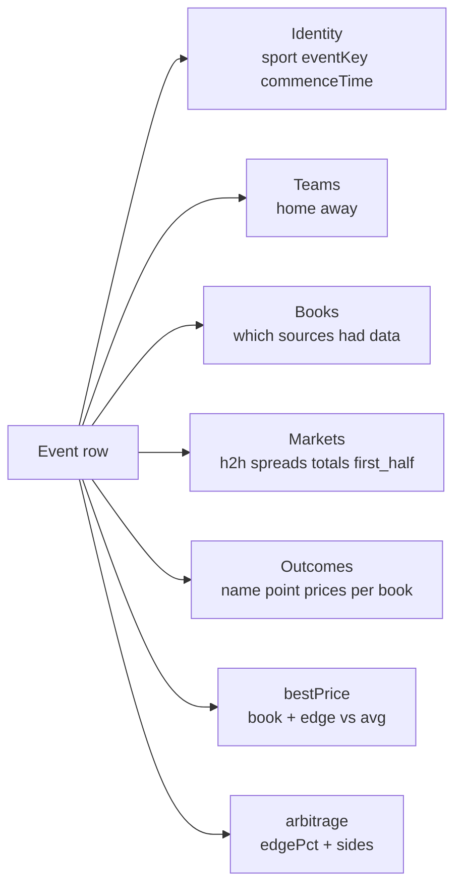

# Sports Odds Intelligence: Live Lines from DraftKings, Pinnacle, FanDuel, BetMGM

Pull live sports betting odds across DraftKings, Pinnacle, FanDuel, BetMGM, Caesars, Bet365, and any sportsbook event page. One row per event with a normalized markets array covering moneyline, spreads, totals, team totals, first half, and player props. Best price per outcome flagged across books, optional arbitrage detection. No third party API key required. Pay per row.

**Built for** sharp bettors hunting closing line value, syndicate traders running middle and arb strategies, fantasy and DFS analysts modeling implied probabilities, sportsbook operators monitoring competitor lines, BI teams piping odds into a warehouse, content teams powering odds widgets and previews, and AI builders training EV models or pick generators on a clean cross book dataset.

**Keywords this actor ranks for:** sports odds intelligence, sportsbook odds api, draftkings odds intelligence, fanduel odds intelligence, pinnacle odds api, sports betting data, arbitrage finder, best odds tracker, betting line tracker, odds movement, closing line value, sportsbook data feed, odds to JSON, odds to CSV, NFL odds api, NBA odds api, soccer odds intelligence, prop bet data.

---

## Why this actor

| Other odds tools | **This actor** |
|---|---|
| Require a paid API key (The Odds API, OpsBet) | Hits public sportsbook JSON endpoints directly. No third party key. |
| Single book or single sport | DraftKings + Pinnacle on every league out of the box, with a JSON-LD fallback for any other book |
| Rough HTML pulling that breaks weekly | Public JSON the books use to render their own clients. Same source, lower brittleness. |
| Decimal only | American, decimal, fractional, and implied probability formats |
| No edge detection | Best price flag per outcome plus arbitrage compute across books |
| No deduplication | Per event dedupe across runs, persisted in a key value store |
| Single market | h2h, spreads, totals, team totals, first half, and player props in one row |
| No periods | Period 0 (full match) plus first half splits where available |

---

## How it works

```mermaid
flowchart LR
    A[Sports + leagues<br/>or Event URLs] --> B[Per book endpoint resolver]
    B --> C[DraftKings<br/>eventgroups JSON]
    B --> D[Pinnacle<br/>matchups + markets]
    B --> E[Direct event URL<br/>JSON-LD fallback]
    C --> F[Normalize<br/>home / away / commenceTime]
    D --> F
    E --> F
    F --> G[Merge by event key<br/>sport+home+away+time]
    G --> H{Best price<br/>or arb requested?}
    H -->|yes| I[Compute edge<br/>per outcome]
    H -->|no| J[Skip]
    I --> K[One row per event<br/>markets[] across books]
    J --> K
    K --> L[(JSON CSV API)]
```

DraftKings event group endpoints serve the same JSON the DK web client renders. Pinnacle exposes a guest API used by their own front end. Both ship structured offers + outcomes with prices, points, and periods. Events are merged into a single row keyed on sport plus normalized home and away plus commenceTime, so a Lakers vs Celtics game shows once with prices indexed by book.

---

## What you get per row



Toggle `computeBestPrice` and every outcome ships a `bestPrice` object with the highest decimal odds, the source book, and the percentage edge versus the average across books. Toggle `computeArbitrage` and two way markets get an `arbitrage` block when the inverse sum drops below 1.

---

## Quick start

**Today's NBA games across every supported book**

```json
{
  "sports": ["nba"],
  "books": ["draftkings", "pinnacle"],
  "markets": ["h2h", "spreads", "totals"],
  "computeBestPrice": true,
  "totalMaxEvents": 25
}
```

**NFL Sunday slate with arb detection**

```json
{
  "sports": ["nfl"],
  "books": ["draftkings", "pinnacle", "fanduel", "betmgm"],
  "markets": ["h2h", "spreads", "totals"],
  "computeArbitrage": true,
  "minArbPct": 0.5,
  "totalMaxEvents": 16
}
```

**Multi sport sweep with a 24h look ahead window**

```json
{
  "sports": ["nba", "nhl", "mlb", "soccer_epl"],
  "books": ["draftkings", "pinnacle"],
  "lookAheadHours": 24,
  "totalMaxEvents": 100
}
```

**Direct DraftKings event URL with player props**

```json
{
  "eventUrls": [
    "https://sportsbook.draftkings.com/event/lal-vs-bos/29489765"
  ],
  "markets": ["h2h", "spreads", "totals", "player_props"]
}
```

**Tennis ATP slate, decimal odds**

```json
{
  "sports": ["tennis_atp"],
  "books": ["pinnacle"],
  "markets": ["h2h", "totals"],
  "oddsFormat": "decimal",
  "totalMaxEvents": 50
}
```

---

## Sample output

```json
{
  "sport": "nba",
  "home": "Boston Celtics",
  "away": "Philadelphia 76ers",
  "commenceTime": "2026-04-28T23:05:00Z",
  "eventKey": "nba|bostonceltics|philadelphia76ers|2026-04-28T23:05",
  "books": ["draftkings", "pinnacle"],
  "sources": [
    "https://sportsbook.draftkings.com/event/29489765",
    "https://www.pinnacle.com/en/nba/matchup/1629428987"
  ],
  "markets": [
    {
      "key": "h2h",
      "label": "moneyline",
      "outcomes": [
        {
          "name": "Boston Celtics",
          "point": null,
          "prices": {
            "draftkings": { "price": -550, "decimal": 1.182 },
            "pinnacle":   { "price": -528, "decimal": 1.189 }
          },
          "bestPrice": {
            "book": "pinnacle",
            "price": -528,
            "decimal": 1.189,
            "averageDecimal": 1.1855,
            "edgePctVsAverage": 0.30
          }
        },
        {
          "name": "Philadelphia 76ers",
          "point": null,
          "prices": {
            "draftkings": { "price": 400, "decimal": 5.0 },
            "pinnacle":   { "price": 423, "decimal": 5.23 }
          },
          "bestPrice": {
            "book": "pinnacle",
            "price": 423,
            "decimal": 5.23,
            "averageDecimal": 5.115,
            "edgePctVsAverage": 2.25
          }
        }
      ],
      "arbitrage": {
        "point": null,
        "edgePct": 0.81,
        "sides": [
          { "name": "Boston Celtics", "book": "pinnacle", "decimal": 1.189 },
          { "name": "Philadelphia 76ers", "book": "pinnacle", "decimal": 5.23 }
        ]
      }
    },
    {
      "key": "spreads",
      "label": "spread",
      "outcomes": [
        {
          "name": "Boston Celtics",
          "point": -8.5,
          "prices": {
            "draftkings": { "price": -110, "decimal": 1.909 },
            "pinnacle":   { "price": -103, "decimal": 1.971 }
          },
          "bestPrice": {
            "book": "pinnacle",
            "price": -103,
            "decimal": 1.971,
            "averageDecimal": 1.94,
            "edgePctVsAverage": 1.60
          }
        }
      ]
    }
  ],
  "scrapedAt": "2026-04-28T22:30:00.000Z"
}
```

---

## Who uses this

| Role | Use case |
|---|---|
| Sharp bettor | Track closing line value across books. Pick the best number per game. |
| Syndicate trader | Run middle and arb strategies across DraftKings, Pinnacle, FanDuel, BetMGM. |
| DFS / fantasy analyst | Convert moneylines into implied win probabilities for projections. |
| Sportsbook operator | Monitor competitor lines and react to market moves on your own book. |
| BI / data analyst | Pipe daily odds into Snowflake or BigQuery. One row per event, books indexed. |
| Content team | Power matchup pages, previews, and odds widgets with structured data. |
| AI builder | Train EV models, pick generators, or chatbots on a clean cross book dataset. |
| Picks site / handicapper | Source the prices behind your picks without a paid odds vendor. |

---

## Input reference

| Field | Type | What it does |
|---|---|---|
| `sports` | string[] | Pick leagues (NFL, NBA, MLB, NHL, UFC, soccer EPL/LaLiga/Bundesliga/Serie A/Ligue 1/MLS/UCL/UEL, tennis ATP/WTA, golf PGA, F1, esports). |
| `eventUrls` | string[] | Direct event page URLs from any sportsbook. Mix and match. |
| `books` | string[] | draftkings, pinnacle, fanduel, betmgm, caesars, bet365. |
| `markets` | string[] | h2h, spreads, totals, player_props, team_totals, first_half. |
| `oddsFormat` | enum | american, decimal, fractional, implied_probability. |
| `computeBestPrice` | boolean | Attach bestPrice per outcome with edge vs average. |
| `computeArbitrage` | boolean | Flag two way markets with guaranteed profit across books. |
| `minArbPct` | number | Drop arb opportunities below this percent. |
| `minBestEdgePct` | number | Filter best price flags to only those that beat market average by N%. |
| `totalMaxEvents` | integer | Hard cap on rows pushed per run. 0 means unlimited. |
| `maxEventsPerSport` | integer | Per league cap. |
| `includeStartedEvents` | boolean | Include in play events. Off keeps to upcoming only. |
| `lookAheadHours` | integer | Only events starting within N hours from now. 0 means no time limit. |
| `dedupe` | boolean | Skip event keys from previous runs. |
| `concurrency` | integer | Parallel book + sport fetches. |
| `proxyConfiguration` | object | Apify proxy. Pinnacle works on datacenter or unproxied. DraftKings is geo gated and Akamai protected, so US residential is required. |

---

## API call

```bash
curl -X POST \
  "https://api.apify.com/v2/acts/YOUR_USER~sports-odds-scraper/runs?token=YOUR_TOKEN" \
  -H "Content-Type: application/json" \
  -d '{
    "sports": ["nba", "nhl"],
    "books": ["draftkings", "pinnacle"],
    "markets": ["h2h", "spreads", "totals"],
    "computeBestPrice": true,
    "computeArbitrage": true,
    "lookAheadHours": 24,
    "totalMaxEvents": 30
  }'
```

---

## Pricing

The first few events per run are free so you can validate output before paying. After that, one charge per event row regardless of how many books or markets ship inside it. Best price compute and arbitrage detection are included at no extra cost.

---

## FAQ

### What is the difference between this and The Odds API?

The Odds API is a paid SaaS aggregator (free tier 500 requests / month, paid tiers $30 to $999 / month). This actor hits public sportsbook JSON endpoints directly so you only pay Apify per row. No third party key, no monthly cap, and you get the full per book breakdown rather than a single normalized line.

### Why does DraftKings need a US residential proxy?

DraftKings is geo gated to US states where they operate, and protected by Akamai bot detection. Datacenter IPs and non US IPs return 403. Apify residential proxy from US states resolves both. The default proxy preset uses RESIDENTIAL.

### How accurate is the best price field?

`bestPrice.book` always points to the highest decimal odds across whichever books returned a price for that outcome. `edgePctVsAverage` is the percentage above the simple average across all books that priced the outcome. Useful for spotting which book is currently soft on a side.

### What does the arbitrage field mean?

For each two way market (moneyline, spread at a given point, total at a given point), the actor takes the best price on each side across all books and computes the inverse sum. If that sum is less than 1, there is a guaranteed profit. `edgePct` is `(1 - inverseSum) * 100`. Stake sizes are left to your bankroll math.

### Does it cover player props?

Pass `markets: ["player_props"]` and DraftKings player props will be pulled. Pinnacle player props are limited to a handful of leagues. Other books cover props through the JSON-LD fallback when you provide a direct event URL.

### What about live in play odds?

Set `includeStartedEvents: true` and the actor includes events already in progress. Live lines move fast though. For high frequency live tracking, schedule the actor to run every 60 seconds.

### How do I track odds movement over time?

Schedule the actor to run on a cron (every 5, 10, or 60 minutes) and the dataset accumulates timestamped snapshots per event. Each row carries `scrapedAt`. Diff between two runs to see line movement. The related Sports Odds Movement Tracker actor is purpose built for this.

### Can I detect closing line value?

Yes. Run the actor at your bet placement time and again 5 minutes before kickoff. Compare your booked price to the closing decimal. CLV equals `(yourDecimal / closingDecimal) - 1`.

### Does it work for soccer?

Yes. Pass `sports: ["soccer_epl"]` (Premier League), `soccer_laliga`, `soccer_bundesliga`, `soccer_seriea`, `soccer_ligue1`, `soccer_mls`, `soccer_uefa_cl` (Champions League), or `soccer_uefa_el` (Europa League). Pinnacle is especially deep on soccer markets.

### Is sports odds pulling legal?

This actor reads JSON any anonymous web visitor of the sportsbook website can see. Respect each sportsbook's terms and rate limit sensibly. Do not redistribute their odds data in a commercial product without checking their TOS and licensing requirements where you operate.

---

## Related actors

- **Sports Odds Movement Tracker**. Same odds shape, optimized for cron schedules with timestamped snapshots and odds movement diffs out of the box.
- **Polymarket Market Monitor**. Same shape applied to crypto prediction markets. Useful as a sanity check against sportsbook lines.
- **Sports Odds Intelligence Pro**. Pipeline version that joins live odds with team and player metadata in one row.
- **TripAdvisor Property Rank Tracker**. Daily rank tracking applied to hospitality.
- **Crypto Whale Token Launch Tracker**. Same temporal shape applied to onchain trades.
- **SEC 8-K Event Tracker**. Same temporal shape applied to corporate events.
