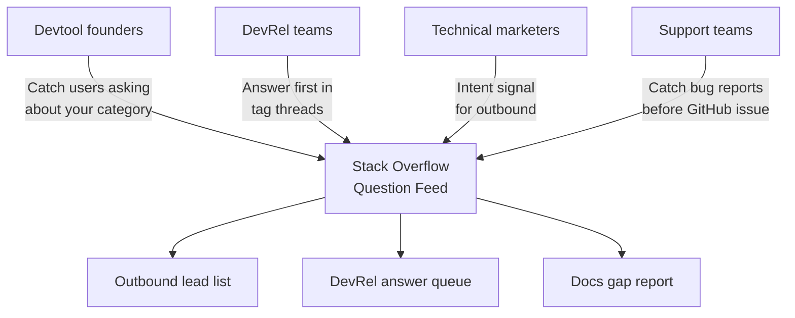
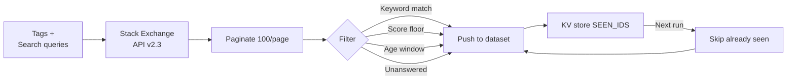
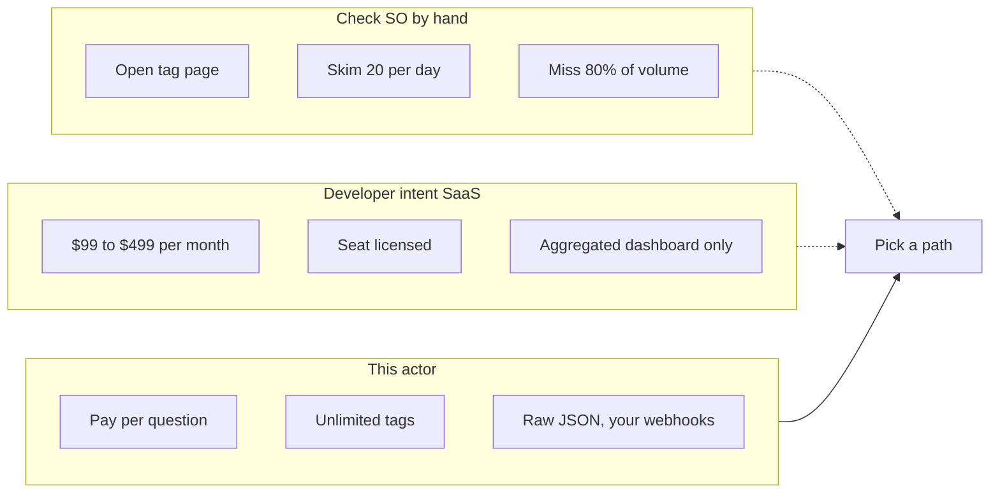

# Stack Overflow Scraper and Tag Question Monitor

Watch Stack Overflow for new questions that match your tags, keywords, score floor, and age window. Export question ID, title, full body, tags, author profile, link, score, view count, answer count, and timestamps. Dedupes across runs so you only ever see new questions.

Built for devtool founders turning "how do I do X with Y" into warm pipeline, DevRel teams answering in category threads before competitors do, and technical marketers mining Stack Overflow intent data without paying for a logs seat.

---

## Who uses this Stack Overflow scraper



| Role | What this Stack Overflow scraper unlocks |
|---|---|
| **Devtool founder** | Every "how do I" question tagged with your category, fed into a lead list as warm outbound |
| **DevRel engineer** | Queue of unanswered or rejected questions in your tag, ready for a helpful reply with a docs link |
| **Technical marketer** | Raw intent data to prioritize blog posts, landing pages, and docs against real searcher language |
| **Support team** | Catch user pain on Stack Overflow before it becomes a GitHub issue or a tweet |
| **Product manager** | Track tag volume over time to see when a category is heating up or cooling off |

---

## How the Stack Overflow scraper works



Pass a list of tags (like `langchain`, `postgres`, `react-native`) or search queries. The actor calls Stack Exchange's official API v2.3, paginates 100 items per page, filters locally for your keywords, score, age, and answered/accepted state, then pushes matching questions to the dataset.

Every question ID it pushes is stored in the key value store under `SEEN_IDS`. On the next run, already seen IDs are skipped. Schedule the actor every hour and you get a deduped feed of new questions in your tags, nothing else.

No API key required. Stack Exchange allows 300 API calls per day anonymously, which covers hourly scheduling across 4 or 5 tags for most use cases. For higher volume, paste a free key (stackapps.com/apps/oauth/register) and the cap bumps to 10,000 per day.

---

## Stack Overflow tools vs this scraper



| Feature | Developer intent SaaS | This actor |
|---|---|---|
| Pricing | $99 to $499 per month, flat | Pay per question, first 50 per run free |
| Tag cap | 10 to 50 per plan tier | Unlimited |
| Unanswered filter | Usually a premium tier | Included, one boolean away |
| Site coverage | Stack Overflow only | Any Stack Exchange site (DBA, ServerFault, Super User, etc) |
| Scheduling | Hourly at best | Apify Scheduler every 10 minutes |
| Dedup across runs | Yes, vendor owned | Yes, in your own key value store |
| Output | Dashboard or CSV | JSON, CSV, Excel, API, webhook |

---

## Quick start

Watch Python and LangChain tags for new questions mentioning "vector" or "embedding", last 7 days, unanswered only:

```bash
curl -X POST "https://api.apify.com/v2/acts/scrapemint~stackoverflow-lead-monitor/run-sync-get-dataset-items?token=YOUR_TOKEN" \
  -H "Content-Type: application/json" \
  -d '{
    "tags": ["python", "langchain"],
    "keywords": ["vector", "embedding"],
    "sortBy": "creation",
    "maxAgeHours": 168,
    "onlyUnanswered": true,
    "dedupe": true
  }'
```

Devtool founder outbound on postgres performance pain:

```json
{
  "tags": ["postgresql", "performance"],
  "searchQueries": ["postgres slow query"],
  "onlyNoAcceptedAnswer": true,
  "minScore": 0,
  "maxAgeHours": 72,
  "maxQuestionsTotal": 100
}
```

DevRel answer queue across multiple Stack Exchange sites:

```json
{
  "tags": ["kubernetes"],
  "site": "devops.stackexchange",
  "onlyUnanswered": true,
  "sortBy": "creation"
}
```

---

## What one question record looks like

```json
{
  "questionId": 78394512,
  "title": "How do I chunk a PDF for RAG with LangChain?",
  "body": "I'm trying to build a RAG pipeline with LangChain and a vector database...",
  "link": "https://stackoverflow.com/questions/78394512/how-do-i-chunk-a-pdf-for-rag-with-langchain",
  "tags": ["python", "langchain", "vector-database", "rag"],
  "score": 2,
  "viewCount": 47,
  "answerCount": 0,
  "isAnswered": false,
  "hasAcceptedAnswer": false,
  "creationDate": "2026-04-19T14:22:00.000Z",
  "lastActivityDate": "2026-04-19T14:22:00.000Z",
  "author": {
    "userId": 123456,
    "displayName": "devfounder99",
    "reputation": 347,
    "profileUrl": "https://stackoverflow.com/users/123456/devfounder99"
  },
  "site": "stackoverflow",
  "matchedKeywords": ["vector", "langchain"],
  "sourceKind": "tag",
  "sourceValue": "langchain",
  "scrapedAt": "2026-04-19T19:30:00.000Z"
}
```

Every row: question ID, title, body, direct link, tags, score, view count, answer count, accepted answer flag, creation and last activity timestamps, full author profile, and matched keywords.

---

## Pricing

First 50 questions per run are free. After that you pay per question extracted. No seat licenses. No tier gating. A 200 question run lands under $1 on the Apify free plan.

---

## FAQ

**Do I need a Stack Overflow or Stack Exchange account?**
No. The API is fully public and anonymous. You can run the actor without logging in anywhere.

**What about the API rate limit?**
Stack Exchange allows 300 API calls per day anonymously. That is enough for hourly scheduling across 4 or 5 tags with pagination. For more, grab a free API key at stackapps.com/apps/oauth/register and the cap rises to 10,000 calls per day.

**Can I monitor sites other than Stack Overflow?**
Yes. Set `site` to any Stack Exchange API identifier. Popular ones: `serverfault`, `superuser`, `dba`, `askubuntu`, `datascience`, `ai.stackexchange`, `devops.stackexchange`, `security.stackexchange`.

**How do I find tag slugs?**
Open the tag page on Stack Overflow. The URL ends with the slug. Example: `stackoverflow.com/questions/tagged/langchain` means the slug is `langchain`.

**Does the actor pull question bodies?**
Yes. Turn off `includeBody` if you only need titles and metadata, which saves dataset space.

**Can I filter for unanswered questions only?**
Yes. Set `onlyUnanswered: true`. For devtool lead gen this is the best filter since unanswered questions are live intent.

**What is the difference between unanswered and no accepted answer?**
`onlyUnanswered` returns questions with zero answers. `onlyNoAcceptedAnswer` returns questions that might have answers but none of them have been accepted by the asker. Both are strong lead gen signals.

**Does it dedupe?**
Yes. Question IDs are stored in the key value store under `SEEN_IDS`. Every run skips IDs already seen. Set `dedupe: false` to disable.

**Can I run it on a schedule?**
Yes. Apify Scheduler supports down to 1 minute. For most users every hour covers the volume.

---

## Related actors by Scrapemint

- **Hacker News Scraper** for stories and comments matching keywords
- **Reddit Lead Monitor** for subreddit and keyword mention tracking
- **Upwork Opportunity Alert** for freelance lead generation
- **Product Hunt Launch Tracker** for competitor launch monitoring
- **App Store Review Scraper** for mobile apps on iOS and Android
- **Trustpilot Brand Reputation** for DTC and ecommerce brands
- **Google Reviews Intelligence** for local businesses
- **Indeed Company Review Intelligence** for employer branding

Stack these to cover every public developer conversation surface one brand touches.
