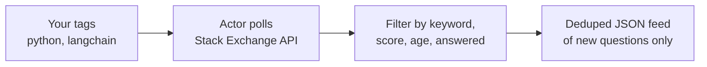
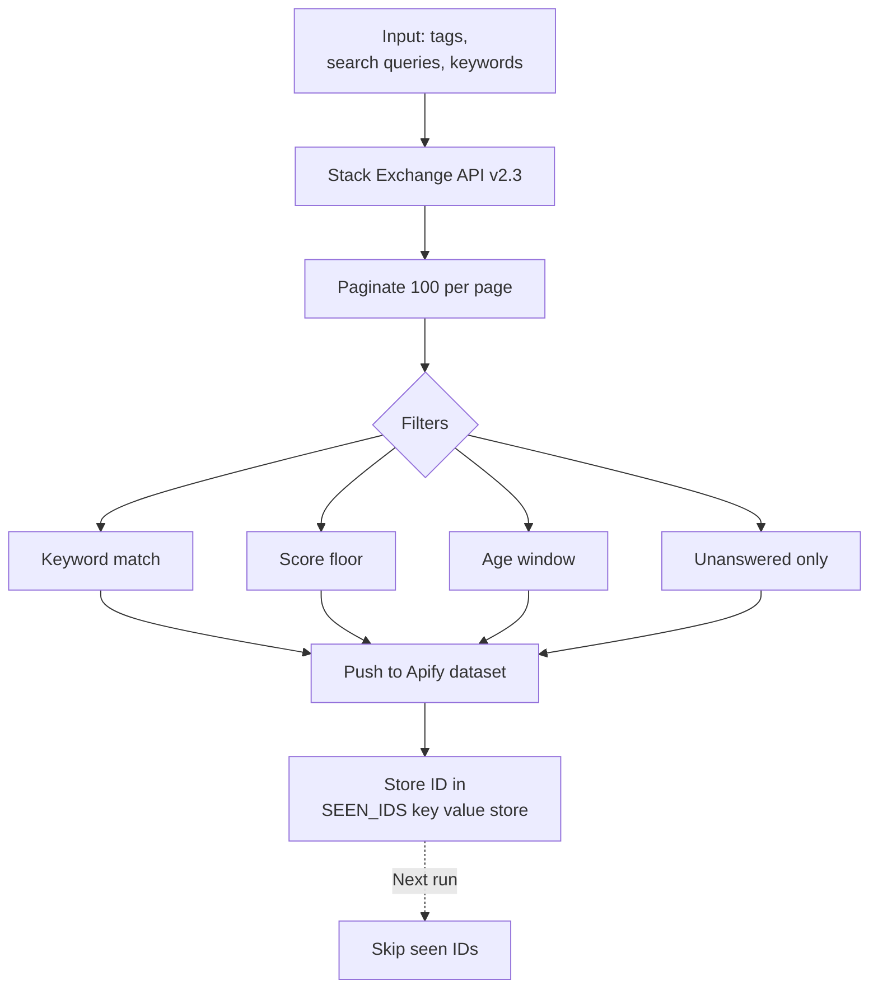
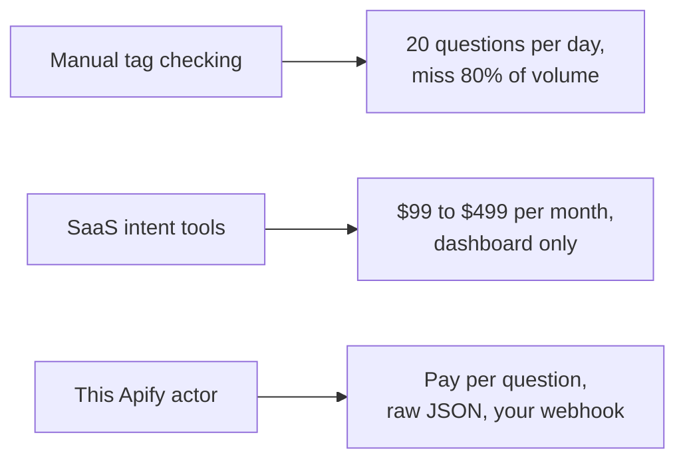

# Stack Overflow Scraper: Monitor Tags, Keywords, and New Questions

Scrape Stack Overflow questions by tag, keyword, or search query. Export titles, bodies, tags, authors, scores, and timestamps to JSON, CSV, or Excel. Deduped across runs so you only see new questions. No login. No API key. Pay per question.

**Keywords this actor is built for:** Stack Overflow scraper, Stack Overflow API data, scrape Stack Overflow questions, Stack Overflow tag monitor, Stack Exchange scraper, developer lead generation, Stack Overflow JSON export.

---

## What you get in 30 seconds



Paste a tag. Pick a filter. Get a clean JSON feed of new Stack Overflow questions every run. That is the whole product.

---

## Who this Stack Overflow scraper is for

| You are a... | You use this to... |
|---|---|
| **Devtool founder** | Find every "how do I use X" question in your category and turn it into warm outbound |
| **DevRel engineer** | Build a queue of unanswered questions in your tag, ready for a helpful reply |
| **Technical marketer** | Mine real searcher language for blog posts, docs, and landing pages |
| **Support team** | Catch user pain on Stack Overflow before it hits GitHub issues or Twitter |
| **Product manager** | Track tag volume week over week to see when a category is heating up |

---

## How it works



1. You pass tags, search queries, or both.
2. Actor calls the official Stack Exchange API v2.3 with pagination.
3. Results are filtered by your keyword list, score floor, age window, and answered state.
4. Matching questions get pushed to the dataset.
5. Every question ID is stored in a named key value store so future runs skip duplicates.

Schedule it every hour on Apify Scheduler and you get a deduped stream of new questions. Nothing else.

---

## Quick start

**Watch the `langchain` tag for new questions about vectors or embeddings:**

```json
{
  "tags": ["python", "langchain"],
  "keywords": ["vector", "embedding"],
  "maxAgeHours": 168,
  "onlyUnanswered": true
}
```

**Outbound list for postgres performance pain:**

```json
{
  "tags": ["postgresql", "performance"],
  "searchQueries": ["postgres slow query"],
  "onlyNoAcceptedAnswer": true,
  "maxAgeHours": 72,
  "maxQuestionsTotal": 100
}
```

**DevRel answer queue on a sibling Stack Exchange site:**

```json
{
  "tags": ["kubernetes"],
  "site": "devops.stackexchange",
  "onlyUnanswered": true
}
```

Or run it from the command line:

```bash
curl -X POST "https://api.apify.com/v2/acts/scrapemint~stackoverflow-lead-monitor/run-sync-get-dataset-items?token=YOUR_TOKEN" \
  -H "Content-Type: application/json" \
  -d '{"tags":["langchain"],"keywords":["vector"],"onlyUnanswered":true}'
```

---

## This scraper vs the alternatives



| Feature | Manual checking | SaaS tools | This actor |
|---|---|---|---|
| Pricing | Free, but costs time | $99 to $499 per month | Pay per question, first 2 per run free |
| Tag limit | Unlimited, if you click them all | 10 to 50 per tier | Unlimited |
| Unanswered filter | Sort by no answers | Premium tier only | Built in |
| Other Stack Exchange sites | Tab hopping | Stack Overflow only | Any site (DBA, ServerFault, Super User) |
| Scheduling | You | Hourly | Every 10 minutes |
| Dedup across runs | Your memory | Yes, vendor owned | Yes, in your key value store |
| Output | Browser tab | Dashboard or CSV | JSON, CSV, Excel, webhook, API |

---

## Sample output

One question record looks like this:

```json
{
  "questionId": 78394512,
  "title": "How do I chunk a PDF for RAG with LangChain?",
  "body": "I'm trying to build a RAG pipeline...",
  "link": "https://stackoverflow.com/questions/78394512/",
  "tags": ["python", "langchain", "vector-database", "rag"],
  "score": 2,
  "viewCount": 47,
  "answerCount": 0,
  "isAnswered": false,
  "hasAcceptedAnswer": false,
  "creationDate": "2026-04-19T14:22:00.000Z",
  "author": {
    "userId": 123456,
    "displayName": "devfounder99",
    "reputation": 347,
    "profileUrl": "https://stackoverflow.com/users/123456/"
  },
  "matchedKeywords": ["vector", "langchain"],
  "sourceKind": "tag",
  "sourceValue": "langchain"
}
```

Every field ready to drop into a CRM, a Slack channel, or a Notion database.

---

## Pricing

First 2 questions per run are free. After that you pay per extracted question. No seat licenses, no tier gating. A 200 question run lands under $1 on the Apify free plan.

---

## FAQ

**Do I need a Stack Overflow account to use this scraper?**
No. The Stack Exchange API is fully public. You run it without signing in anywhere.

**What is the Stack Exchange API rate limit?**
300 calls per day anonymously. That covers hourly runs across 4 or 5 tags. For more, get a free key from `stackapps.com/apps/oauth/register` and the cap rises to 10,000 per day.

**Can I scrape Stack Exchange sites other than Stack Overflow?**
Yes. Set `site` to any Stack Exchange slug: `serverfault`, `superuser`, `dba`, `askubuntu`, `datascience`, `ai.stackexchange`, `devops.stackexchange`, `security.stackexchange`.

**How do I find a Stack Overflow tag slug?**
Open the tag page. The URL ends with the slug. Example: `stackoverflow.com/questions/tagged/langchain` means the slug is `langchain`.

**Does the actor pull full question bodies?**
Yes by default. Turn off `includeBody` if you only need titles and metadata and want to save dataset space.

**Can I filter for unanswered questions only?**
Yes. Set `onlyUnanswered: true`. For devtool lead gen this is the best filter since unanswered questions are live intent.

**What is the difference between `onlyUnanswered` and `onlyNoAcceptedAnswer`?**
`onlyUnanswered` returns questions with zero answers. `onlyNoAcceptedAnswer` returns questions that may have answers but none were accepted. Both are strong lead gen signals.

**Does it dedupe across runs?**
Yes. Question IDs are stored in the key value store under `SEEN_IDS`. Set `dedupe: false` to disable.

**Can I run it on a schedule?**
Yes. Apify Scheduler goes down to 1 minute. Hourly covers most use cases.

**Is scraping Stack Overflow allowed?**
This actor uses the official Stack Exchange API v2.3, which is rate limited and public by design. No HTML scraping, no terms of service risk.

---

## Related Scrapemint actors

- **GitHub Issue Monitor** for issue and PR tracking by keyword and repo
- **Hacker News Scraper** for stories and comments matching keywords
- **Reddit Lead Monitor** for subreddit and keyword mention tracking
- **Upwork Opportunity Alert** for freelance lead generation
- **Product Hunt Launch Tracker** for competitor launch monitoring
- **App Store Review Scraper** for mobile apps on iOS and Android
- **Trustpilot Brand Reputation** for DTC and ecommerce brands
- **Google Reviews Intelligence** for local businesses
- **Indeed Company Review Intelligence** for employer branding
- **Amazon Review Intelligence** for product review mining

Stack these to cover every public developer and customer conversation surface one brand touches.
