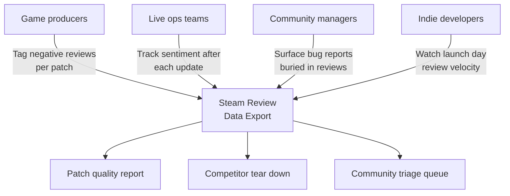
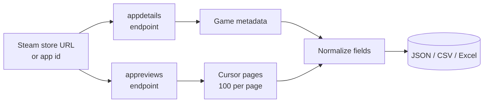
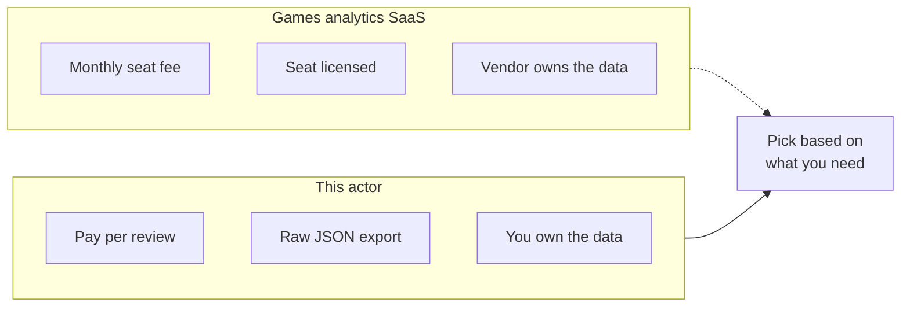

# Steam Review Intelligence and Steam Game Data Export Tool

Export every review for any Steam game into a clean JSON, CSV, or Excel file. Pull review text, thumbs up or down, playtime at the moment the review was written, Steam purchase flag, early access flag, helpful and funny votes, plus store metadata like developer, publisher, genres, price, release date, and Metacritic score for your game and every competitor in one run.

Built for game producers, live ops teams, indie developers, community managers, and market researchers who need Steam review data without building a scraper from scratch or paying for a games analytics seat.

---

## Who uses this Steam review scraper



| Role | What this scraper unlocks |
|---|---|
| **Game producer** | Sentiment split by patch window, so you see which update lost goodwill |
| **Live ops** | Review velocity and thumbs ratio tracked the same day a patch ships |
| **Community manager** | Bug and refund threats pulled straight into a triage queue |
| **Indie developer** | Launch signal without paying for a games analytics dashboard |
| **Market researcher** | Full review corpus plus owners band for genre and pricing studies |

---

## How the Steam review scraper works



Paste one or more Steam store URLs or bare numeric app IDs. The actor pulls the public store metadata feed and the public review feed Steam already exposes, then returns one normalized dataset. No login, no captcha, no fragile DOM pulling.

Store metadata comes from Steam's appdetails endpoint: name, developer, publisher, genres, price, release date, and Metacritic score.

Reviews come from the same appreviews endpoint the Steam community page uses. Pagination follows Steam's cursor, 100 reviews per page, so popular titles return thousands of reviews per pull. Each row carries playtime at the moment the review was posted, which is the field most teams use to weight credibility.

Turn on the SteamSpy option to add an estimated owners band, average playtime, and concurrent player count per game.

---

## Games dashboards vs this scraper



| Feature | Games analytics SaaS | This actor |
|---|---|---|
| Pricing | Monthly seat fee, flat | Pay per review, first 100 per run free |
| Coverage | Titles on your plan tier | Any public Steam app id |
| Playtime context | Often summarized only | Playtime at review on every row |
| Data ownership | Vendor hosts behind a login | Raw JSON in your account |
| Scheduling | Built in, but locked in | Apify Scheduler, plus webhooks to Slack or your DB |
| Export format | CSV or PDF, often paywalled | JSON, CSV, Excel, or API |

---

## Quick start

Export recent reviews for one game:

```bash
curl -X POST "https://api.apify.com/v2/acts/scrapemint~steam-game-review-intelligence/run-sync-get-dataset-items?token=YOUR_TOKEN" \
  -H "Content-Type: application/json" \
  -d '{
    "appUrls": [
      { "url": "https://store.steampowered.com/app/570/Dota_2/" }
    ],
    "maxReviewsPerApp": 500
  }'
```

Compare your game against two competitors, English negative reviews only, Steam purchases only:

```json
{
  "appUrls": [
    { "url": "https://store.steampowered.com/app/570/Dota_2/" },
    { "url": "730" },
    { "url": "https://store.steampowered.com/app/578080/PUBG/" }
  ],
  "maxReviewsPerApp": 2000,
  "reviewLanguage": "english",
  "reviewType": "negative",
  "purchaseType": "steam",
  "sortBy": "recent",
  "includeSteamSpy": true
}
```

Mix store URLs and bare app IDs in the same run.

---

## What one review record looks like

```json
{
  "platform": "steam",
  "appId": "570",
  "appName": "Dota 2",
  "developer": "Valve",
  "publisher": "Valve",
  "genres": "Action, Free To Play, Strategy",
  "price": "Free",
  "releaseDate": "9 Jul, 2013",
  "metacritic": 90,
  "appReviewScoreDesc": "Very Positive",
  "appTotalPositive": 1684231,
  "appTotalNegative": 312004,
  "reviewId": "187654321",
  "votedUp": false,
  "sentiment": "negative",
  "text": "Matchmaking fell apart after the 7.36 patch...",
  "language": "english",
  "votesUp": 41,
  "votesFunny": 3,
  "steamPurchase": true,
  "writtenDuringEarlyAccess": false,
  "playtimeForeverMin": 58420,
  "playtimeAtReviewMin": 57190,
  "createdAt": "2026-04-18T14:22:00.000Z",
  "sourceUrl": "https://store.steampowered.com/app/570/Dota_2/",
  "scrapedAt": "2026-05-17T19:30:00.000Z"
}
```

Every row carries the game metadata, the store wide review score, the single review with thumbs direction, votes, purchase and early access flags, the reviewer's library size, and playtime at the moment the review was written.

---

## Pricing

First 100 reviews per run are free. After that you pay per review extracted. No seat licenses. No tier gating. 1000 reviews lands under $2 on the Apify free plan.

---

## FAQ

**Can this pull Steam reviews for any game?**
Yes. Any title with a public Steam store page. Paste the store URL or the numeric app id and the actor pulls the review feed.

**How many reviews can I get per game?**
Steam paginates 100 reviews per cursor page with no documented ceiling, so a popular title can return tens of thousands. The `maxReviewsPerApp` cap controls the stop point.

**Is pulling Steam reviews legal?**
Both feeds are public and Steam exposes them openly. The appreviews and appdetails endpoints are the same ones the Steam store and community pages call.

**How do I track sentiment per patch?**
Each review carries the created date and playtime at review. Group by date around your patch windows in a spreadsheet and the thumbs ratio shift shows which update moved sentiment.

**What is playtime at review and why does it matter?**
It is how many minutes the reviewer had played when they posted. Teams use it to down weight drive by reviews and trust reviews from players with real hours in the game.

**Can I filter to one language or only negative reviews?**
Yes. Set `reviewLanguage` to a Steam language code, `reviewType` to positive or negative, and `purchaseType` to Steam purchases only.

**What does the SteamSpy option add?**
An estimated owners band, average playtime, and concurrent player count per game. It adds one extra request per app and is off by default.

**Can I run this on a schedule?**
Yes. Use the Apify Scheduler to run hourly or daily. Add a webhook to push fresh negative reviews straight to Slack on patch day.

---

## Related actors by Scrapemint

- **App Review Intelligence** for iOS App Store and Google Play reviews
- **ProductHunt Launch Tracker** for launch day signal

Stack these to cover every review surface one product touches.
