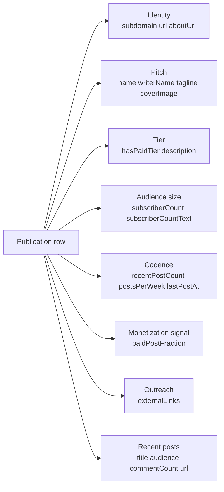

# Substack Newsletter Intelligence: Top Writer Tracker

Track Substack publications at scale. Each row carries the publication identity, writer name, tagline, description, cover image, subscriber count parsed from the public about page, paid tier flag, external links (Twitter / X, LinkedIn, GitHub, YouTube), and optional recent posts with comment counts and free vs paid mix. Pay per publication row. No auth required.

**Built for** ad networks pitching sponsored newsletters, creator economy VCs scouting paid writers before they break out, agencies building newsletter benchmarks for clients, content marketers studying competitive editorial calendars, talent reps sourcing writers, and aspiring writers reverse engineering top performers' posting cadence and paid post ratio.

**Keywords this actor ranks for:** substack api, substack scraper, substack newsletter tracker, substack subscriber count, newsletter intelligence, creator economy data, substack writer profile, paid newsletter tracker, substack discovery, sponsored newsletter prospecting, newsletter sponsorship sales, creator economy investment, substack analytics.

---

## Why this actor

| Other newsletter tools | **This actor** |
|---|---|
| Sparkloop, Beehiiv recommend network: $99 to $499 per month per seat | Pay per row scraped. No seat license. |
| Manual subdomain by subdomain browsing | Structured JSON one row per publication. |
| English / US only | Works on any Substack publication globally. |
| Top level data only | Optional recent posts with audience flag (everyone vs paid) and comment count. |
| Drop writer external links | Pull writer's X, LinkedIn, YouTube, GitHub for outreach. |
| Free vs paid posting cadence hidden | `paidPostFraction` and `postsPerWeek` derived from the archive API. |
| Last post date unknown | `lastPostAt` parsed from the most recent post. |

---

## How it works

```mermaid
flowchart LR
    A[Subdomains<br/>Publication URLs<br/>Search queries] --> B[Seed router]
    B --> C[About page<br/>{sub}.substack.com/about]
    B --> D[Search page<br/>substack.com/search/{term}]
    D --> E[Harvest publication cards<br/>via rendered DOM]
    E --> C
    C --> F[Parse HTML<br/>meta tags + body text]
    F --> G[Subscriber count<br/>writer name + paid flag<br/>external links]
    F --> H{fetchRecentPosts?}
    H -->|yes| I[/api/v1/archive<br/>public JSON]
    I --> J[Recent posts<br/>audience + comments<br/>paid mix + cadence]
    G --> K[(Publication row)]
    J --> K
```

About pages are server rendered and include the subscriber count in plain text ("446,000 subscribers"). The archive API is public, returns one row per post with title, audience (everyone vs paid), comment_count, and post_date. We derive `paidPostFraction`, `postsPerWeek`, and `lastPostAt` from the post window.

---

## What you get per row



`paidPostFraction` is the share of recent posts gated for paid subscribers. Combined with `subscriberCount`, it's a usable proxy for monthly recurring revenue tier (writers with a high paid fraction + high subscriber count are the buyers ad networks chase).

---

## Quick start

**Daily snapshot of named top writers**

```json
{
  "subdomains": ["noahpinion", "platformer", "stratechery", "garbageday", "lennysnewsletter"],
  "fetchRecentPosts": true,
  "maxRecentPosts": 12
}
```

**Discover by topic across queries**

```json
{
  "queries": ["AI safety", "product management", "creator economy"],
  "maxPublications": 100,
  "fetchRecentPosts": true
}
```

**Direct publication URLs including custom domains**

```json
{
  "publicationUrls": [
    "https://noahpinion.substack.com",
    "https://www.platformer.news",
    "https://stratechery.com"
  ],
  "fetchAuthorLinks": true
}
```

**Lightweight outreach list (no post enrichment)**

```json
{
  "queries": ["sales prospecting", "B2B SaaS"],
  "maxPublications": 50,
  "fetchRecentPosts": false,
  "fetchAuthorLinks": true
}
```

---

## Sample output

```json
{
  "subdomain": "noahpinion",
  "url": "https://noahpinion.substack.com/",
  "aboutUrl": "https://noahpinion.substack.com/about",
  "name": "Noahpinion",
  "writerName": "Noah Smith",
  "tagline": "Economics and other interesting stuff",
  "description": "Economics and other interesting stuff. Click to read Noahpinion, by Noah Smith, a Substack publication with hundreds of thousands of subscribers.",
  "coverImage": "https://substackcdn.com/image/fetch/.../subscribe-card.jpg",
  "subscriberCount": 446000,
  "subscriberCountText": "446,000 subscribers",
  "hasPaidTier": true,
  "externalLinks": [
    "https://twitter.com/Noahpinion",
    "https://www.youtube.com/@noahpinion"
  ],
  "sourceQuery": null,
  "recentPostCount": 12,
  "paidPostFraction": 0.5,
  "lastPostAt": "2026-05-13T09:40:06.112Z",
  "postsPerWeek": 4.2,
  "recentPosts": [
    {
      "id": 197453444,
      "title": "Trump actually started to decouple America from China",
      "subtitle": "And other notes on the tariff war",
      "slug": "trump-actually-started-to-decouple",
      "postDate": "2026-05-13T09:40:06.112Z",
      "audience": "everyone",
      "type": "newsletter",
      "commentCount": 312,
      "wordcount": 2840,
      "podcastDuration": null,
      "url": "https://noahpinion.substack.com/p/trump-actually-started-to-decouple"
    }
  ],
  "scrapedAt": "2026-05-15T22:00:00.000Z"
}
```

---

## Who uses this

| Role | Use case |
|---|---|
| Ad network / Sparkloop seller | Pitch sponsored newsletter slots. Filter by subscriber count and paidPostFraction. |
| Creator economy VC | Scout breakout writers. Watch postsPerWeek + subscriberCount over time. |
| Agency | Benchmark client newsletters against category leaders. |
| Content marketer | Reverse engineer top performers' editorial cadence, paid mix, and post topics. |
| Talent rep | Build outreach lists from externalLinks (writer's X, LinkedIn). |
| Newsletter founder | Compete intel on competitor cadence and tier strategy. |
| Aspiring writer | Find writers in your niche to study and learn from. |
| Recruiter | Source senior writers and journalists publishing under their own name. |

---

## Input reference

| Field | Type | What it does |
|---|---|---|
| `subdomains` | string[] | Direct Substack subdomain slugs. Skip discovery, jump to enrichment. |
| `publicationUrls` | string[] | Direct publication URLs (substack.com subdomain or custom domain pointing back). |
| `queries` | string[] | Substack search terms. Renders substack.com/search/{term} via Playwright. |
| `fetchRecentPosts` | boolean | Pull recent posts from the public archive API. |
| `maxRecentPosts` | integer | Recent posts per publication. 12 is the Substack default page. |
| `fetchAuthorLinks` | boolean | Pull writer's external links (X, LinkedIn, YouTube, GitHub). |
| `maxPublications` | integer | Hard cap on rows per run. |
| `maxResultsPerQuery` | integer | Cap on publications harvested per search query. |
| `dedupe` | boolean | Skip subdomains already pushed in previous runs. |
| `navigationDelayMs` | integer | Pause between page loads. 1000 to 3000 ms is safe. |
| `concurrency` | integer | Parallel browser pages. 3 to 6 is safe on residential. |
| `proxyConfiguration` | object | Apify proxy. Datacenter is fine for Substack. |

---

## API call

```bash
curl -X POST \
  "https://api.apify.com/v2/acts/YOUR_USER~substack-newsletter-intelligence/runs?token=YOUR_TOKEN" \
  -H "Content-Type: application/json" \
  -d '{
    "queries": ["AI safety", "creator economy"],
    "fetchRecentPosts": true,
    "maxPublications": 100
  }'
```

---

## Pricing

The first 3 publication rows per run are free so you can validate the schema before paying. After that, one charge per publication row regardless of how many enrichment fields you turn on. Recent posts, paid post fraction, posting cadence, and author links are included at no extra per row charge.

---

## FAQ

### Do I need a Substack account?

No. The actor only touches the public /about page and the public archive API that any anonymous web visitor can see.

### Why do some publications return null for subscriberCount?

Substack only displays a subscriber count once a publication crosses a threshold (commonly 1,000). Small publications display "Subscribe" without a count. The field stays null in that case.

### Does it work for custom domains?

Yes. Many Substack publications front a custom domain (example: stratechery.com). The actor follows the custom domain to /about. If a publication switched fully off Substack, /about will 404 and the row will be skipped.

### How fresh is the data?

Each run hits the live /about page and archive API. Subscriber counts and recent posts reflect what Substack shows at scrape time.

### Will Substack block me?

Substack is lightly defended. Datacenter proxy works for low volume. Switch to residential past a few hundred requests in a short window. Navigation delay of 1500 ms is the default safe band.

### How is this different from Beehiiv's recommend network?

Beehiiv's recommend network is a closed marketplace for cross promotion between newsletters on Beehiiv. This actor pulls open public data on Substack publications, which is a different platform and a different buyer profile (sponsorship sellers, VCs, agencies).

### Can I track a writer over time?

Run the actor on an Apify schedule and store snapshots. The dataset will have one row per scrape per subdomain. Plot `subscriberCount`, `postsPerWeek`, `paidPostFraction` over time to spot inflection points.

### What is the audience field on a post?

Substack tags every post with `audience` set to one of: `everyone` (free), `only_paid` (paid only), `founding` (founding tier only). The actor passes this through unchanged so you can compute paid mix or filter to free posts only.

### Can I get post body content?

Not in this actor by design. Post body extraction is a different shape (one row per post, paid wall handling, image extraction). For full post bodies pair this actor with Apify's Website Content Crawler pointed at the post URLs returned here.

### Why only 12 recent posts by default?

Twelve is the Substack archive page size. You can raise `maxRecentPosts` up to 100 for deeper history at no extra per row charge.

---

## Related actors

- **GitHub Trending Scraper**. Catch dev writers cross posting between Substack and GitHub.
- **HN Lead Monitor**. Surface Hacker News mentions of Substack publications for sponsor leads.
- **Reddit Lead Monitor**. Same applied to Reddit, useful for tracking newsletter recommendations.
- **Website Content Scraper: Clean Markdown for AI and RAG**. Pipe `recentPosts[].url` into the crawler for full body extraction with paid wall handling.
- **Lead Enrichment Pipeline**. Pipe writer external links through the enrichment pipeline for direct outreach contact info.
