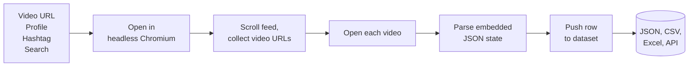
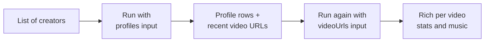
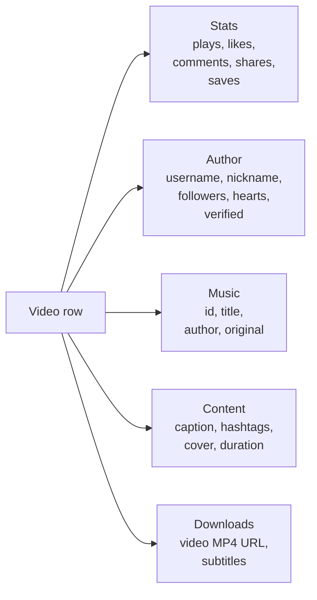

# TikTok Scraper: Videos, Profiles, Hashtags & Music Data to JSON

Scrape TikTok without an API key. Pull plays, likes, shares, saves, follower counts, hearts, captions, hashtags, and music from any TikTok video, creator profile, hashtag, or search. One JSON row per item. Pay only for what you keep.

**Ranks for:** TikTok scraper, TikTok API alternative, TikTok API free, scrape TikTok videos, TikTok data export, TikTok profile scraper, TikTok follower count API, TikTok hashtag tracker, TikTok trend monitor, TikTok video downloader, TikTok music search, TikTok creator stats, TikTok to CSV, TikTok to JSON.

---

## How it works



Feed the actor a hashtag, a handle, a search query, or a direct video URL. The actor walks the page, extracts the embedded rehydration state, and returns one clean row per video and per profile.

---

## What works today

| Input | Status | What you get |
|---|---|---|
| `videoUrls` | Reliable | Full stats, author, music, hashtags, download URL. |
| `profiles` | Reliable | Profile row (followers, hearts, bio) plus recent videos. |
| `hashtags` | Limited | TikTok restricts anonymous hashtag browsing. Expect few or no results without a session. |
| `searchQueries` | Limited | TikTok redirects anonymous search to the For You feed. Limited results without a session. |

> **Best practice:** scrape a list of profiles first, collect the returned video URLs, then run the actor again with `videoUrls` for full stats. Diagram below.

---

## Recommended workflow



Two runs. First pulls recent URLs per creator. Second returns the full stat sheet per video. Cheap, reliable, scales to thousands of creators.

---

## Quick start

**Creator stats and recent videos:**

```json
{
  "profiles": ["gordonramsayofficial", "khaby.lame"],
  "resultsPerPage": 30
}
```

**Single video deep dive:**

```json
{
  "videoUrls": [
    "https://www.tiktok.com/@gordonramsayofficial/video/7341108653442829601"
  ],
  "scrapeComments": true,
  "maxCommentsPerVideo": 100
}
```

**Bulk video stat refresh (campaign measurement):**

```json
{
  "videoUrls": [
    "https://www.tiktok.com/@creator_a/video/7000000000000000001",
    "https://www.tiktok.com/@creator_b/video/7000000000000000002"
  ],
  "dedupe": false
}
```

---

## Sample output

Per video row:

```json
{
  "type": "video",
  "id": "7341108653442829601",
  "url": "https://www.tiktok.com/@gordonramsayofficial/video/7341108653442829601",
  "text": "Its curry in a hurry from #NextLevelKitchen !",
  "createTime": "2024-02-29T19:31:02.000Z",
  "duration": 87,
  "cover": "https://p19-common-sign-useastred.tiktokcdn-eu.com/...",
  "authorUsername": "gordonramsayofficial",
  "authorNickname": "Gordon Ramsay",
  "authorVerified": true,
  "authorFollowers": 40900000,
  "authorHearts": 727100000,
  "authorVideoCount": 686,
  "plays": 26900000,
  "likes": 1900000,
  "comments": 14400,
  "shares": 101200,
  "saves": 474125,
  "hashtags": ["nextlevelkitchen"],
  "musicId": "7341108705247382305",
  "musicTitle": "original sound",
  "musicAuthor": "Gordon Ramsay",
  "musicOriginal": true,
  "downloadAddr": "https://v16-webapp-prime.tiktok.com/video/...mp4"
}
```

Per profile row:

```json
{
  "type": "profile",
  "id": "6747935906352907269",
  "username": "gordonramsayofficial",
  "nickname": "Gordon Ramsay",
  "verified": true,
  "signature": "I cook sometimes too.....",
  "followers": 40900000,
  "following": 571,
  "hearts": 727100000,
  "videoCount": 686
}
```

---

## What you get back



Every row is self contained. No joins required.

---

## Who uses this

| Role | Use case |
|---|---|
| Brand marketer | Measure branded hashtag reach and UGC volume. |
| Talent agency | Rank creators by followers, engagement, and video cadence. |
| Trend researcher | Surface rising videos for a topic, sound, or niche. |
| Music label | Track sound usage and top remix creators. |
| Social listening team | Feed TikTok signals into sentiment and share of voice models. |
| Ad buyer | Validate creator reach and average plays before paying for a sponsorship. |
| Affiliate marketer | Find high intent videos in a product category for outreach. |

---

## Input reference

| Field | Type | Purpose |
|---|---|---|
| `videoUrls` | string[] | Direct video URLs. Most reliable source. |
| `profiles` | string[] | Usernames or profile URLs. |
| `hashtags` | string[] | Hashtag names, with or without `#`. |
| `searchQueries` | string[] | Keyword searches. |
| `resultsPerPage` | integer | Cap per source. Default 100. |
| `profileScrapeSections` | enum | `videos`, `reposts`, `liked`, `favorites`. |
| `searchSection` | enum | `top`, `videos`, `users`, `live`. |
| `downloadVideos` | boolean | Save MP4s and include a download URL per row. |
| `downloadSubtitles` | boolean | Extract auto captions. Paid add on. |
| `subtitleLanguages` | string[] | Preferred language codes, first match wins. |
| `scrapeComments` | boolean | Collect top comments per video. Paid add on. |
| `maxCommentsPerVideo` | integer | Cap on comments per video. |
| `countryCode` | string | Two letter ISO code. Changes geo ranking. Paid add on. |
| `dedupe` | boolean | Skip IDs already pushed in previous runs. |
| `maxVideosTotal` | integer | Hard cap across all sources. Default 500. |
| `proxyConfiguration` | object | Apify proxy. Residential recommended. |

---

## API example

Call the actor from any backend. Swap in your Apify user and token.

```bash
curl -X POST \
  "https://api.apify.com/v2/acts/YOUR_USER~tiktok-scraper/runs?token=YOUR_TOKEN" \
  -H "Content-Type: application/json" \
  -d '{
    "profiles": ["gordonramsayofficial"],
    "resultsPerPage": 30
  }'
```

Poll the run, read the dataset. Or use the Apify client SDK in Node, Python, or PHP.

---

## TikTok scraper alternatives compared

|  | Official TikTok Research API | Custom scraper | **This actor** |
|---|---|---|---|
| Access | Gated, academic email | Self hosted maintenance | Anyone with an Apify account |
| Setup time | Weeks of approval | Days of coding | 60 seconds |
| Video stats | Yes | Yes if you code it | Yes out of the box |
| Creator stats | Limited | Yes if you code it | Yes out of the box |
| Music data | No | Yes if you code it | Yes out of the box |
| Video MP4 download | No | Yes if you code it | Yes, toggle on |
| Proxy and anti block | Your problem | Your problem | Handled |
| Pricing | N/A | Proxy + server bill | Pay per video row |

---

## Pricing

First 10 videos per run are free so you can test the output before paying. After that you pay per video row. Profile rows, music fields, and hashtag arrays ride along at no extra cost. Subtitles, comments, and country filter are paid add ons billed per row when enabled.

---

## FAQ

**Is there a free TikTok API?**
TikTok's own Research API is gated to approved academics. This actor gives anyone public TikTok data with a pay per use model, no API key required.

**How do I scrape TikTok without an API key?**
Pick a profile or a direct video URL, drop it in the input, hit Start. The actor handles headless Chromium, fingerprint rotation, and residential proxy for you.

**Can I download TikTok videos as MP4?**
Yes. Turn on `downloadVideos`. Each row includes a `downloadAddr` link to the source MP4.

**How accurate are TikTok follower counts?**
The counts come straight from TikTok's rendered profile response, same numbers a visitor sees in the web app. Accurate at the moment of the scrape.

**Does it return TikTok comments?**
Yes. Enable `scrapeComments` and set `maxCommentsPerVideo`. The actor opens the comment drawer on each video and pulls the top comments.

**Can I get TikTok video transcripts or subtitles?**
Yes. Enable `downloadSubtitles` and list preferred languages. The actor returns the caption track URL and language code when TikTok has auto captions available.

**Does it work for private accounts?**
No. Only public profiles, hashtags, and videos.

**Why do hashtag runs sometimes return zero videos?**
TikTok restricts anonymous hashtag browsing. Use `profiles` or `videoUrls` for reliable output. See the recommended workflow above.

**Can I run this on a schedule?**
Yes. Use the Apify scheduler to run the actor hourly, daily, or weekly. Turn `dedupe` off if you want a fresh snapshot each run for trend tracking.

**Does it work in any country?**
Set `countryCode` to the two letter ISO code. The actor matches the proxy locale and returns results as they appear to viewers in that country.

**Is scraping TikTok allowed?**
This actor reads public HTML that any web visitor can see. Respect TikTok's terms and rate limit sensibly. Do not store or redistribute content you do not have the right to use.

---

## Related actors

- **Reddit Brand Monitor & Lead Finder** for subreddit mentions and high intent leads
- **Google Maps Scraper** for local business data and reviews
- **TripAdvisor Review Intelligence** for hotel and restaurant review monitoring
- **Yelp Review Intelligence** for local service reviews
- **Amazon Review Intelligence** for product review tracking
- **Zillow Home Price Scraper** for real estate listings and price history
