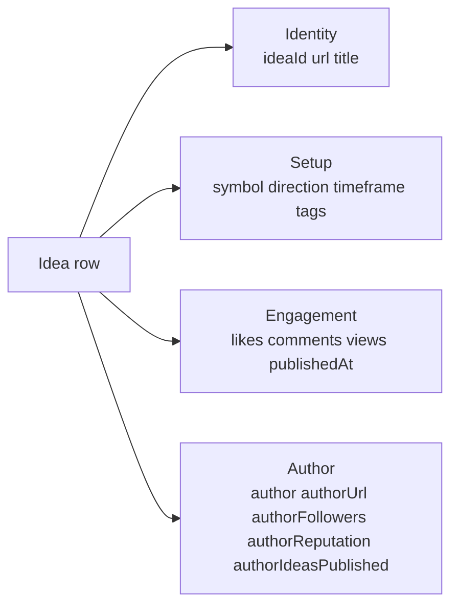

# TradingView Ideas Intelligence (No Login Required)

Pull public TradingView trade ideas from any symbol, category, or tag. No cookies. No login. No TradingView Pro account. Each row ships the idea ID, title, description snippet, symbol, direction (long, short, education), timeframe, chart snapshot image URL, author handle, plus author intel like follower count, total ideas published, and TradingView reputation. Pay per idea.

**Built for** retail traders sourcing setups, prop firm analysts surveying the FX and crypto idea flow, fintech newsletter writers tracking what is being called, sentiment quants modelling crowd direction, and trader copy platforms benchmarking author pull.

**Keywords this actor ranks for:** tradingview intelligence, tradingview ideas api, tradingview ideas intelligence, tradingview author intelligence, forex trade ideas api, crypto trade ideas api, retail trader sentiment, tradingview followers, copy trading research, fx setups api, btc ideas tracker.

---

## Why this actor

| Other TradingView scrapers | **This actor** |
|---|---|
| Need a TradingView session cookie | Zero cookies, zero login |
| Return one HTML blob per page | Idea ID, title, symbol, direction, timeframe, likes, views, tags parsed |
| Drop author intel | Author followers, reputation, total ideas published embedded on every idea row |
| Charge per page hit | Charge per idea row, no contract |
| Get rate limited at five rows | Built on residential proxy with session pooling for sustained runs |

---

## How it works

```mermaid
flowchart LR
    A[Symbol or category or tag] --> B[Build TradingView ideas URL]
    B --> C[Open the public SPA<br/>no auth needed]
    C --> D[Paginate the ideas grid<br/>respect maxIdeasPerSource]
    D --> E[Anchor on chart link pattern<br/>walk to article card]
    E --> F[Parse title, symbol, direction,<br/>timeframe, likes, views]
    F --> G[Lazy fetch author intel<br/>once per unique author]
    G --> H[Embed author intel into row]
    H --> I[Push one row per idea]
    I --> J[(JSON CSV Excel API)]
```



The actor anchors extraction on the public `/chart/<chartId>/<slug>/` link pattern that TradingView renders on every idea card. That keeps it resilient to the React class name churn that breaks most TradingView scrapers within weeks. Author intel is fetched once per unique author and embedded onto every idea row from that author.

---

## What you get per row



Pipe straight into a sentiment dashboard, a copy trader leaderboard, or a newsletter scout sheet.

---

## Quick start

**Sweep the EURUSD and GBPUSD idea flow**

```json
{
  "symbols": ["EURUSD", "GBPUSD"],
  "maxIdeasPerSource": 100
}
```

**Track every BTCUSD long published this week**

```json
{
  "symbols": ["BTCUSD"],
  "direction": "long",
  "maxIdeasPerSource": 200,
  "includeAuthorIntel": true
}
```

**Survey the wider forex and crypto idea flow**

```json
{
  "categories": ["forex", "crypto"],
  "maxIdeasPerSource": 60
}
```

---

## Sample output

```json
{
  "ideaId": "abc123Xy",
  "url": "https://www.tradingview.com/chart/EURUSD/abc123Xy-eurusd-double-top-rejection/",
  "title": "EURUSD double top rejection at 1.0950, target 1.0820",
  "description": "Price printed a clean double top at the September swing high. RSI divergence on the 4H plus rejection from the daily POC...",
  "symbol": "EURUSD",
  "direction": "short",
  "timeframe": "4h",
  "imageUrl": "https://s3.tradingview.com/snapshots/.../abc123Xy_big.png",
  "author": "fxsetups_pro",
  "authorUrl": "https://www.tradingview.com/u/fxsetups_pro/",
  "authorFollowers": 18420,
  "authorIdeasPublished": 312,
  "authorReputation": 4870,
  "likes": 284,
  "comments": 47,
  "views": 12930,
  "publishedAt": "2026-05-09T14:22:00.000Z",
  "tags": ["trend-analysis", "double-top", "eurusd"],
  "isEditorsPick": false,
  "sourceType": "symbol",
  "sourceKey": "symbol:EURUSD",
  "scrapedAt": "2026-05-10T09:30:00.000Z"
}
```

---

## Who uses this

| Role | Use case |
|---|---|
| Retail trader | Source setups across EURUSD, BTCUSD, SPX from top authors weekly |
| Prop firm analyst | Survey idea flow per pair to gauge crowd positioning |
| Fintech newsletter | Pull the most liked weekly forex and crypto ideas with snapshots |
| Sentiment quant | Model long vs short ratio per symbol per day |
| Copy trader | Rank authors by follower count, reputation, and recent like velocity |
| Discord server admin | Curate the top three setups per pair into a daily digest |
| Trading educator | Track which patterns and tags trend across retail audience |

---

## Input reference

| Field | Type | What it does |
|---|---|---|
| `symbols` | string[] | TradingView symbols. One ideas page per symbol. |
| `categories` | string[] | Category sweeps: forex, crypto, stocks, futures, indices, economy, bitcoin, education. |
| `tags` | string[] | TradingView idea tags such as trend-analysis, fibonacci, supply-and-demand. |
| `direction` | string | Filter by long, short, education, or all. Default all. |
| `maxIdeasPerSource` | integer | Max ideas collected per source before pagination stops. Default 60. |
| `includeAuthorIntel` | boolean | Embed author followers, reputation, ideas published onto every row. Default true. |
| `concurrency` | integer | Pages processed in parallel. Five is the safe default. |
| `proxyConfiguration` | object | Apify proxy. Residential is required at any meaningful volume. |

---

## API call

```bash
curl -X POST \
  "https://api.apify.com/v2/acts/YOUR_USER~tradingview-ideas-scraper/runs?token=YOUR_TOKEN" \
  -H "Content-Type: application/json" \
  -d '{
    "symbols": ["EURUSD"],
    "maxIdeasPerSource": 100
  }'
```

---

## Pricing

The first 25 idea rows per run are free so you can validate output before paying. After that, each idea row is charged. No surprise add on charges.

---

## FAQ

### Do I need a TradingView Pro account?

No. The actor only touches TradingView's public ideas pages and public author profiles. Your account is never touched.

### Can I get the actual chart data behind the idea?

The actor returns the public chart snapshot image URL plus the structured idea metadata. Live OHLC for the symbol is not pulled here , pair it with a market data feed if you need bars.

### How many ideas can I pull per symbol?

Up to `maxIdeasPerSource`, capped at 1000. Most active symbols on TradingView surface several hundred recent ideas through the public ideas grid.

### Can I filter by direction?

Yes. Set `direction` to long, short, or education. The default keeps everything.

### What about Pine scripts or strategies?

This actor returns trade ideas, not Pine Script publications. Strategy and indicator scrolls live on a separate TradingView surface.

### How fresh is the data?

Each run hits the live page, so likes, views, and the most recent ideas reflect what TradingView renders at pull time. Schedule daily runs to track sentiment shifts.

### Is pulling TradingView allowed?

This actor reads HTML any anonymous web visitor can see. Respect TradingView's terms and rate limit sensibly. Do not redistribute personal data you have no lawful basis to process.

---

## Related actors

- **Polymarket Intelligence** , pull live prediction market odds, volume, and resolution metadata
- **Sports Odds Intelligence** , pull live moneyline, spread, and total odds across sportsbooks
- **Crypto Whale Token Launch Tracker** , pull on-chain whale wallet activity around new launches
- **Google Patents Intelligence** , pull patent metadata, claims, and citations by query
- **PubMed Clinical Trials Intelligence** , pull clinical trials and pubmed records by condition
