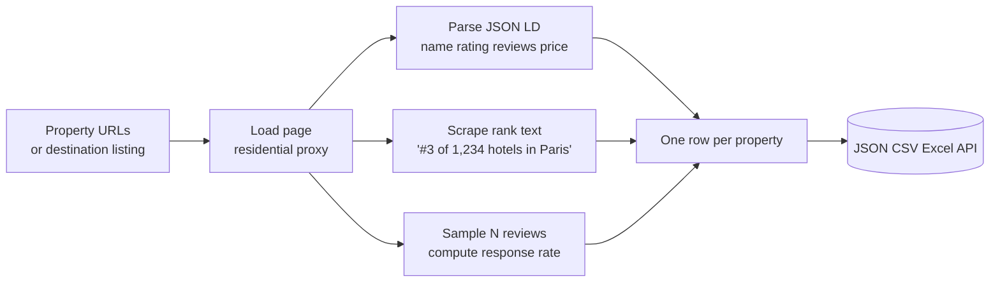
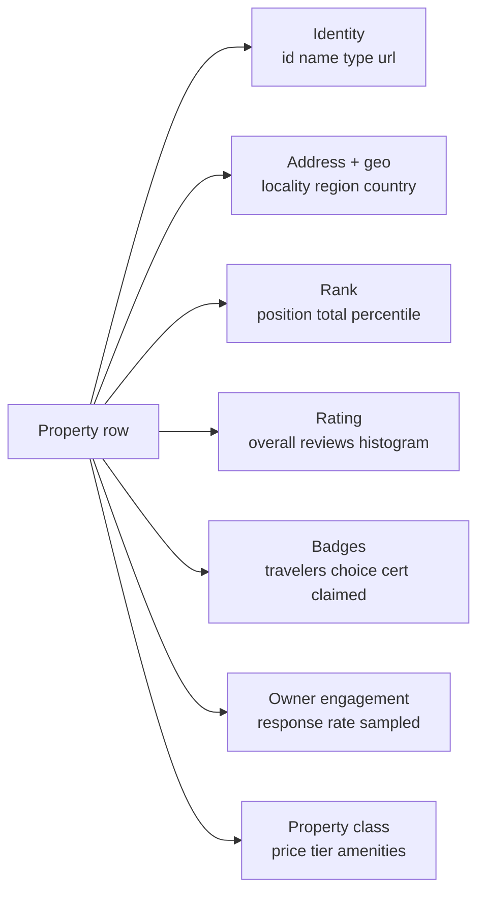

# TripAdvisor Property Rank Tracker — Hotel & Restaurant Competitor Benchmark

Track daily TripAdvisor rank, rating drift, review volume, and owner response rate for any hotel, restaurant, or attraction. One row per property per run. No reputation SaaS subscription. No rank tracker seat. Pay per snapshot.

**Built for** hotel general managers, restaurant owners, travel agencies, short term rental managers, and BI analysts who want a clean structured feed of TripAdvisor property signals for daily competitor benchmarking, revenue management, and reputation monitoring.

**Keywords this actor ranks for:** tripadvisor rank tracker, tripadvisor api, tripadvisor scraper, hotel rank tracker, hotel competitor benchmark, restaurant rank monitor, tripadvisor hotel ranking, tripadvisor rating tracker, hotel reputation api, certificate of excellence tracker, travelers choice tracker, tripadvisor competitor analysis, hospitality rank monitoring tool.

---

## Why this actor

| Other rank trackers | **This actor** |
|---|---|
| $300 per month per seat | Pay per property snapshot |
| Hotels only | Hotels, restaurants, and attractions |
| Weekly refresh | On demand or daily schedule |
| Rank only | Rank, rating histogram, response rate, badges, claim status, amenities, hotel class |
| English only | Pulls from any TripAdvisor regional domain |

---

## How it works



Two ways in. Paste property URLs to snapshot specific hotels, restaurants, or attractions. Or paste a destination listing URL (Hotels-, Restaurants-, Attractions-) and the actor sweeps the top N properties for that destination so you can run a daily competitor scan in one job.

---

## What you get per row



Every snapshot ships clean numeric fields buyers can chart immediately. No string parsing on your side.

---

## Quick start

**Daily competitor sweep for a city's top 25 hotels**

```json
{
  "destinationUrls": [
    "https://www.tripadvisor.com/Hotels-g60763-New_York_City_New_York-Hotels.html"
  ],
  "maxPerDestination": 25,
  "responseRateSampleSize": 30
}
```

**Snapshot a specific property and three rivals**

```json
{
  "targetUrls": [
    "https://www.tripadvisor.com/Hotel_Review-g60763-d93589-Reviews-The_Pierre_A_Taj_Hotel.html",
    "https://www.tripadvisor.com/Hotel_Review-g60763-d99352-Reviews-The_Plaza_Hotel.html",
    "https://www.tripadvisor.com/Hotel_Review-g60763-d99355-Reviews-The_Carlyle_A_Rosewood_Hotel.html"
  ],
  "responseRateSampleSize": 30
}
```

**Restaurant district benchmark (top 50)**

```json
{
  "destinationUrls": [
    "https://www.tripadvisor.com/Restaurants-g187147-Paris_Ile_de_France.html"
  ],
  "maxPerDestination": 50,
  "responseRateSampleSize": 0
}
```

**Travel agency due diligence on 10 properties**

```json
{
  "targetUrls": [
    "https://www.tripadvisor.com/Hotel_Review-g60763-d93589-..."
  ],
  "extractAmenities": true,
  "extractRatingHistogram": true
}
```

---

## Sample output

```json
{
  "id": "d93589",
  "url": "https://www.tripadvisor.com/Hotel_Review-g60763-d93589-Reviews-The_Pierre_A_Taj_Hotel.html",
  "type": "hotel",
  "name": "The Pierre, A Taj Hotel",
  "address": {
    "locality": "New York City",
    "region": "New York",
    "country": "United States",
    "latitude": 40.7659,
    "longitude": -73.9710
  },
  "destination": { "id": "g60763", "name": "New York City", "category": "hotels" },
  "rank": { "position": 41, "totalInCategory": 504, "percentile": 91.87, "raw": "#41 of 504 hotels in New York City" },
  "rating": {
    "overall": 4.5,
    "reviewCount": 2371,
    "histogram": { "5": 1602, "4": 521, "3": 124, "2": 71, "1": 53 }
  },
  "badges": {
    "travelersChoice": true,
    "travelersChoiceYear": 2026,
    "certificateOfExcellence": false,
    "ownerClaimed": true
  },
  "ownerEngagement": { "sampleSize": 30, "respondedTo": 24, "responseRatePercent": 80.0 },
  "priceTier": "$$$$",
  "hotelClass": 5,
  "amenities": ["Free WiFi", "Pool", "Spa", "Pet friendly", "Restaurant", "Concierge"],
  "scrapedAt": "2026-04-25T15:30:00.000Z"
}
```

---

## Who uses this

| Role | Use case |
|---|---|
| Hotel general manager | Spot rank slips before they hit revenue. Watch competitor rating drift weekly. |
| Restaurant owner | See response rate gap vs the top 10 local rivals. Alert when a competitor wins Travelers' Choice. |
| Travel agency | Pre vet 50 properties at once for trip packaging. Filter by claim status, response rate, and rating. |
| STR manager | Benchmark your listing against every vacation rental in the area. |
| Reputation SaaS | Drop a paid SaaS subscription. Run this on a schedule and pipe to your own dashboard. |
| BI analyst | Clean JSON or CSV ready for Looker, Metabase, or Snowflake. |

---

## Input reference

| Field | Type | What it does |
|---|---|---|
| `targetUrls` | string[] | Property URLs to snapshot. One row per URL. |
| `destinationUrls` | string[] | Destination listing URLs to sweep top N from. |
| `maxPerDestination` | integer | Cap properties processed per destination. Default 25. |
| `responseRateSampleSize` | integer | Reviews sampled per property to compute owner response rate. 0 to skip. |
| `extractAmenities` | boolean | Pull amenity and feature flags. Default true. |
| `extractRatingHistogram` | boolean | Capture review counts by star tier. Default true. |
| `concurrency` | integer | Properties processed in parallel. Two to four is safe. |
| `proxyConfiguration` | object | Apify proxy. Residential is required. |

---

## API call

```bash
curl -X POST \
  "https://api.apify.com/v2/acts/YOUR_USER~tripadvisor-property-rank-tracker/runs?token=YOUR_TOKEN" \
  -H "Content-Type: application/json" \
  -d '{
    "destinationUrls": ["https://www.tripadvisor.com/Hotels-g60763-New_York_City_New_York-Hotels.html"],
    "maxPerDestination": 25,
    "responseRateSampleSize": 30
  }'
```

---

## Pricing

The first few property snapshots per run are free so you can validate output before paying. After that, one charge per property row pushed. Rating histogram, response rate sampling, amenity extraction, and badge detection are all included at no extra cost.

---

## FAQ

### What does this actor return that the TripAdvisor Review Intelligence actor does not?

This one operates at the property level, not the review level. One row per property per run with rank, rating histogram, badges, claim status, response rate, and amenities. The review actor explains why a property is rated the way it is. This actor tracks what is actually happening to rank and rating over time.

### How does the rank field work?

For every TripAdvisor property page, the actor parses the rendered rank text such as "#3 of 1,234 hotels in Paris" and ships it as `rank.position`, `rank.totalInCategory`, and a derived `rank.percentile`. Schedule the actor daily and you have a rank time series in your dataset.

### Can I run this on a schedule?

Yes. Use the Apify scheduler for hourly, daily, or weekly runs. Combine destination URLs with `maxPerDestination` for a recurring competitor sweep, or pass a fixed list of property URLs for a watchlist. Each run pushes a fresh snapshot row per property.

### Does it work for restaurants and attractions, not just hotels?

Yes. Pass any TripAdvisor property URL. Hotel_Review, Restaurant_Review, and Attraction_Review pages are all supported. Restaurant snapshots also pull cuisine tags. Attraction snapshots pull category tags.

### How accurate is the response rate field?

The actor samples the most recent N reviews on the property page (default 30) and counts how many have an owner response. If you set `responseRateSampleSize: 0` the field is skipped. Bigger samples mean better accuracy at the cost of a small extra second per property.

### Is scraping TripAdvisor allowed?

This actor reads HTML any anonymous web visitor can see. Respect TripAdvisor's terms and rate limit sensibly. Do not redistribute review text or property data you do not have a lawful basis to publish.

### Does it work on regional TripAdvisor domains?

Yes. Pass tripadvisor.co.uk, tripadvisor.fr, tripadvisor.de, or any other locale. The parser is locale aware on the rank phrase and rating histogram.

### How fresh is the data?

Each run hits the live property page, so rank, rating, review count, and response rate are current at scrape time.

### Can I export to CSV or push to a database?

Yes. Apify datasets export to JSON, CSV, Excel, RSS, and HTML. The Apify API also lets you pipe each new dataset item to a webhook for streaming into a warehouse.

---

## Related actors

- **TripAdvisor Review Intelligence** — every review with rating, text, traveler origin, stay date, and owner response
- **Booking Review Intelligence** — same idea for Booking.com properties
- **Google Maps Scraper** — local business data, ratings, and reviews
- **Google Reviews Intelligence** — Google review export for hotels and restaurants
- **Yelp Review Intelligence** — Yelp review export for restaurants
