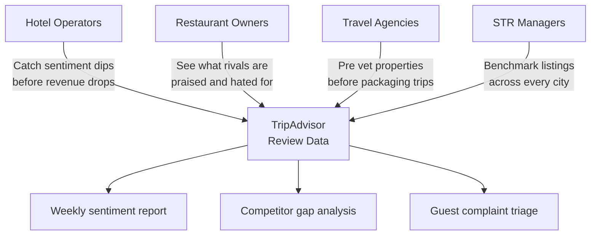
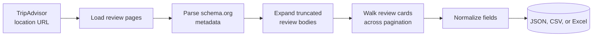
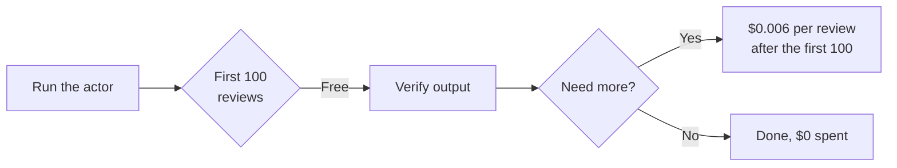
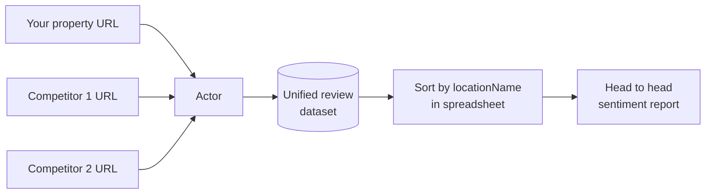
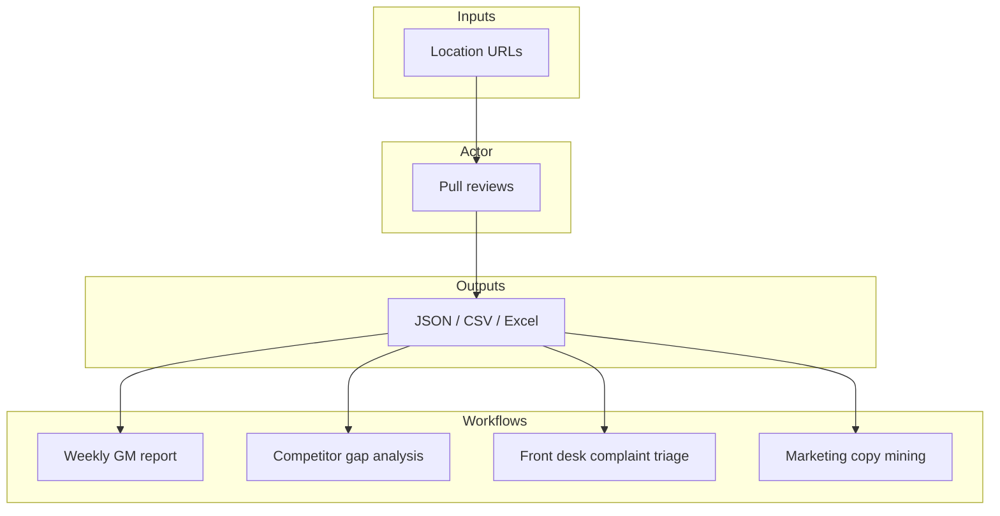
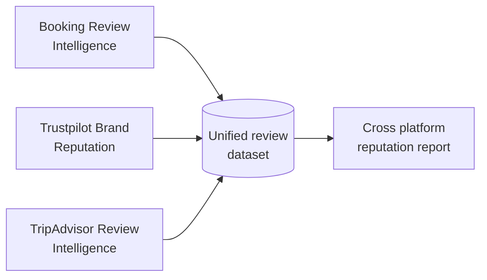

# TripAdvisor Review Data and Hotel Reputation Monitoring Tool

Export every TripAdvisor review for any hotel, restaurant, or attraction into a clean spreadsheet or JSON file. Get star ratings, full review text, trip type, traveler origin, stay dates, owner responses, and aggregate property ratings for your property and every competing destination.

Built for hotel operators, restaurant owners, travel agencies, and STR managers who need TripAdvisor review data without paying for a hospitality reputation subscription.

---

## Who uses this and why



| Role | What this gives you |
|---|---|
| **Hotel operator** | Weekly review volume, star trends, stay date ranges, owner reply coverage |
| **Restaurant owner** | Side by side sentiment vs direct local competitors |
| **Travel agency** | Pre trip due diligence on every property in a package |
| **STR manager** | Benchmark your listing against every vacation rental in the area |
| **BI analyst** | Clean JSON or CSV ready for dashboards and sentiment models |

---

## How it works



The actor visits each TripAdvisor location page, reads the schema.org metadata TripAdvisor ships for aggregate ratings, expands every truncated review body, and walks through all reviews 10 at a time. Residential proxies keep you past the Cloudflare gate. Same data TripAdvisor shows in its own UI, delivered as a clean dataset.

---

## What one review record looks like

```json
{
  "reviewId": "987654321",
  "locationName": "The Pierre, A Taj Hotel, New York",
  "locationType": "LodgingBusiness",
  "locationAggregateRating": 4.5,
  "locationReviewCount": 2168,
  "locationCity": "New York City",
  "locationCountry": "US",
  "rating": 5,
  "title": "Flawless anniversary stay",
  "text": "Stayed in a corner suite overlooking Central Park for our 10 year anniversary. Doorman remembered my name by the second day. Bar downstairs is worth the price of the room alone...",
  "reviewerName": "MarissaK",
  "reviewerLocation": "Chicago, Illinois",
  "writtenDate": "Written April 8, 2026",
  "stayDate": "Date of stay: March 2026",
  "tripType": "Traveled as a couple",
  "language": "en",
  "helpfulVotes": 4,
  "hasOwnerResponse": true,
  "ownerResponseText": "Dear Marissa, thank you for choosing The Pierre for such a special occasion...",
  "ownerResponseDate": "Responded April 10, 2026"
}
```

Every review comes back with: star rating (1 to 5), title, full text, reviewer name and home location, written date, stay date, trip type (family, couple, business, solo, friends), helpful vote count, and the full owner response with its own timestamp. Plus the property name, type (hotel, restaurant, attraction), aggregate rating, city, and country on every record so you can group in any spreadsheet.

---

## Quick start

Export 200 recent reviews for a single hotel:

```bash
curl -X POST "https://api.apify.com/v2/acts/scrapemint~tripadvisor-review-intelligence/run-sync-get-dataset-items?token=YOUR_TOKEN" \
  -H "Content-Type: application/json" \
  -d '{
    "locationUrl": "https://www.tripadvisor.com/Hotel_Review-g60763-d93589-Reviews-The_Pierre.html",
    "maxReviews": 200,
    "sortBy": "NEWEST_FIRST"
  }'
```

Compare your hotel against 2 competitors in one run, filtering for complaints only:

```json
{
  "locationUrls": [
    { "url": "https://www.tripadvisor.com/Hotel_Review-g60763-d93589-Reviews-The_Pierre.html" },
    { "url": "https://www.tripadvisor.com/Hotel_Review-g60763-d93361-Reviews-The_Plaza.html" },
    { "url": "https://www.tripadvisor.com/Hotel_Review-g60763-d93541-Reviews-The_Carlyle.html" }
  ],
  "maxReviews": 500,
  "filterByRating": ["1", "2"]
}
```

---

## Inputs

| Field | Type | Default | What it does |
|---|---|---|---|
| `locationUrls` | array | `[]` | TripAdvisor review URLs. Hotels, attractions, or restaurants. Add several to compare in one run. |
| `locationUrl` | string | `null` | Single URL shortcut. Used when `locationUrls` is empty. |
| `maxReviews` | integer | `500` | Hard cap per location. Controls cost. |
| `sortBy` | string | `NEWEST_FIRST` | `NEWEST_FIRST` or `MOST_HELPFUL` |
| `filterByRating` | array | `[]` | Ratings to keep (e.g. `["1","2"]` for complaint analysis). Empty = all. |
| `language` | string | `""` | Filter by language code (`en`, `es`, `fr`, `de`, `it`). Empty = all. |

---

## Pricing

Pay per review. Free tier lets you check the data before spending anything.

| Tier | Price | Best for |
|---|---|---|
| Free | First 100 reviews per run | Verifying the output format |
| Standard | $0.006 per review | Ongoing monitoring and competitor benchmarking |



---

## How this beats the alternatives

| Method | Cost for 5,000 reviews across 5 hotels | Data depth | Time |
|---|---|---|---|
| Read TripAdvisor manually | 20 to 30 analyst hours | Spreadsheet notes | Days |
| Hospitality reputation SaaS | $400 to $1,200 per month per property | Aggregated dashboards | Subscription locked |
| **This actor** | **$29.40 once** | Full reviews, traveler data, responses, timestamps | Minutes |

---

## Compare destinations in one run



Every record carries the `locationName`, `locationCity`, and `locationAggregateRating` fields, so you can group results in any spreadsheet or BI tool in seconds.

---

## Use case flows



- **Weekly GM report:** cron this actor, diff the latest run, email the GM when 1 or 2 star volume spikes
- **Competitor gap analysis:** pull your property plus 3 rivals, sort by stars, show ownership what guests praise next door
- **Front desk complaint triage:** feed 1 and 2 star reviews into your PMS so CS sees complaints before they escalate
- **Marketing copy mining:** grep 5 star reviews for the exact phrases guests use, reuse them in booking page copy

---

## Related tools in the review intelligence suite



* [**Booking Review Intelligence**](https://apify.com/scrapemint/booking-review-intelligence): hotel and STR reviews with sentiment, category scores, traveler type, and management replies
* [**Trustpilot Brand Reputation**](https://apify.com/scrapemint/trustpilot-brand-reputation): e-commerce and service business reviews with trust scores, consumer country, and verification status
* **More review sources on the roadmap:** Google Reviews, Yelp, OpenTable

---

## Frequently asked questions

**How do I download TripAdvisor reviews to a CSV file?**
Run this actor with a TripAdvisor location URL and your chosen cap. Export the dataset as CSV from the Apify console or pull it via the API. Works for any hotel, restaurant, or attraction with a public TripAdvisor page.

**How do I monitor my property reputation on TripAdvisor without paying for a SaaS subscription?**
Schedule this actor weekly against your TripAdvisor URL. Export the latest reviews and compare against last week in your own spreadsheet. A few dollars per run replaces a $400+ monthly hospitality reputation subscription.

**Can I compare multiple hotels on TripAdvisor in one run?**
Yes. Pass every URL in the `locationUrls` array. Every review record includes `locationName`, `locationCity`, and `locationAggregateRating`, so you can group and compare in any tool.

**How do I analyze only negative TripAdvisor reviews?**
Set `filterByRating` to `["1", "2"]` to pull just 1 and 2 star reviews. Most complaint analysis workflows use this filter.

**What data does this return for each TripAdvisor review?**
Rating (1 to 5), title, full review text, reviewer name, reviewer home location, written date, stay date, trip type, helpful votes, language, and the full owner response with its timestamp. Plus property name, type, aggregate rating, city, and country on every record.

**Does this work for restaurants and attractions too?**
Yes. Any TripAdvisor URL with `Hotel_Review`, `Restaurant_Review`, or `Attraction_Review` in the path works.

**Does this work across international TripAdvisor domains?**
Yes. Works for tripadvisor.com, tripadvisor.co.uk, tripadvisor.de, tripadvisor.fr, and other locales. Just paste the location URL.

**How many reviews can I pull from one location?**
Up to the full review history. Use `maxReviews` to set a cap. Properties with thousands of reviews take several minutes to finish.

**How fresh is the data?**
Live at query time. Every run pulls straight from TripAdvisor. No cached snapshots.

**What format is the output?**
JSON, CSV, or Excel. Download from the Apify dataset or pull via API.

**Why does this need residential proxies?**
TripAdvisor fronts every page with Cloudflare. Datacenter proxies get blocked within a few requests. Residential proxies keep runs clean. The actor ships with residential proxy defaults.
