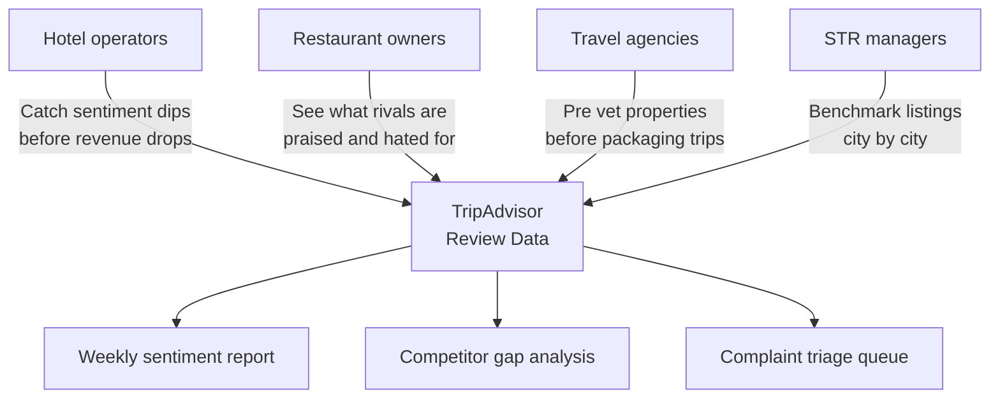
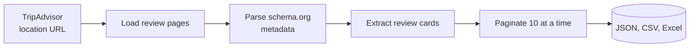
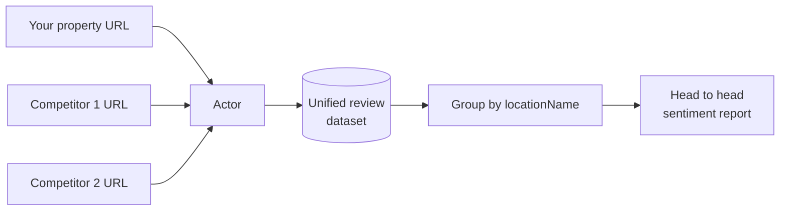

# TripAdvisor Review Export and Hotel Reputation Monitor

Export every TripAdvisor review for any hotel, restaurant, or attraction into a clean JSON or CSV file. Get star ratings, review text, reviewer names, stay dates, trip type, owner responses, and aggregate property ratings for your property and every competitor.

Built for hotel operators, restaurant owners, travel agencies, and short term rental managers who need TripAdvisor review data without paying for a hospitality reputation SaaS.

---

## Who uses this and why



| Role | What this gives you |
|---|---|
| **Hotel operator** | Weekly review volume, star trends, stay date ranges, owner reply coverage |
| **Restaurant owner** | Side by side sentiment vs direct local competitors |
| **Travel agency** | Pre trip due diligence on every property in a package |
| **STR manager** | Benchmark your listing against every vacation rental in the area |
| **BI analyst** | Clean JSON or CSV ready for dashboards and sentiment models |

---

## How it works



The actor opens each TripAdvisor location page in a real browser, reads the schema.org JSON that TripAdvisor ships for aggregate ratings, walks the rendered review cards, and paginates until `maxReviews` is hit. Residential proxies keep you past Cloudflare.

---

## Quick start

Export 200 recent reviews for a single hotel:

```bash
curl -X POST "https://api.apify.com/v2/acts/scrapemint~tripadvisor-review-intelligence/run-sync-get-dataset-items?token=YOUR_TOKEN" \
  -H "Content-Type: application/json" \
  -d '{
    "locationUrl": "https://www.tripadvisor.com/Hotel_Review-g60763-d93589-Reviews-The_Pierre.html",
    "maxReviews": 200,
    "sortBy": "NEWEST_FIRST"
  }'
```

Compare your hotel against 2 competitors in one run, pulling complaints only:

```json
{
  "locationUrls": [
    { "url": "https://www.tripadvisor.com/Hotel_Review-g60763-d93589-Reviews-The_Pierre.html" },
    { "url": "https://www.tripadvisor.com/Hotel_Review-g60763-d93361-Reviews-The_Plaza.html" },
    { "url": "https://www.tripadvisor.com/Hotel_Review-g60763-d93541-Reviews-The_Carlyle.html" }
  ],
  "maxReviews": 500,
  "filterByRating": ["1", "2"]
}
```

---

## What one review record looks like

```json
{
  "rating": 5,
  "title": "Flawless anniversary stay",
  "text": "Stayed in a corner suite overlooking Central Park. Doorman remembered my name by the second day.",
  "reviewerName": "MarissaK",
  "reviewerLocation": "Chicago, Illinois",
  "writtenDate": "April 8, 2026",
  "stayDate": "March 2026",
  "tripType": "Couple",
  "hasOwnerResponse": true,
  "ownerResponseText": "Dear Marissa, thank you for choosing The Pierre...",
  "locationName": "The Pierre, A Taj Hotel",
  "locationAggregateRating": 4.5,
  "locationReviewCount": 2168,
  "locationCity": "New York City",
  "locationCountry": "US"
}
```

Every record carries both the review fields and the property rollup, so a dataset of 3 hotels + 500 reviews each groups cleanly in any spreadsheet.

---

## Inputs

| Field | Type | Default | What it does |
|---|---|---|---|
| `locationUrls` | array | `[]` | TripAdvisor review URLs. Hotels, attractions, or restaurants. |
| `locationUrl` | string | `null` | Single URL shortcut. Used when `locationUrls` is empty. |
| `maxReviews` | integer | `500` | Hard cap per location. Controls cost. |
| `sortBy` | string | `NEWEST_FIRST` | `NEWEST_FIRST` or `MOST_HELPFUL` |
| `filterByRating` | array | `[]` | Ratings to keep (e.g. `["1","2"]` for complaint analysis). |
| `language` | string | `""` | Filter by language code (`en`, `es`, `fr`, `de`, `it`). |

---

## Pricing

Pay per review. Free tier lets you verify the output before spending anything.

| Tier | Price | Best for |
|---|---|---|
| Free | First 100 reviews per run | Verifying the output format |
| Standard | $0.006 per review | Ongoing monitoring and benchmarking |

5,000 reviews across 5 properties: **$29.40 once**. Hospitality reputation SaaS: $400 to $1,200 per month per property.

---

## Compare properties in one run



Every record includes `locationName`, `locationCity`, and `locationAggregateRating`, so grouping in Excel, Sheets, or a BI tool takes seconds.

---

## Common workflows

- **Weekly GM report.** Cron this actor. Diff the latest run, email the GM when 1 or 2 star volume spikes.
- **Competitor gap analysis.** Pull your property plus 3 rivals. Sort by stars. Show ownership what guests praise next door.
- **Complaint triage.** Push 1 and 2 star reviews into your PMS so front desk sees complaints before they escalate.
- **Marketing copy mining.** Search 5 star reviews for the exact phrases guests use. Reuse them in booking page copy.

---

## Related tools in the review intelligence suite

* [**App Store and Play Store Review Intelligence**](https://apify.com/scrapemint/app-review-intelligence): mobile app reviews across both stores
* [**Steam Game and Review Intelligence Monitor**](https://apify.com/scrapemint/steam-game-review-intelligence): PC game reviews and player sentiment
* [**TripAdvisor Travel Intelligence: Hotels and More**](https://apify.com/scrapemint/tripadvisor-scraper): listings, ranks and prices alongside the reviews
* [**Viator Tours Intelligence: Activities, Prices, Reviews**](https://apify.com/scrapemint/viator-tours-tracker): tours and activities by city

---

## Frequently asked questions

**How do I download TripAdvisor reviews to a CSV file?**
Run this actor with a TripAdvisor location URL and a review cap. Export the dataset as CSV from the Apify console or pull it via the API. Works for any hotel, restaurant, or attraction.

**How do I monitor my TripAdvisor reputation without paying for a SaaS subscription?**
Schedule this actor weekly. Export the latest reviews and diff against last week in your own spreadsheet. Replaces a $400+ monthly reputation subscription.

**Can I compare multiple TripAdvisor properties in one run?**
Yes. Pass every URL in `locationUrls`. Every record includes `locationName`, `locationCity`, and `locationAggregateRating` for easy grouping.

**How do I analyze only negative TripAdvisor reviews?**
Set `filterByRating` to `["1", "2"]` to pull just 1 and 2 star reviews.

**Does this work for restaurants and attractions too?**
Yes. Any URL with `Hotel_Review`, `Restaurant_Review`, or `Attraction_Review` works.

**Does this work across international TripAdvisor domains?**
Yes. tripadvisor.com, tripadvisor.co.uk, tripadvisor.de, tripadvisor.fr, and other locales all work. Paste the location URL.

**How fresh is the data?**
Live at query time. Every run pulls straight from TripAdvisor.

**Why residential proxies?**
TripAdvisor fronts every page with Cloudflare. Datacenter proxies get blocked within a few requests. Residential proxies keep runs clean, and the actor ships with residential defaults.
