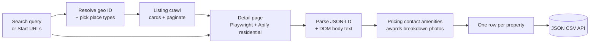
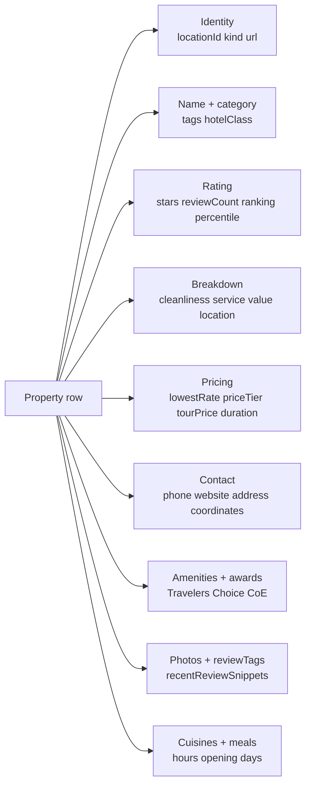

# TripAdvisor Intelligence Pro: Hotels, Restaurants, Attractions, Tours & Rentals

Pull TripAdvisor hotels, restaurants, attractions, things to do, vacation rentals, and tours. Each row ships pricing, contact details, amenities, awards, ratings breakdown, photos, coordinates, address, hours, cuisine types, and review summaries. Multi country, multi currency, multi language. Pay per row.

**Built for** travel agencies pulling supplier catalogs, OTAs benchmarking competitors, hotel revenue managers tracking comp set rates, restaurant owners watching neighborhood rankings, BI teams piping travel data into a warehouse, content teams powering travel guides with structured data, and lead-gen platforms enriching travel records with TripAdvisor authority signals.

**Keywords this actor ranks for:** tripadvisor scraper, tripadvisor api, tripadvisor data extractor, tripadvisor hotel scraper, tripadvisor restaurant scraper, tripadvisor attraction scraper, tripadvisor reviews api, tripadvisor pricing api, vacation rental scraper, tripadvisor to JSON, tripadvisor to CSV, hotel competitor benchmarking, restaurant ranking tracker.

---

## Why this actor

| Other TripAdvisor scrapers | **This actor** |
|---|---|
| Hotels only | Six entity types: hotels, restaurants, attractions, things to do, vacation rentals, tours |
| Title and rating only | Full enrichment: pricing, amenities, hours, awards, breakdown, photos, coordinates |
| One ranking field | Position + total + percentile + raw text |
| Single currency | 17 currencies with rate normalization for hotels and tours |
| English only | 16 interface and review languages |
| No structured address | Street, city, region, postal, country parsed from JSON-LD |
| No badge detection | Travelers' Choice (with year), Certificate of Excellence, owner claimed |
| No nearby graph | Optional nearby section graph for place clustering |

---

## How it works



Pages render with Playwright behind rotating residential proxy with browser fingerprinting and per-session homepage warmup. JSON-LD blocks ship name, rating, review count, address, and coordinates as primary source. DOM body text covers rank, badges, amenities, and hours. DataDome interstitials resolve automatically.

---

## What you get per row



Toggle on `includeNearbyResults` and the row carries the surrounding properties (10 to 20 nearby hotels, restaurants, or attractions).

---

## Quick start

**Pull Chicago top hotels, restaurants, and attractions**

```json
{
  "searchQuery": "Chicago",
  "placeTypes": ["hotels", "restaurants", "things_to_do"],
  "maxResults": 25,
  "extractAmenities": true,
  "extractAwards": true,
  "extractRatingBreakdown": true
}
```

**Direct property URLs (mix any types)**

```json
{
  "startUrls": [
    "https://www.tripadvisor.com/Hotel_Review-g60713-d224064-Reviews-The_Ritz_Carlton_San_Francisco-San_Francisco_California.html",
    "https://www.tripadvisor.com/Restaurant_Review-g60713-d301570-Reviews-Gary_Danko-San_Francisco_California.html",
    "https://www.tripadvisor.com/Attraction_Review-g60713-d104713-Reviews-Alcatraz_Island-San_Francisco_California.html"
  ],
  "extractRatingBreakdown": true,
  "extractPhotos": true
}
```

**Vacation rentals in Tuscany with check in / check out dates**

```json
{
  "searchQuery": "Tuscany",
  "placeTypes": ["vacation_rentals"],
  "maxResults": 30,
  "checkInDate": "2026-06-01",
  "checkOutDate": "2026-06-08",
  "guests": 4,
  "currency": "EUR",
  "language": "en"
}
```

**Tours and experiences in Tokyo**

```json
{
  "searchQuery": "Tokyo",
  "placeTypes": ["tours"],
  "maxResults": 50,
  "language": "en",
  "currency": "USD"
}
```

**Top hotels with minimum rating filter**

```json
{
  "searchQuery": "Maldives",
  "placeTypes": ["hotels"],
  "maxResults": 100,
  "minRating": 4.5,
  "extractAmenities": true,
  "extractAwards": true,
  "currency": "USD"
}
```

---

## Sample output

```json
{
  "locationId": "224064",
  "kind": "hotel",
  "url": "https://www.tripadvisor.com/Hotel_Review-g60713-d224064-Reviews-The_Ritz_Carlton_San_Francisco-San_Francisco_California.html",
  "name": "The Ritz-Carlton, San Francisco",
  "category": "Hotel",
  "rating": {
    "stars": 4.5,
    "reviewCount": 2847,
    "ranking": {
      "position": 4,
      "total": 235,
      "text": "#4 of 235 hotels in San Francisco",
      "percentile": 98.72
    },
    "breakdown": {
      "cleanliness": 4.8,
      "service": 4.7,
      "value": 4.2,
      "location": 4.6,
      "rooms": 4.6,
      "sleep quality": 4.7
    }
  },
  "priceTier": "$$$$",
  "hotelClass": 5.0,
  "contact": {
    "phone": "+1-415-296-7465",
    "website": "https://www.ritzcarlton.com/...",
    "address": "600 Stockton St, San Francisco, CA 94108-3601",
    "addressStructured": {
      "street": "600 Stockton St",
      "city": "San Francisco",
      "region": "CA",
      "postalCode": "94108-3601",
      "country": "US"
    },
    "coordinates": { "lat": 37.79213, "lng": -122.40869 }
  },
  "amenities": [
    "Free High Speed Internet",
    "Pool",
    "Fitness Center",
    "Spa",
    "Restaurant",
    "Bar / Lounge",
    "Pet Friendly",
    "Airport Transportation"
  ],
  "awards": ["Travelers' Choice 2026", "Certificate of Excellence"],
  "reviewTags": ["great location", "luxury experience", "club lounge", "afternoon tea"],
  "recentReviewSnippets": [
    "Stunning property with impeccable service",
    "Best afternoon tea in the city",
    "Worth every penny for the experience"
  ],
  "pricing": {
    "lowestRate": { "amount": 695, "currency": "USD", "rawText": "from $695" },
    "checkInDate": null,
    "checkOutDate": null,
    "guests": 2,
    "rooms": 1,
    "currency": "USD"
  },
  "photos": [
    "https://media-cdn.tripadvisor.com/media/photo-o/.../original.jpg"
  ],
  "scrapedAt": "2026-04-28T10:00:00.000Z"
}
```

---

## Who uses this

| Role | Use case |
|---|---|
| Travel agency | Pull supplier catalog with pricing, photos, and amenities. Build a custom booking site. |
| OTA / metasearch | Benchmark competitor pricing across hotels, vacation rentals, and tours daily. |
| Hotel revenue manager | Track comp set ranking and rate movements. One row per property per snapshot. |
| Restaurant owner | Watch neighborhood ranking and review tag drift. Spot menu trends. |
| Content team | Power travel guides with structured data: cuisines, hours, photo galleries. |
| BI / data analyst | Pipe TripAdvisor catalog into Snowflake or BigQuery. Each row API ready. |
| Lead-gen platform | Enrich company records with TripAdvisor authority signals (review count, ranking). |
| Real estate / VR | Vacation rental market analysis with date range pricing and amenity filtering. |

---

## Input reference

| Field | Type | What it does |
|---|---|---|
| `searchQuery` | string | City, neighborhood, or country. Resolves to a TripAdvisor geo ID. |
| `startUrls` | string[] | Mix Tourism, Hotel_Review, Restaurant_Review, Attraction_Review, VacationRentalReview, AttractionProductReview, list URLs. |
| `maxResults` | integer | Cap per search query or list URL. |
| `placeTypes` | string[] | hotels, restaurants, things_to_do, vacation_rentals, tours. |
| `includeReviewTags` | boolean | Pull auto generated review tags. |
| `includeNearbyResults` | boolean | Capture the nearby section graph. |
| `extractAmenities` | boolean | Pull every listed amenity. |
| `extractAwards` | boolean | Travelers' Choice, Certificate of Excellence, more. |
| `extractRatingBreakdown` | boolean | Per category ratings. |
| `extractRecentReviewSnippets` | boolean | First three review snippets. |
| `extractContact` | boolean | Phone, website, address, coordinates. |
| `extractHoursAndPricing` | boolean | Hours, lowest rate, tour duration and price, meal types. |
| `extractPhotos` | boolean | Gallery photo URLs. |
| `maxPhotosPerProperty` | integer | Cap on photo URLs returned per row. |
| `checkInDate`, `checkOutDate` | string | ISO dates for hotel and vacation rental availability. |
| `guests`, `rooms` | integer | Pricing parameters. |
| `minRating` | number | Drop properties below this stars threshold. |
| `language` | enum | 16 languages. |
| `currency` | enum | 17 currencies. |
| `dedupe` | boolean | Skip location IDs from previous runs. |
| `concurrency` | integer | Parallel pages. |
| `proxyConfiguration` | object | Apify proxy. Residential is required. |

---

## API call

```bash
curl -X POST \
  "https://api.apify.com/v2/acts/YOUR_USER~tripadvisor-scraper/runs?token=YOUR_TOKEN" \
  -H "Content-Type: application/json" \
  -d '{
    "searchQuery": "Barcelona",
    "placeTypes": ["hotels", "restaurants"],
    "maxResults": 50,
    "currency": "EUR",
    "extractAmenities": true,
    "extractAwards": true
  }'
```

---

## Pricing

The first few properties per run are free so you can validate output before paying. After that, one charge per property row. Amenities, awards, ratings breakdown, photos, contact details, and review tags are all included at no extra cost.

---

## FAQ

### What is the difference between this and the official TripAdvisor Content API?

TripAdvisor's Content API is partner-tier only and starts at thousands of dollars per month with strict access requirements. This actor reads HTML any anonymous web visitor sees, no key required, with full enrichment fields including coordinates, hours, amenities, and ranking percentile.

### Why does TripAdvisor block scrapers?

TripAdvisor sits behind DataDome with aggressive bot detection. The actor uses fingerprinted Chrome with rotating residential proxies, per-session homepage warmup, and DataDome interstitial resolution. Most challenges resolve within two retries.

### Does it work for vacation rentals?

Yes. Pass `placeTypes: ["vacation_rentals"]` plus `checkInDate` / `checkOutDate` and the actor returns the available rentals with per-night rates in your chosen currency.

### Does it pull reviews?

This actor focuses on property data with summary review fields (count, breakdown, recent snippets, tags). For full reviews with author and timestamps, use the related TripAdvisor Review Intelligence actor.

### Can I pull attractions and tours separately?

Yes. `things_to_do` covers all attractions. `tours` filters to bookable tour products with duration and price.

### How accurate is the ranking field?

`rating.ranking.percentile` is computed from position and total. Position 4 of 235 hotels gives 98.72 percentile (top 1.3%). Useful for comp-set benchmarking and dashboards.

### Does it pull coordinates?

Yes. From JSON-LD when available, falling back to embedded map data. Returned as `{ lat, lng }` decimal degrees.

### Is TripAdvisor pulling legal?

This actor reads HTML any anonymous web visitor can see. Respect TripAdvisor's terms and rate limit sensibly. Do not redistribute photos or descriptions you have no lawful basis to publish.

---

## Related actors

- **TripAdvisor Property Rank Tracker**. Daily rank, rating drift, and Travelers' Choice signals for one or many properties.
- **TripAdvisor Review Intelligence**. Every review with rating, text, trip type, traveler info, and helpful votes.
- **Booking Review Intelligence**. Same shape across Booking.com hotels.
- **Airbnb Market Intelligence**. Vacation rental market data on Airbnb.
- **Yelp Review Intelligence**. Restaurant and local business reviews.
- **Google Maps Scraper**. Local business data with reviews and photos.
