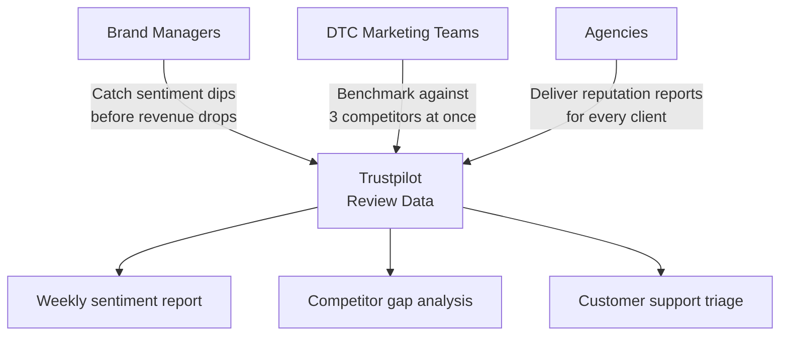
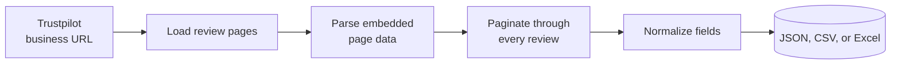
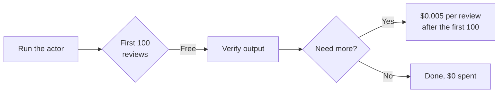
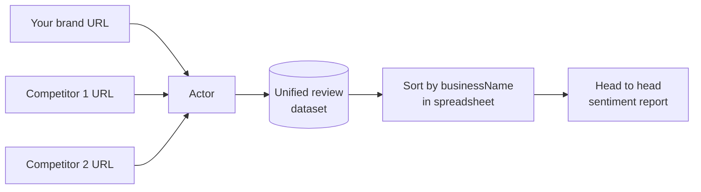
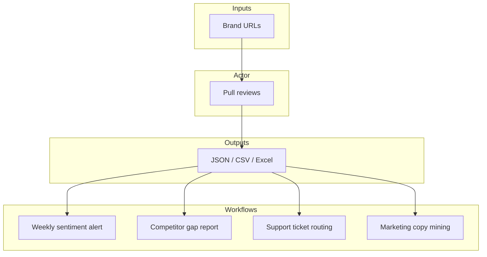
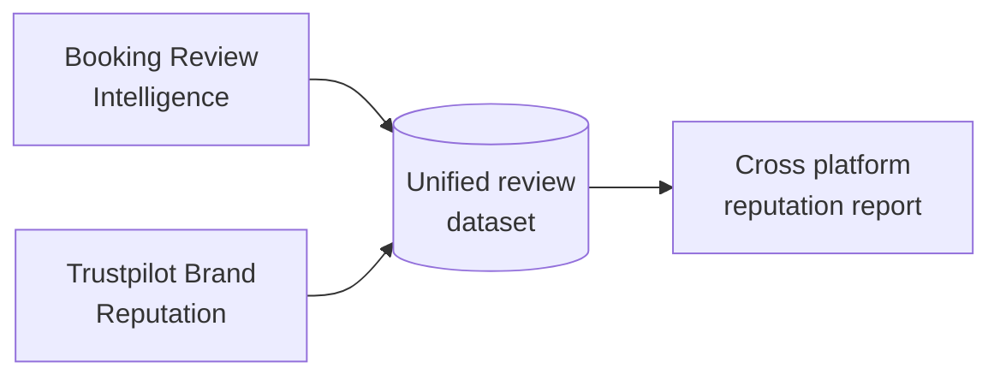

# Trustpilot Review Data and Brand Reputation Monitoring Tool

Export every Trustpilot review for any business into a clean spreadsheet or JSON file. Get star ratings, review text, consumer country, verified status, review dates, company replies, and overall trust scores for your brand and your competitors.

Built for e-commerce brand managers, DTC marketing teams, and agencies who need Trustpilot review data without paying for a monthly reputation monitoring subscription.

---

## Who uses this and why



| Role | What this gives you |
|---|---|
| **Brand manager** | Weekly review volume, star trends, verified vs unverified mix |
| **DTC marketer** | Side by side sentiment comparison against direct competitors |
| **Agency or consultant** | Client ready Trustpilot reports with full review datasets |
| **BI analyst** | Clean JSON or CSV ready for dashboards and sentiment models |

---

## How it works



The actor visits each Trustpilot business page, reads the structured data Trustpilot ships inside every page, and walks through every review 20 at a time. No brittle selectors, no login, no captcha. Same data Trustpilot shows in its own UI, delivered as a clean dataset.

---

## What one review record looks like

```json
{
  "reviewId": "69dbe793de2117596b6629fd",
  "businessName": "Booking.com",
  "businessOverallStars": 2,
  "businessTotalReviews": 108160,
  "businessTrustScore": 1.8,
  "rating": 1,
  "title": "Booked an apartment in Manchester",
  "text": "Booked an apartment in Manchester, got there, no such place...",
  "language": "en",
  "experiencedDate": "2026-04-04T00:00:00.000Z",
  "publishedDate": "2026-04-12T20:42:27.000Z",
  "isVerified": false,
  "consumerName": "Kathryn Burnand",
  "consumerCountry": "GB",
  "consumerReviewCount": 34,
  "hasCompanyReply": false,
  "companyReplyText": null
}
```

Every review comes back with: star rating (1 to 5), title, full text, language, source (organic or invited), likes, experience date, publish date, verification level, consumer name, country, total reviews the consumer has written, and the company reply with its own timestamp.

---

## Quick start

Export 200 recent reviews for a single business:

```bash
curl -X POST "https://api.apify.com/v2/acts/scrapemint~trustpilot-brand-reputation/run-sync-get-dataset-items?token=YOUR_TOKEN" \
  -H "Content-Type: application/json" \
  -d '{
    "businessUrl": "https://www.trustpilot.com/review/yourbrand.com",
    "maxReviews": 200,
    "sortBy": "NEWEST_FIRST"
  }'
```

Compare your brand against 2 competitors in one run, filtering for negative reviews only:

```json
{
  "businessUrls": [
    { "url": "https://www.trustpilot.com/review/yourbrand.com" },
    { "url": "https://www.trustpilot.com/review/competitor-one.com" },
    { "url": "https://www.trustpilot.com/review/competitor-two.com" }
  ],
  "maxReviews": 500,
  "filterByStars": ["1", "2"],
  "sortBy": "NEWEST_FIRST"
}
```

---

## Inputs

| Field | Type | Default | What it does |
|---|---|---|---|
| `businessUrls` | array | `[]` | Trustpilot business URLs. Add several to compare brands in one run. |
| `businessUrl` | string | `null` | Single URL shortcut. Used when `businessUrls` is empty. |
| `maxReviews` | integer | `500` | Hard cap per business. Controls cost. |
| `sortBy` | string | `NEWEST_FIRST` | `NEWEST_FIRST` or `MOST_RELEVANT` |
| `filterByStars` | array | `[]` | Ratings to keep (e.g. `["1","2"]` for complaint analysis). Empty = all. |
| `language` | string | `""` | Filter by language code like `en`, `fr`, `de`, `es`. Empty = all. |

---

## Pricing

Pay per review. Free tier lets you check the data before spending anything.

| Tier | Price | Best for |
|---|---|---|
| Free | First 100 reviews per run | Verifying the output format |
| Standard | $0.005 per review | Ongoing monitoring and competitor benchmarking |



---

## How this beats the alternatives

| Method | Cost for 5,000 reviews across 5 brands | Data depth | Time |
|---|---|---|---|
| Read Trustpilot manually | 15 to 25 analyst hours | Spreadsheet notes | Days |
| Reputation monitoring SaaS | $200 to $800 per month per brand | Aggregated dashboards | Subscription locked |
| **This actor** | **$24.50 once** | Full reviews, consumer data, replies, timestamps | Minutes |

---

## Compare brands in one run



Every record carries the `businessName` and `businessDomain` fields, so you can group results by brand in any spreadsheet or BI tool in seconds.

---

## Use case flows



- **Weekly sentiment alert:** cron this actor, diff the latest run, email yourself when 1 star volume spikes
- **Competitor gap report:** pull your brand plus 3 competitors, sort by stars, show management what guests praise next door
- **Support ticket routing:** feed 1 and 2 star reviews into your helpdesk so CS sees complaints before they escalate
- **Marketing copy mining:** grep 5 star reviews for the exact phrases customers use, reuse them in landing pages

---

## Related tools in the review intelligence suite



* [**Booking Review Intelligence**](https://apify.com/scrapemint/booking-review-intelligence): hotel and STR reviews with sentiment, category scores, traveler type, and management replies
* **More review sources on the roadmap:** Google Reviews, G2, Capterra

---

## Frequently asked questions

**How do I download Trustpilot reviews to a CSV file?**
Run this actor with a Trustpilot business URL and your chosen cap. Export the dataset as CSV from the Apify console or pull it via the API. Works for any business with a public Trustpilot page.

**How do I monitor my brand reputation on Trustpilot without paying for a SaaS subscription?**
Schedule this actor weekly against your Trustpilot URL. Export the latest reviews and compare against last week in your own spreadsheet. A few dollars per run replaces a $200+ monthly subscription.

**Can I compare multiple brands on Trustpilot in one run?**
Yes. Pass every URL in the `businessUrls` array. Every review record includes `businessName` and `businessDomain`, so you can group and compare in any tool.

**How do I analyze only negative Trustpilot reviews?**
Set `filterByStars` to `["1", "2"]` to pull just 1 and 2 star reviews. Most complaint analysis workflows use this filter.

**What data does this return for each Trustpilot review?**
Rating (1 to 5), title, full review text, language, country, source (organic or invited), likes, experience date, publish date, verification status, consumer name and review history, and the full company reply with its timestamp.

**Does this work for Trustpilot pages in any country?**
Yes. Works across the US, UK, EU, and other Trustpilot locales. Just paste the business URL.

**How many reviews can I pull from one business?**
Up to the full history. Use `maxReviews` to set a cap. Large brands with 100,000+ reviews take several minutes to finish.

**How fresh is the data?**
Live at query time. Every run pulls straight from Trustpilot. No cached snapshots.

**What format is the output?**
JSON, CSV, or Excel. Download from the Apify dataset or pull via API.
