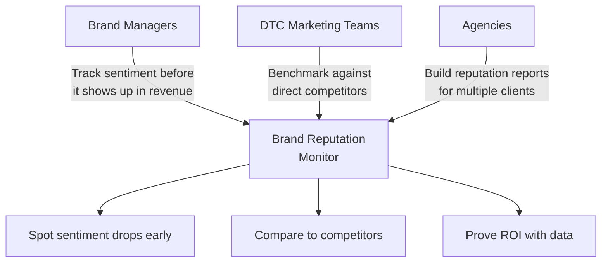
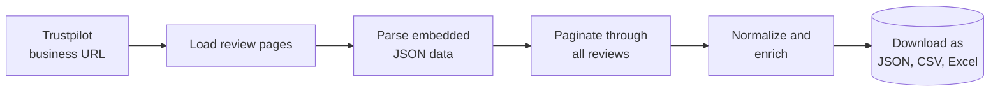
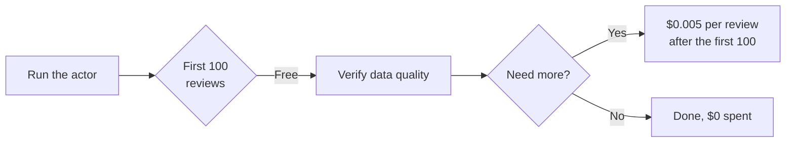
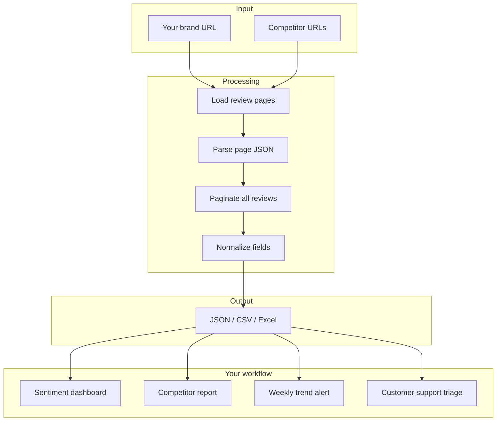
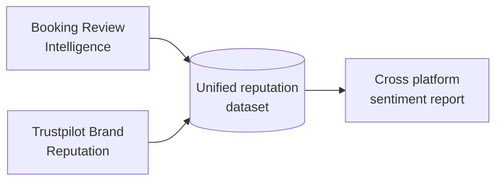

# Trustpilot Brand Reputation Monitor and Competitor Sentiment Tracker

Pull every Trustpilot review for any business in minutes. Get star ratings, review text, consumer country, verified status, company replies, and overall trust scores for your brand and its competitors.

Built for e-commerce brand managers, DTC marketing teams, and competitive intel analysts who need structured review data without paying for a monitoring subscription.

---

## Who uses this and why



| Role | What you get |
|---|---|
| **Brand manager** | Sentiment changes week over week, response rate, unverified review volume |
| **DTC marketer** | Head to head comparison of your brand vs 5 competitors |
| **Agency / consultant** | Client ready reputation reports with structured review data |
| **BI analyst** | Clean JSON or CSV ready for dashboards and sentiment models |

---

## How it works



The actor visits each Trustpilot business page, reads the page state JSON that Trustpilot ships on every page, and paginates through reviews 20 at a time. No fragile selectors, no login, no captcha. You get the same data Trustpilot renders in its own UI, ready for analysis.

---

## What one review record looks like

```json
{
  "reviewId": "69dbe793de2117596b6629fd",
  "businessName": "Booking.com",
  "businessOverallStars": 2,
  "businessTotalReviews": 245318,
  "rating": 1,
  "title": "Booked an apartment in Manchester",
  "text": "Booked an apartment in Manchester, got there, no such place...",
  "language": "en",
  "source": "Organic",
  "experiencedDate": "2026-04-04T00:00:00.000Z",
  "publishedDate": "2026-04-12T20:42:27.000Z",
  "isVerified": false,
  "verificationLevel": "not-verified",
  "consumerName": "Kathryn Burnand",
  "consumerCountry": "GB",
  "consumerReviewCount": 34,
  "hasCompanyReply": false,
  "companyReplyText": null
}
```

Every review includes: star rating (1 to 5), title, full text, language, source (organic vs invited), likes, experience date, publish date, verification status, consumer name, country, total reviews written, and the company reply with its own timestamp.

---

## Quick start

Pull 200 reviews for a single business:

```bash
curl -X POST "https://api.apify.com/v2/acts/scrapemint~trustpilot-brand-reputation/run-sync-get-dataset-items?token=YOUR_TOKEN" \
  -H "Content-Type: application/json" \
  -d '{
    "businessUrl": "https://www.trustpilot.com/review/yourbrand.com",
    "maxReviews": 200,
    "sortBy": "NEWEST_FIRST"
  }'
```

Compare your brand against competitors in one run:

```json
{
  "businessUrls": [
    { "url": "https://www.trustpilot.com/review/yourbrand.com" },
    { "url": "https://www.trustpilot.com/review/competitor-one.com" },
    { "url": "https://www.trustpilot.com/review/competitor-two.com" }
  ],
  "maxReviews": 500,
  "filterByStars": [1, 2],
  "sortBy": "NEWEST_FIRST"
}
```

---

## Inputs

| Field | Type | Default | What it does |
|---|---|---|---|
| `businessUrls` | array | `[]` | Trustpilot business URLs. Add multiple to compare. |
| `businessUrl` | string | `null` | Single URL shortcut. Used when `businessUrls` is empty. |
| `maxReviews` | integer | `500` | Hard cap per business. Controls cost. |
| `sortBy` | string | `NEWEST_FIRST` | `NEWEST_FIRST` or `MOST_RELEVANT` |
| `filterByStars` | array | `[]` | Only pull specific ratings (1 to 5). Useful for complaint analysis. |
| `language` | string | `""` | Filter by language code (en, fr, de, es...). Empty = all. |

---

## Pricing

Pay per review. Free tier lets you verify the output before you spend anything.

| Tier | Price | Best for |
|---|---|---|
| Free | First 100 reviews per run | Testing the data quality |
| Standard | $0.005 per review | Sentiment tracking and competitor monitoring |



---

## Cost comparison: brand reputation monitoring

| Option | Cost for 5,000 reviews across 5 brands | Data depth | Time |
|---|---|---|---|
| Read them on Trustpilot manually | 15 to 25 hours of analyst time | Spreadsheet notes | Days |
| Reputation monitoring SaaS | $200 to $800 per month per brand | Aggregated dashboards | Subscription based |
| **This actor** | **$24.50 once** | Full reviews, consumer data, replies, timestamps | Minutes |

---

## Data flow: from Trustpilot to brand insights



---

## Related tools in the review intelligence suite



* [**Booking Review Intelligence**](https://apify.com/scrapemint/booking-review-intelligence): hotel and STR review data with sentiment text, category scores, traveler type, and management replies
* **More review sources coming**: Google Reviews, G2, Capterra (roadmap)

---

## Frequently asked questions

**How do I monitor my brand reputation on Trustpilot without subscribing to an expensive tool?**
Run this actor against your Trustpilot business URL on a weekly cron. Set `maxReviews` to cover a week of new reviews. Export the dataset to your own dashboard or spreadsheet. Costs a few dollars per run instead of $200+ per month for a SaaS tool.

**Can I compare my brand to competitors in one run?**
Yes. Pass multiple URLs in `businessUrls` and the actor scans each one. Every review record includes `businessName` and `businessDomain` so you can group and compare in your analysis.

**What data do I get per review?**
Rating (1 to 5), title, full review text, language, country, source (organic or invited), likes, experience date, publish date, verified status, consumer review history, and the full company reply with its timestamp.

**Can I pull only negative reviews?**
Yes. Set `filterByStars` to `[1, 2]` to get only 1 and 2 star reviews. This is what most complaint analysis workflows need.

**Does it work for any Trustpilot business?**
Any business with a public Trustpilot review page. Just paste the URL. Works across US, UK, EU, and other Trustpilot locales.

**How many reviews can I pull from a single business?**
Up to the full history. Set `maxReviews` to control cost. Large brands with 100,000+ reviews take several minutes to finish.

**How fresh is the data?**
Live at query time. Every run pulls straight from Trustpilot. No cached data.

**Does Trustpilot block scrapers?**
Most business review pages are public and render server side. The actor uses Apify residential proxy support and reads the page data without interacting with the DOM, which is the most resilient path.

**What format is the output?**
JSON, CSV, or Excel. Download from the Apify dataset page or pull via API.
