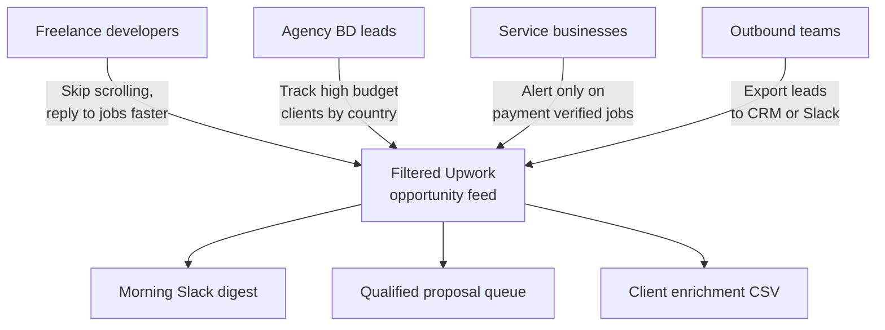
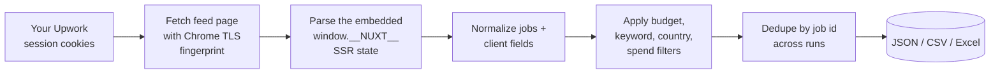
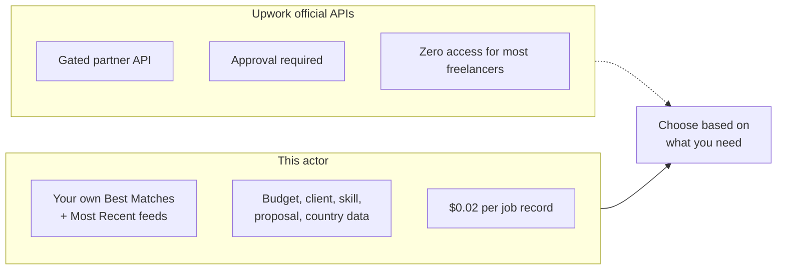
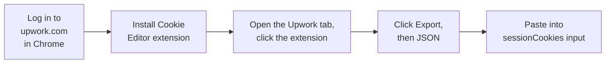
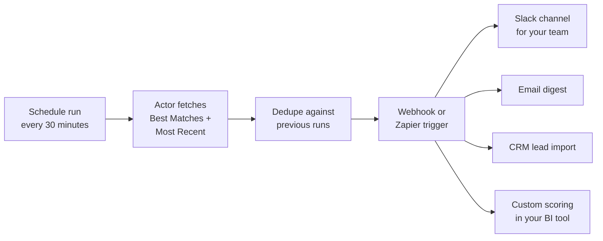
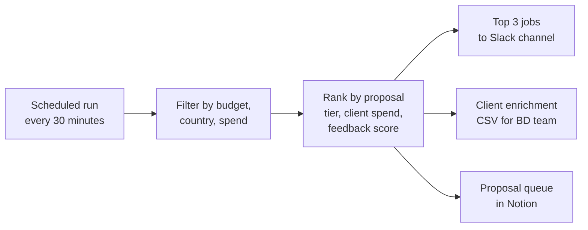
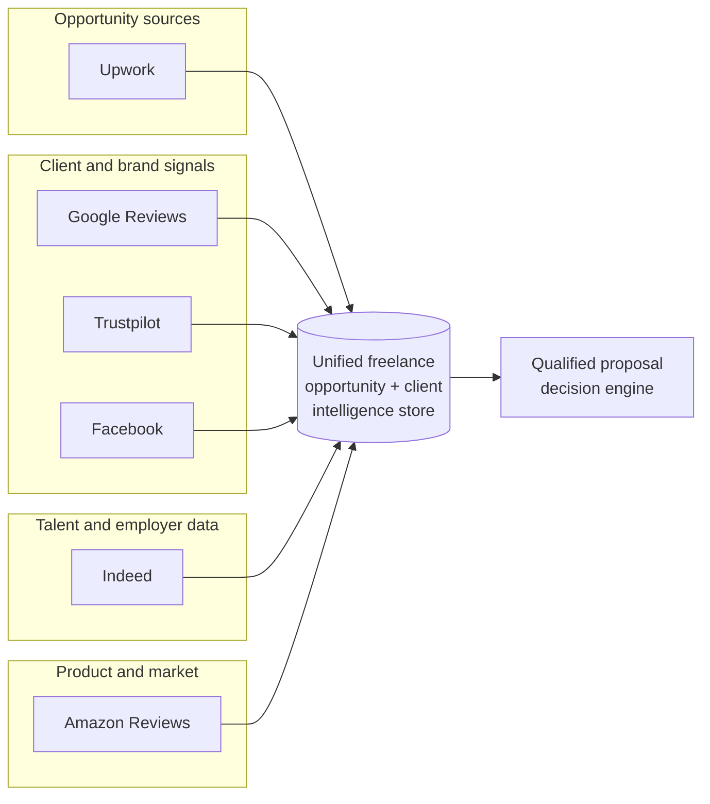

# Upwork Job Scraper and Opportunity Alert Engine for Freelancers and Agencies

Pull the freshest jobs from your Upwork Best Matches and Most Recent feeds into a clean JSON, CSV, or Excel file. Every job record carries the title, description, budget, skills, proposal tier, client country, lifetime spend, hire count, payment verification, and a direct job URL, so you can stop scrolling Upwork and start replying to the jobs worth a proposal.

Built for freelance developers, agency owners, business development leads, and service businesses who want Upwork opportunity alerts filtered by budget, client quality, and keyword without paying $49 per month for a bloated SaaS tool.

---

## Who uses this Upwork job scraper



| Role | What the feed unlocks |
|---|---|
| **Freelance developer** | Only the Best Matches jobs that hit your rate, budget, and keyword filters |
| **Agency BD lead** | Jobs filtered by client country and lifetime spend, for qualified outbound |
| **Service business** | Daily alert on payment verified clients over $10k spend in your niche |
| **Outbound team** | Structured client data (country, hires, reviews, timezone) ready for CRM import |
| **Freelance coach** | Live market sample of rates and proposal tiers to teach students |

---

## How the Upwork opportunity feed works



You paste your own Upwork session cookies once. The actor fetches the Best Matches and Most Recent feed routes directly, reads the server rendered SSR payload (the same payload the Upwork frontend renders from), and extracts 30 best matches and 10 most recent jobs per run with the full structured client and budget data already populated. No browser automation, no Turnstile challenge, no tile by tile HTML scraping.

---

## Upwork has no public jobs API for third parties



| Feature | Upwork official API | This actor |
|---|---|---|
| Access | Gated partner program | Your own session cookies |
| Best Matches feed | Not exposed | Yes |
| Most Recent feed | Not exposed | Yes |
| Client country and spend | Partial | Full |
| Payment verification flag | Not exposed | Yes |
| Proposal tier (bid count) | Not exposed | Yes |
| Price | Enterprise pricing | $0.02 per job, free tier for testing |

---

## Quick start

Pull the latest 100 jobs from both feeds, only payment verified clients, only posts from the last 24 hours:

```bash
curl -X POST "https://api.apify.com/v2/acts/scrapemint~upwork-opportunity-alert/run-sync-get-dataset-items?token=YOUR_TOKEN" \
  -H "Content-Type: application/json" \
  -d '{
    "sessionCookies": "[{...}]",
    "feed": "BOTH",
    "postedWithin": "HOUR_24",
    "paymentVerifiedOnly": true,
    "maxJobs": 100
  }'
```

Only high budget fixed jobs from USA, Canada, or UK clients:

```json
{
  "sessionCookies": "[{...}]",
  "feed": "BOTH",
  "jobType": "FIXED",
  "fixedBudgetMin": 2000,
  "clientCountries": "USA, Canada, United Kingdom",
  "paymentVerifiedOnly": true,
  "minClientSpent": 10000,
  "maxJobs": 50
}
```

Web scraping jobs at $40 per hour or more, expert level only:

```json
{
  "sessionCookies": "[{...}]",
  "feed": "BEST_MATCHES",
  "keywords": "web scraping, data extraction, crawler",
  "jobType": "HOURLY",
  "hourlyRateMin": 40,
  "experienceLevel": "EXPERT",
  "postedWithin": "DAY_7"
}
```

---

## How to export your Upwork cookies



The actor uses your own session, so nothing is shared and no shared account can get banned. Cookies last roughly 30 days before another export is needed. Required auth cookies: `master_access_token`, `oauth2_global_js_token`, `XSRF-TOKEN`. The actor fails fast if any of the three are missing from the paste.

---

## What one job record looks like

```json
{
  "uid": "~021743201088711294976",
  "title": "Senior Python developer for Playwright web scraping project",
  "url": "https://www.upwork.com/jobs/021743201088711294976",
  "description": "We need a senior engineer to build a Playwright scraper for...",
  "jobType": "Hourly",
  "hourlyBudgetMin": 40,
  "hourlyBudgetMax": 80,
  "fixedAmount": null,
  "currency": "USD",
  "duration": "Less than a month",
  "engagement": "Less than 30 hrs/week",
  "tier": "Expert",
  "proposalsTier": "5 to 10",
  "freelancersToHire": 1,
  "connectPrice": 16,
  "skills": ["Python", "Playwright", "Web Scraping", "Data Extraction"],
  "publishedOn": "2026-04-18T09:22:11.000Z",
  "createdOn": "2026-04-18T09:22:11.000Z",
  "renewedOn": null,
  "enterpriseJob": false,
  "premium": false,
  "client": {
    "country": "United States",
    "city": "San Francisco",
    "state": "California",
    "region": "Northern America",
    "timezone": "UTC-08:00 America/Los_Angeles",
    "totalHires": 42,
    "totalSpent": 184300,
    "totalReviews": 38,
    "totalFeedback": 4.92,
    "paymentVerified": true,
    "topClient": true,
    "lastRecruitingActivity": "2026-04-18T09:22:11.000Z"
  },
  "feed": "best-matches",
  "scrapedAt": "2026-04-18T09:25:44.221Z"
}
```

Client fields are a separate object so you can group, rank, and score by spend, reviews, or country in one step. `proposalsTier` tells you how crowded the job already is before you spend Connects on a bid. `url` opens the job page directly in Upwork.

---

## Inputs

| Field | Type | Default | What it does |
|---|---|---|---|
| `sessionCookies` | string | required | Your exported Upwork cookies as a JSON array |
| `feed` | string | `BOTH` | `BEST_MATCHES`, `MOST_RECENT`, or `BOTH` |
| `keywords` | string | `""` | Comma or space separated. Match in title, description, or skills |
| `jobType` | string | `ALL` | `ALL`, `HOURLY`, or `FIXED` |
| `experienceLevel` | string | `ALL` | `ALL`, `ENTRY`, `INTERMEDIATE`, `EXPERT` |
| `hourlyRateMin` | integer | `0` | Floor on hourly max budget (USD) |
| `fixedBudgetMin` | integer | `0` | Floor on fixed price budget (USD) |
| `postedWithin` | string | `DAY_7` | `HOUR_24`, `DAY_7`, `DAY_30`, `ANY` |
| `paymentVerifiedOnly` | boolean | `false` | Skip clients without payment verification |
| `minClientSpent` | integer | `0` | Floor on client lifetime spend (USD) |
| `clientCountries` | string | `""` | Comma separated allowed countries |
| `maxJobs` | integer | `100` | Hard cap per run |
| `dedupe` | boolean | `true` | Skip job ids already pushed in prior runs |
| `proxyConfiguration` | object | none | Apify proxy. Add residential only if you hit 403 |

---

## Pricing

Pay per job record. The free tier lets you verify the output before spending anything.

| Tier | Price | Best for |
|---|---|---|
| Free | First 10 jobs per run | Testing filters and cookie export |
| Standard | $0.02 per job | Daily opportunity alerts and outbound |

100 jobs per day, 30 days: **$60 per month**. Upwork lead generation SaaS tools: $49 to $199 per month with fewer fields and no raw export. Ship your own morning digest to Slack or email for less than a coffee.

---

## Alert automation patterns



The actor stores seen job ids in the Apify key value store and skips them on the next run, so a scheduled run only ever pushes genuinely new jobs. Point an Apify webhook at Slack, Zapier, or your CRM and freelance opportunity alerts arrive while competitors are still refreshing the feed.

---

## From feed to proposal pipeline



---

## Common workflows

- **Morning opportunity digest.** Schedule the actor at 7am and 8am. Filter by your rate floor and preferred countries. Pipe the output to Slack as a daily digest. You open the app already knowing which 5 jobs are worth a Connect.
- **Agency outbound list.** Filter by client country, lifetime spend over $10k, and payment verified. Export weekly to CSV, hand it to the BD team. Each record has country, timezone, and hire history for personalized outreach.
- **Niche monitoring.** Pick 5 keywords ("RAG", "LLM", "vector database", "embeddings", "fine tuning"). Run every 15 minutes. Every new job in your niche lands in Slack within half an hour of posting.
- **Rate calibration for coaches.** Pull 500 jobs per week tagged with your niche keywords. Chart hourly and fixed budgets by client country and experience level. Teach students with live numbers, not 2023 screenshots.
- **Proposal tier avoidance.** Filter out jobs with proposal tier "50+" so you only spend Connects where the bid count is still manageable.

---

## Freelance intelligence pipeline



Push Upwork jobs into the same pipeline as your existing review and reputation exports. Enrich a prospective client with their Trustpilot score or Google Maps rating before writing the proposal. One export format across every actor in the suite.

---

## Related tools in the Scrapemint suite

* [**Google Reviews Intelligence**](https://apify.com/scrapemint/google-reviews-intelligence): Google Maps reviews with full history export
* [**Amazon Review Intelligence**](https://apify.com/scrapemint/amazon-review-intelligence): Amazon product reviews across 10 marketplaces
* [**Indeed Review Intelligence**](https://apify.com/scrapemint/indeed-review-intelligence): Indeed company reviews with pros, cons, employment status
* [**Facebook Review Intelligence**](https://apify.com/scrapemint/facebook-review-intelligence): Facebook business page recommendations
* [**Yelp Review Intelligence**](https://apify.com/scrapemint/yelp-review-intelligence): Yelp reviews with elite reviewer tracking
* [**TripAdvisor Review Intelligence**](https://apify.com/scrapemint/tripadvisor-review-intelligence): hotel, restaurant, and attraction reviews
* [**Booking Review Intelligence**](https://apify.com/scrapemint/booking-review-intelligence): hotel guest reviews with sentiment scores
* [**Trustpilot Brand Reputation**](https://apify.com/scrapemint/trustpilot-brand-reputation): brand trust scores and verification status
* [**Airbnb Market Intelligence**](https://apify.com/scrapemint/airbnb-market-intelligence): rental pricing and guest review data

Ten actors covering Upwork opportunities, Google, Amazon, Indeed, Facebook, Yelp, TripAdvisor, Booking, Trustpilot, and Airbnb. Lead generation, client enrichment, and reputation intelligence in one suite.

---

## Frequently asked questions

**How do I scrape Upwork jobs into a CSV or Excel file?**
Paste your Upwork session cookies into `sessionCookies`, set the filters you want, and run. Export the dataset as CSV or Excel from the Apify console, or pull it via the API.

**Is there an Upwork API that returns jobs?**
Upwork has a gated partner API that requires approval and is not available to most freelancers or agencies. This actor uses your own logged in session, fetches the same feeds the Upwork frontend uses, and exports the full structured job data.

**Is it safe to paste my Upwork cookies?**
You are pasting cookies from your own session, into your own Apify actor run, that only you can read. Nothing is shared. The actor talks to upwork.com as you, exactly the same way the Upwork tab in your browser does. Cookies expire after about 30 days and can be rotated at any time.

**Why does this actor use cookies instead of a login form?**
Logging in programmatically triggers Cloudflare Turnstile and 2FA challenges that break automation. Pasting an already authenticated session sidesteps both, stays invisible to Upwork's bot detection, and keeps the run time under 10 seconds.

**How fresh is the data?**
Live at query time. Best Matches returns your personalized top 30 jobs at the exact moment of the run. Most Recent returns the 10 latest posts across all of Upwork.

**Can I get jobs posted in the last 30 minutes?**
Yes. Use `postedWithin: HOUR_24` with a tight schedule (every 15 or 30 minutes) and the actor only pushes jobs newer than any it has seen before, thanks to built in deduplication.

**Can I filter Upwork jobs by client country?**
Yes. Pass a comma separated list in `clientCountries` (for example `USA, Canada, United Kingdom, Australia`). Jobs from clients outside those countries are dropped.

**Can I filter by minimum hourly rate or fixed budget?**
Yes. `hourlyRateMin` filters hourly jobs whose max budget is below the floor. `fixedBudgetMin` filters fixed price jobs below the floor. 0 disables either filter.

**How do I get only payment verified clients?**
Set `paymentVerifiedOnly` to `true`. Jobs from clients who have not verified payment on Upwork are filtered out.

**How do I filter by client lifetime spend?**
Set `minClientSpent` to the floor (for example `10000`). Only clients who have spent that much on Upwork pass. Combine with `paymentVerifiedOnly` for a high quality outbound list.

**Can I get the proposal tier (bid count)?**
Yes. The `proposalsTier` field returns values like `Less than 5`, `5 to 10`, `10 to 15`, `20 to 50`, `50+`. Filter these in your spreadsheet or BI tool to avoid crowded posts.

**Why are Best Matches and Most Recent different?**
Best Matches is a personalized feed Upwork builds for your profile (up to 30 jobs). Most Recent is the 10 latest jobs posted across the whole platform. Running `BOTH` gives you the personalized feed plus a global freshness sample.

**How do I dedupe across runs?**
Leave `dedupe` at its default of `true`. The actor stores seen job ids in the Apify key value store under `SEEN_UIDS`. Only genuinely new jobs push to the dataset on each run.

**How do I send new Upwork jobs to Slack?**
Schedule the actor on the Apify platform. Add a webhook to post the dataset items to a Slack incoming webhook URL, or route through Zapier. Every scheduled run then fires only when new jobs arrive.

**What happens if my cookies expire?**
The actor throws a clear error: the feed redirected to the login page or the auth cookie set is incomplete. Re export cookies from the Upwork tab and rerun.

**Do I need a residential proxy?**
Not by default. The actor uses a real Chrome TLS fingerprint to pass Cloudflare on the feed routes. Add Apify residential proxies only if you start seeing 403 responses on a specific region.

**How do I export the dataset to Google Sheets?**
Use the Apify Google Sheets integration, or export to CSV and paste. Every row maps cleanly to columns since the job record is flat at the top level and client fields are already grouped.

**How does this compare to a $49 per month Upwork SaaS tool?**
SaaS tools wrap a smaller set of filters, cap at a few dozen exports per day, rarely expose client spend or feedback, and charge a monthly flat rate. This actor gives you the full structured payload, pay per job pricing, deduplication across runs, and raw data you own.

**Can I use this for lead generation instead of proposals?**
Yes. Filter by client country, lifetime spend, payment verification, and hire count. Every record has the client's country, timezone, hire history, and review score, which is exactly what a BD team needs to qualify outbound leads.

**How do I find only negative signals (low spend, no hires)?**
Set `minClientSpent` to `0` and then sort or filter the export by `client.totalSpent` and `client.totalHires` in your spreadsheet. Avoid clients with zero hires and zero spend if you want proven buyers.

**Can I run this from n8n, Make, or Zapier?**
Yes. Apify exposes every actor as a REST endpoint and webhook source. Trigger from n8n or Make, consume the dataset items as JSON, fan out to your existing automations.

---

## Related Scrapemint actors

- **GitHub Issue Monitor** for issue and PR tracking by keyword and repo
- **Stack Overflow Lead Monitor** for dev question tracking by tag
- **Hacker News Scraper** for stories and comments matching keywords
- **Reddit Lead Monitor** for subreddit and keyword mention tracking
- **Product Hunt Launch Tracker** for competitor launch monitoring
- **Trustpilot Brand Reputation** for DTC and ecommerce brands
- **Google Reviews Intelligence** for local businesses
- **Amazon Review Intelligence** for product review mining

Stack these to cover every public developer and customer conversation surface one brand touches.
