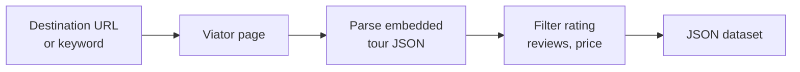
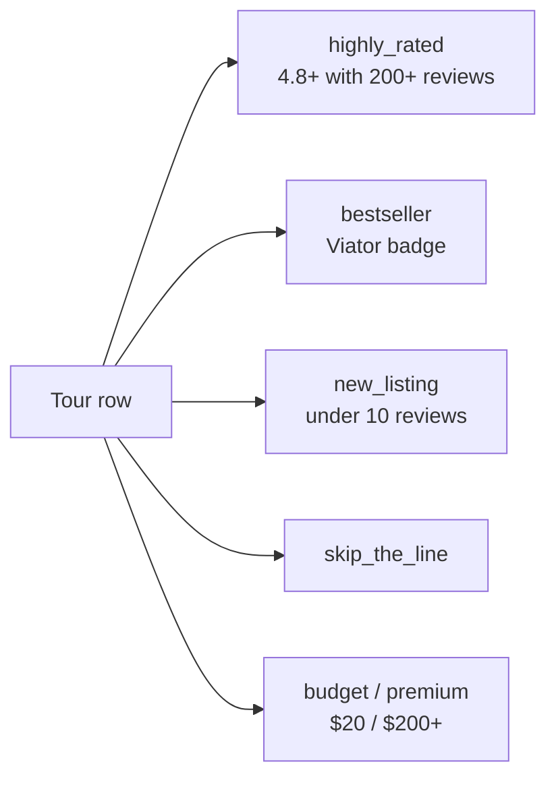

# Viator Intelligence: Tours, Activities, Prices, and Reviews

Pull Viator tours and activities by destination, keyword, or product URL. Every row has price from, star rating, review count, duration, highlights, supplier, category, and free cancellation flag. Works for Paris, London, Rome, Tokyo, New York, Dubai, and every Viator city. JSON output. Pay per item.

**Ranks for:** Viator intelligence, Viator API, tour price tracker, travel activity data, TripAdvisor experiences, destination tour feed, sightseeing price monitor, attraction booking data.

---

## How it works



Paste a Viator destination URL. One row per tour, deduped by product code.

---

## Who uses this

| Role | Use case |
|---|---|
| **Tour operator** | Watch rival prices in your city. Alert on undercuts. |
| **OTA / affiliate site** | Power a top tours widget without Viator Partner API approval. |
| **Destination marketing org** | Measure which tours rank highest by category. |
| **Travel journalist** | Pull best reviewed experiences for a city guide. |
| **Concierge software** | Feed curated things to do into a hotel guest app. |

---

## Quick start

**Top Paris tours:**

```json
{
  "destinationUrls": ["https://www.viator.com/Paris/d479-ttd"],
  "minRating": 4.5,
  "minReviewCount": 200
}
```

**Keyword search:**

```json
{
  "searchQueries": ["cooking class rome", "sunset cruise dubai"],
  "minRating": 4.7
}
```

**Premium only:**

```json
{
  "destinationUrls": ["https://www.viator.com/Dubai/d828-ttd"],
  "minPriceUsd": 200
}
```

---

## Popular destinations

| City | URL |
|---|---|
| Paris | `viator.com/Paris/d479-ttd` |
| London | `viator.com/London/d737-ttd` |
| Rome | `viator.com/Rome/d511-ttd` |
| New York | `viator.com/New-York-City/d687-ttd` |
| Tokyo | `viator.com/Tokyo/d334-ttd` |
| Dubai | `viator.com/Dubai/d828-ttd` |
| Barcelona | `viator.com/Barcelona/d562-ttd` |
| Bangkok | `viator.com/Bangkok/d343-ttd` |
| Amsterdam | `viator.com/Amsterdam/d525-ttd` |
| Istanbul | `viator.com/Istanbul/d585-ttd` |

Any Viator city works. Copy the URL from viator.com.

---

## Output flags



Each row has a `flags` array so pipelines filter without parsing titles.

---

## Viator intelligence vs the alternatives

| | Viator Partner API | Manual copy paste | **This actor** |
|---|---|---|---|
| Access | Affiliate approval | Anyone | Anyone |
| Setup | Weeks of paperwork | None | 60 seconds |
| Price + reviews | Yes | Yes, slow | Yes |
| Schedule | Yes | Hire an intern | Every 60s |
| JSON output | Yes | No | Yes |
| Pricing | Rev share | Time | Pay per item |

---

## Sample output

```json
{
  "productCode": "2050XPACKAGE",
  "title": "Skip the Line: Eiffel Tower Summit Access",
  "destinationName": "Paris",
  "destinationId": 479,
  "primaryCategory": "Tours & Sightseeing",
  "durationMinutes": 90,
  "durationLabel": "1h 30m",
  "priceFrom": 79.5,
  "priceCurrency": "USD",
  "rating": 4.6,
  "reviewCount": 5421,
  "freeCancellation": true,
  "supplier": "Paris Tours Inc",
  "highlights": ["Skip the main line", "Summit access", "Small group"],
  "flags": ["highly_rated", "skip_the_line"],
  "url": "https://www.viator.com/tours/Paris/..."
}
```

---

## Pricing

First 50 items per run are free. After that you pay per tour row. A 200 row Paris snapshot lands under $1.

---

## FAQ

**Do I need a Viator API key?**
No. The actor reads public Viator pages.

**Can I track price changes over time?**
Yes. Set `dedupe: false` and schedule every 60 minutes. Each run writes a fresh snapshot with a `scrapedAt` timestamp.

**Which cities are covered?**
Every Viator city (2500+). Paste any destination URL.

**How is price extracted?**
Viator shows a from price per tour. The actor returns `priceFrom` in the page currency (usually USD).

**Does Viator block scrapers?**
Viator runs Cloudflare. The actor ships with residential proxy enabled by default. If you run at high volume and see 403s, rotate proxy groups or lower concurrency.

**Is pulling Viator allowed?**
This actor reads the same public HTML a browser sees. Respect the site's terms of service and rate limit sensibly.

---

## Related Scrapemint actors

- **TripAdvisor Review Intelligence** for hotel and restaurant reviews
- **Airbnb Market Intelligence** for short term rental data
- **Booking Review Intelligence** for hotel reviews by city
- **Google Reviews Intelligence** for places reviews
- **Yelp Review Intelligence** for US local business reviews
- **Trustpilot Brand Reputation** for brand review monitoring

Stack these to cover every public travel and hospitality surface.
