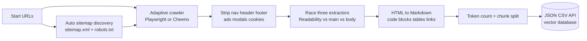
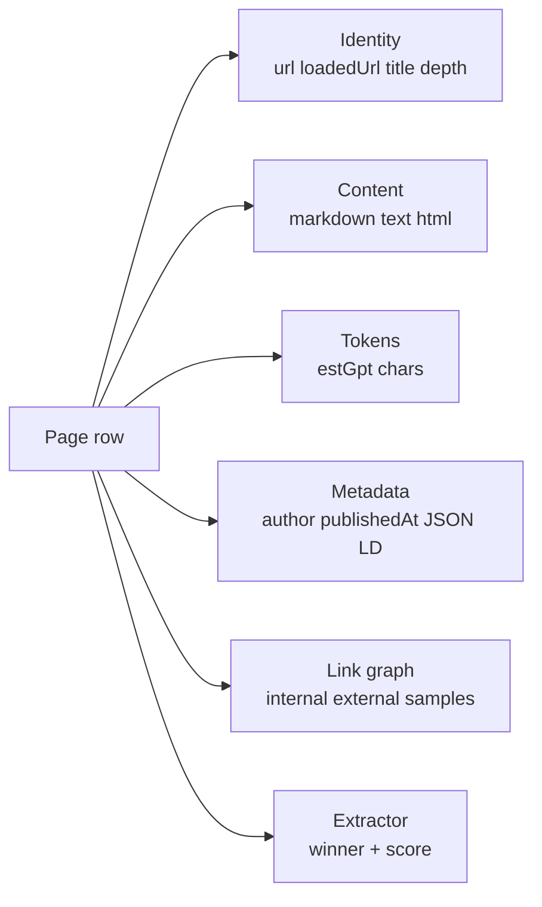

# Website Content Crawler — Markdown, Token Counts & RAG Chunks

Crawl any website and ship clean Markdown, plain text, and HTML for AI, LLM, and RAG pipelines. Each row carries a token estimate, JSON LD metadata, and a link graph. Optional auto chunk splitting drops your data straight into a vector database. Pay per page.

**Built for** AI engineers feeding RAG pipelines, LLM application teams indexing documentation, vector database operators ingesting knowledge bases, and content teams converting websites to clean Markdown for fine tuning.

**Keywords this actor ranks for:** website to markdown, website crawler for LLM, RAG pipeline crawler, scrape website to JSON, website content scraper API, llamaindex web scraper, langchain web crawler, vector database ingestion, AI training data crawler, documentation to markdown, website to RAG chunks, html to markdown converter API, knowledge base crawler.

---

## Why this actor

| Other crawlers | **This actor** |
|---|---|
| Raw HTML or plain text only | Markdown, plain text, AND cleaned HTML in one row |
| One extractor, take it or leave it | Three extractors race, the highest scored wins, the winner is tagged |
| Manual chunking on your side | Auto chunks at paragraph boundaries with token aware overlap |
| No token info | Every row ships an estimated GPT and Claude token count |
| Sitemap configuration required | Auto discovers sitemap.xml, sitemap_index.xml, and robots.txt |
| PII passes through to your index | Optional one click PII redaction (emails, phones, SSN, IBAN) |
| Link graph data missing | Every row carries internal vs external link counts and 25 samples |

---

## How it works



Three extractors run on every page. Mozilla Readability, a custom main content detector, and a body fallback each return text plus a content score. The highest scoring result wins and the row is tagged with which extractor produced it, so you can audit quality on a per row basis.

---

## What you get per row



Toggle `chunkOutput` and the same row format is split into RAG ready chunks. Each chunk row has `chunkIndex`, `totalChunks`, the chunk markdown, and a token count, ready to push straight into Pinecone, Qdrant, Weaviate, or a Postgres pgvector table.

---

## Quick start

**Index a documentation site for RAG**

```json
{
  "startUrls": ["https://docs.example.com/"],
  "maxPages": 500,
  "maxDepth": 5,
  "chunkOutput": true,
  "chunkSize": 1000,
  "chunkOverlap": 100
}
```

**Convert a blog to clean Markdown**

```json
{
  "startUrls": ["https://blog.example.com/"],
  "includeUrlPatterns": ["**/posts/**", "**/blog/**"],
  "outputFormats": ["markdown", "text"],
  "maxPages": 200
}
```

**GDPR safe RAG ingestion (PII redacted)**

```json
{
  "startUrls": ["https://support.example.com/"],
  "redactPII": true,
  "chunkOutput": true,
  "removeFluff": true,
  "minContentLength": 200
}
```

**Index a knowledge base with PDF download**

```json
{
  "startUrls": ["https://kb.example.com/"],
  "downloadFiles": true,
  "downloadFileTypes": ["pdf", "docx"],
  "maxPages": 1000
}
```

---

## Sample output

**Page row**

```json
{
  "url": "https://docs.apify.com/academy/scraping-basics-javascript",
  "loadedUrl": "https://docs.apify.com/academy/scraping-basics-javascript",
  "title": "Web scraping basics for JavaScript devs",
  "depth": 0,
  "extractor": "readability",
  "contentScore": 42.8,
  "markdown": "**Learn how to use JavaScript to extract information from websites...**\n\nIn this course we'll use JavaScript to create...",
  "text": "Learn how to use JavaScript to extract information from websites...",
  "tokens": { "estGpt": 1508, "chars": 6030 },
  "metadata": {
    "title": "Web scraping basics for JavaScript devs",
    "description": "Learn how to extract information from websites in this hands on course.",
    "author": null,
    "publishedAt": "2024-09-12T00:00:00.000Z",
    "modifiedAt": "2025-08-04T00:00:00.000Z",
    "language": "en",
    "jsonLdTypes": ["TechArticle"]
  },
  "links": { "outbound": 57, "internal": 43, "external": 14, "crawlable": 25, "samples": ["..."] },
  "crawledAt": "2026-04-25T16:00:00.000Z"
}
```

**Chunk row** (when `chunkOutput` is on)

```json
{
  "url": "https://docs.apify.com/academy/scraping-basics-javascript",
  "title": "Web scraping basics for JavaScript devs",
  "chunkIndex": 0,
  "totalChunks": 4,
  "markdown": "First 1000 token slice of the page...",
  "tokens": { "estGpt": 998, "chars": 3992 },
  "metadata": { "..." }
}
```

**File row** (when `downloadFiles` is on)

```json
{
  "url": "https://docs.example.com/whitepaper.pdf",
  "kind": "file",
  "extension": "pdf",
  "sizeBytes": 482194,
  "keyValueStoreKey": "https___docs_example_com_whitepaper_pdf-1714053000000.pdf"
}
```

---

## Who uses this

| Role | Use case |
|---|---|
| AI engineer | Index docs, knowledge bases, and blogs into a RAG pipeline. Use chunk output to skip a chunking step. |
| LLM app team | Convert customer documentation into Markdown for prompt context or fine tuning datasets. |
| Vector database operator | Pipe each chunk row straight into Pinecone, Qdrant, Weaviate, or pgvector. |
| Content team | Mirror an old website into clean Markdown for migration to a new CMS. |
| Compliance team | Redact PII at ingest time with `redactPII: true`. No post processing on your side. |
| Researcher | Pull every page from a site with metadata, then run analysis on the link graph. |

---

## Input reference

| Field | Type | What it does |
|---|---|---|
| `startUrls` | string[] | Required. Entry URLs for the crawl. |
| `crawlerType` | enum | adaptive, playwright, or cheerio. |
| `maxPages` | integer | Hard cap across all start URLs. 0 means unlimited. |
| `maxDepth` | integer | Link hops from start URL. 0 means seed only. |
| `useSitemap` | boolean | Auto discover sitemap.xml and robots.txt. |
| `respectRobotsTxt` | boolean | Skip URLs disallowed by robots.txt. |
| `includeUrlPatterns` | string[] | Glob patterns. Pages must match at least one. |
| `excludeUrlPatterns` | string[] | Glob patterns. Pages matching any are skipped. |
| `stayOnDomain` | boolean | Stay on the registrable domain of the start URL. |
| `stayOnSubdomain` | boolean | Stricter than stayOnDomain. Same hostname only. |
| `removeFluff` | boolean | Strip nav, footer, ads, and modals before extracting. |
| `extractor` | enum | auto, readability, main, or body. |
| `outputFormats` | string[] | Any of markdown, text, html. |
| `minContentLength` | integer | Drop pages below this many characters. |
| `chunkOutput` | boolean | Split pages into RAG chunks and push one row per chunk. |
| `chunkSize` | integer | Target tokens per chunk. |
| `chunkOverlap` | integer | Tokens of overlap between consecutive chunks. |
| `redactPII` | boolean | Redact emails, phones, SSN, IBAN before output. |
| `extractMetadata` | boolean | Pull JSON LD, OpenGraph, author, publish dates. |
| `extractLinks` | boolean | Per row link graph counts and 25 samples. |
| `infiniteScroll` | boolean | Stage scroll to render lazy content. Playwright only. |
| `waitForSelector` | string | Wait for a CSS selector before extraction. Playwright only. |
| `cookies` | object[] | Cookies to set for pages behind a login. |
| `downloadFiles` | boolean | Save linked PDF, DOC, XLS files to the key value store. |
| `concurrency` | integer | Pages processed in parallel. |
| `proxyConfiguration` | object | Apify proxy. Datacenter is fine for most sites. |

---

## API call

```bash
curl -X POST \
  "https://api.apify.com/v2/acts/YOUR_USER~website-content-crawler/runs?token=YOUR_TOKEN" \
  -H "Content-Type: application/json" \
  -d '{
    "startUrls": ["https://docs.example.com/"],
    "maxPages": 500,
    "chunkOutput": true,
    "chunkSize": 1000
  }'
```

---

## Pricing

The first few rows per run are free so you can validate output before paying. After that, one charge per dataset row pushed. Auto chunking, token estimation, link graph, PII redaction, and metadata extraction are all included at no extra cost. File downloads count as one row each.

---

## FAQ

### Why is this better than the official Website Content Crawler?

This actor races three extractors and tags the winner per row, ships token estimates on every row, auto chunks for RAG with a single toggle, redacts PII at the source, and adds a link graph (internal vs external counts plus samples) without extra config.

### Will this actor scrape JavaScript heavy sites?

Yes. Set `crawlerType` to `playwright` or leave it on `adaptive`. The browser pool ships fingerprinted Chrome with anti detection patches. Use `infiniteScroll: true` for sites that load content as you scroll, and `waitForSelector` to wait for a specific element before extraction.

### How accurate is the token count?

Token counts use a 4 chars per token estimate for prose and 3 chars per token for fenced code blocks, calibrated against GPT and Claude tokenizers. Real tokenizer counts will be within 5 to 10 percent on English content. Set `chunkSize` slightly under your model limit to leave headroom.

### Does the chunk splitter respect paragraph boundaries?

Yes. The splitter walks paragraphs and packs them into chunks until the token budget is reached. Long paragraphs that exceed the chunk size are split at sentence boundaries. Adjacent chunks share `chunkOverlap` tokens for context continuity during retrieval.

### How does PII redaction work?

Set `redactPII: true` and emails, phone numbers, US Social Security numbers, and IBAN bank account numbers are replaced with `[REDACTED_*]` tokens before output. This applies to both Markdown and plain text fields. Useful for GDPR safe RAG indexing of customer support content.

### Can I crawl pages behind a login?

Yes. Pass authentication cookies in the `cookies` field. Format is an array of `{name, value, domain}` objects. The crawler sets these on every browser context before navigating.

### Does it download PDF files for indexing?

Yes. Set `downloadFiles: true` and choose extensions in `downloadFileTypes`. PDFs, DOC, DOCX, XLS, XLSX, and CSV files are saved to the key value store with one dataset row per file pointing at the storage key.

### Can I run this on a schedule?

Yes. Use the Apify scheduler for hourly, daily, or weekly runs. Combine with a sitemap to capture only new pages, or run a full crawl on a fixed cadence to refresh your vector database.

### Is the data in the dataset compatible with LangChain or LlamaIndex?

Yes. The Markdown output, page URL, and metadata fields map directly to LangChain Document and LlamaIndex Node schemas. Use the Apify dataset reader from either framework, or pull the dataset via API and feed your own pipeline.

---

## Related actors

- **TripAdvisor Property Rank Tracker** — daily rank, rating, and competitor signals for hotels and restaurants
- **LinkedIn Profile & Company Post Tracker** — public LinkedIn posts without a cookie
- **LinkedIn Hiring Tracker & Salary Intelligence** — parsed salary, tech stack, seniority on every job row
- **Google Maps Scraper** — local business data with reviews
- **Reddit Brand Monitor & Lead Finder** — subreddit mentions and high intent leads
