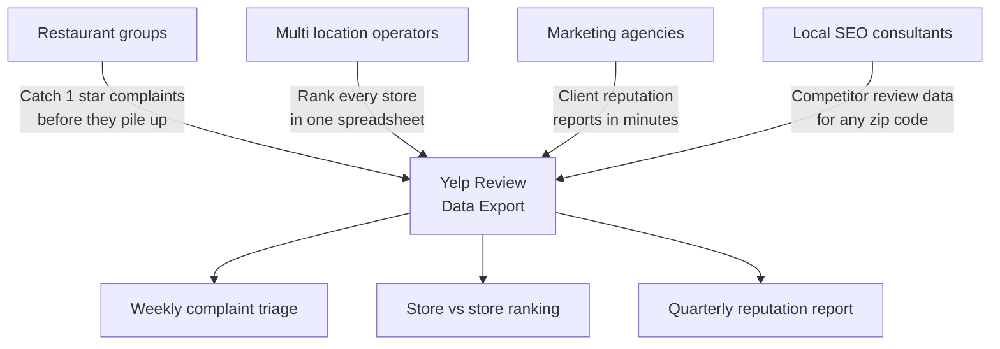
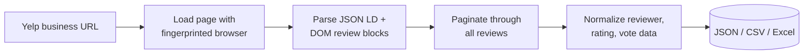
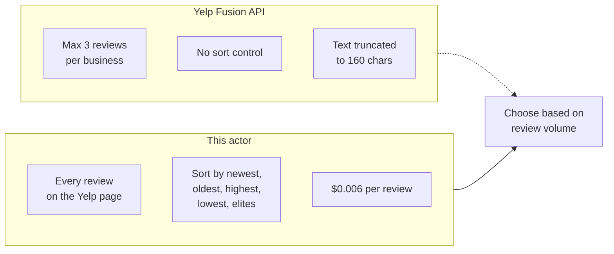
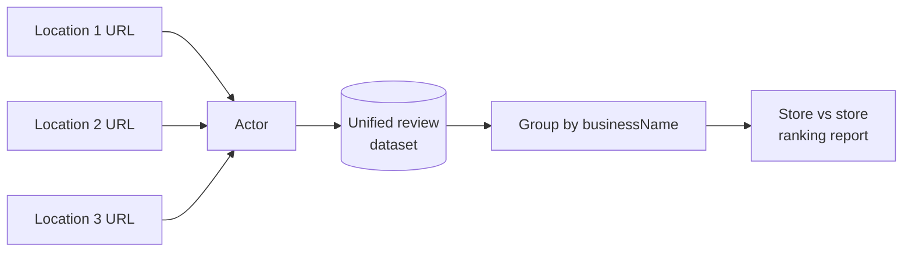

# Yelp Review Scraper and Local Business Reputation Export Tool

Export every Yelp review for any restaurant, salon, clinic, auto shop, or local business into a clean JSON, CSV, or Excel file. Pull star ratings, full review text, reviewer names, locations, photos, useful/funny/cool votes, owner responses, and aggregate business ratings for your business and every competitor on Yelp.

Built for restaurant groups, multi location operators, franchise owners, marketing agencies, and local SEO consultants who need Yelp review data without paying $300 to $1,200 per month per location to Podium, Yext, or Birdeye.

---

## Who uses this Yelp review scraper



| Role | What the export unlocks |
|---|---|
| **Restaurant owner** | Every 1 and 2 star review text so you can triage complaints by shift, dish, or staff |
| **Franchise operator** | Star ratings and recurring complaint patterns across every location in one sheet |
| **Marketing agency** | Fresh Yelp data for client reputation reports without manual copy pasting |
| **Local SEO consultant** | Competitor review data for the 3 closest rivals in any zip code |
| **BI analyst** | Clean JSON or CSV feed for sentiment models and dashboards |

---

## How the Yelp review export works



The actor opens each Yelp business page in a real browser with fingerprint rotation, reads the schema.org JSON LD for business metadata, walks the rendered review cards using stable `data-testid` and `aria-label` selectors (Yelp hashes CSS classes), and paginates via `?start=N` until your review cap is reached.

---

## Yelp Fusion API vs this scraper



| Feature | Yelp Fusion API | This actor |
|---|---|---|
| Reviews per business | 3 (excerpt only) | Full history |
| Review text | Truncated to 160 characters | Full text |
| Sort order | Fixed | Newest, oldest, highest, lowest, elites, most helpful |
| Useful/funny/cool votes | No | Yes |
| Reviewer profiles | No | Yes |
| Owner responses | No | Yes |
| Photo URLs | No | Yes |
| Price | Free (rate limited) | $0.006 per review, first 50 free |

---

## Quick start

Export 200 recent Yelp reviews for one restaurant:

```bash
curl -X POST "https://api.apify.com/v2/acts/scrapemint~yelp-review-intelligence/run-sync-get-dataset-items?token=YOUR_TOKEN" \
  -H "Content-Type: application/json" \
  -d '{
    "businessUrls": [
      { "url": "https://www.yelp.com/biz/the-halal-guys-new-york" }
    ],
    "maxReviews": 200,
    "sortBy": "NEWEST_FIRST"
  }'
```

Pull complaints only across 3 locations:

```json
{
  "businessUrls": [
    { "url": "https://www.yelp.com/biz/the-halal-guys-new-york" },
    { "url": "https://www.yelp.com/biz/joes-pizza-new-york-2" },
    { "url": "https://www.yelp.com/biz/levain-bakery-new-york" }
  ],
  "maxReviews": 500,
  "sortBy": "LOWEST_RATED"
}
```

Pull only elite reviewer opinions:

```json
{
  "businessUrls": [
    { "url": "https://www.yelp.com/biz/peter-luger-steak-house-brooklyn" }
  ],
  "maxReviews": 300,
  "sortBy": "ELITES"
}
```

---

## What one review record looks like

```json
{
  "rating": 5.0,
  "reviewText": "Best falafel in Manhattan. Lines are long but worth it.",
  "reviewDate": "2026-04-10",
  "reviewerName": "Jane D.",
  "reviewerLocation": "Brooklyn, NY",
  "reviewerProfileUrl": "https://www.yelp.com/user_details?userid=abc123",
  "photoCount": 2,
  "photos": [
    "https://s3-media0.fl.yelpcdn.com/bphoto/abc123/o.jpg"
  ],
  "usefulVotes": 12,
  "funnyVotes": 1,
  "coolVotes": 3,
  "hasBusinessReply": true,
  "businessReplyText": "Thanks for the kind words Jane, see you again soon.",
  "businessName": "The Halal Guys",
  "businessCategory": "Halal",
  "businessAddress": "W 53rd St & 6th Ave, New York, NY 10019",
  "businessCity": "New York",
  "businessPhone": "+1 347-527-1505",
  "businessRating": 4.1,
  "businessReviewCount": 6823,
  "sourceUrl": "https://www.yelp.com/biz/the-halal-guys-new-york",
  "scrapedAt": "2026-04-15T20:14:02.331Z"
}
```

Every record carries both the review fields and the business rollup, so multi location exports group cleanly by `businessName` in any spreadsheet.

---

## Inputs

| Field | Type | Default | What it does |
|---|---|---|---|
| `businessUrls` | array | `[]` | Yelp business page URLs |
| `businessUrl` | string | `null` | Single URL shortcut (used when `businessUrls` is empty) |
| `maxReviews` | integer | `500` | Hard cap per business. Controls cost. |
| `sortBy` | string | `NEWEST_FIRST` | `NEWEST_FIRST`, `OLDEST_FIRST`, `HIGHEST_RATED`, `LOWEST_RATED`, `ELITES`, `MOST_HELPFUL` |
| `language` | string | `en` | Filter by language code (`en`, `es`, `fr`, `de`, `it`, `pt`, `ja`). Use `ALL` for every language. |
| `proxyConfiguration` | object | Residential | Apify proxy settings. Yelp blocks datacenter IPs aggressively. |

---

## Pricing

Pay per review. Free tier lets you verify the output before spending anything.

| Tier | Price | Best for |
|---|---|---|
| Free | First 50 reviews per run | Verifying the output format |
| Standard | $0.006 per review | Ongoing monitoring and benchmarking |

5,000 reviews across 10 locations: **$29.70 once**. Reputation SaaS like Podium, Yext, or Birdeye: $300 to $1,200 per month per location.

---

## Benchmark every location in one run



Every record carries `businessName`, `businessAddress`, and `businessRating`, so a pivot table turns multi location exports into a city by city ranking in seconds.

---

## Common workflows

- **Weekly complaint triage.** Schedule this actor every Monday on your own business URL. Filter by `LOWEST_RATED`. Send the text to your manager by 10am.
- **Competitor scan.** Pass the URLs of the 3 closest rival restaurants in your city. Compare average ratings and top complaint themes.
- **Franchise audit.** Pass every store URL in one run. Rank locations by rolling 90 day rating. Catch the one location dragging down the brand.
- **Agency reporting.** Pull 10 client businesses in one afternoon. Generate a quarterly reputation report for each client from the same dataset.
- **Elite reviewer tracking.** Sort by `ELITES` to see what Yelp's most trusted reviewers say about your business.

---

## Related tools in the review intelligence suite

* [**Google Reviews Intelligence**](https://apify.com/scrapemint/google-reviews-intelligence): same model for Google Maps reviews with full history export
* [**TripAdvisor Review Intelligence**](https://apify.com/scrapemint/tripadvisor-review-intelligence): hotel, restaurant, and attraction reviews with trip type and stay dates
* [**Booking Review Intelligence**](https://apify.com/scrapemint/booking-review-intelligence): hotel guest reviews from Booking.com with sentiment and category scores
* [**Trustpilot Brand Reputation**](https://apify.com/scrapemint/trustpilot-brand-reputation): brand level trust scores, country, and verification status
* [**Airbnb Market Intelligence**](https://apify.com/scrapemint/airbnb-market-intelligence): rental pricing and guest review data

Combine all six for a full local business reputation picture across Google, Yelp, TripAdvisor, Booking, Trustpilot, and Airbnb in one pipeline.

---

## Frequently asked questions

**How do I scrape Yelp reviews into a CSV file?**
Run this actor with a Yelp business URL and a review cap. Export the dataset as CSV from the Apify console or pull it via the API. Works for any business category on Yelp.

**Is there a Yelp API alternative that returns full review text?**
Yes. The official Yelp Fusion API caps results at 3 reviews per business and truncates text to 160 characters. This actor pulls the full review history with complete text from the public Yelp page.

**How do I export Yelp reviews for my business?**
Paste your business's Yelp URL into `businessUrls`. The actor pulls every review the public page shows in your chosen sort order, including reviewer info, votes, and your owner replies.

**How do I monitor Yelp reviews without Podium or Yext?**
Schedule this actor weekly. Diff the latest export against last week in a spreadsheet. Replaces a $300+ monthly subscription for Yelp monitoring.

**Can I compare multiple Yelp business locations in one run?**
Yes. Pass every URL in `businessUrls`. Every record includes `businessName` and `businessAddress` for easy grouping and ranking.

**How do I find only negative Yelp reviews?**
Set `sortBy` to `LOWEST_RATED` to surface 1 and 2 star reviews first, or filter the exported dataset by the `rating` field.

**Can I pull only Yelp Elite reviews?**
Yes. Set `sortBy` to `ELITES` and the actor pages through elite reviewer content first.

**Does this work for all Yelp categories?**
Yes. Restaurants, salons, clinics, auto shops, dentists, gyms, any business page on yelp.com.

**How fresh is the data?**
Live at query time. Every run pulls straight from Yelp.

**Why residential proxies?**
Yelp blocks datacenter IPs within a few requests. Residential proxies keep runs clean, and the actor ships with residential defaults.
