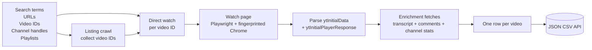
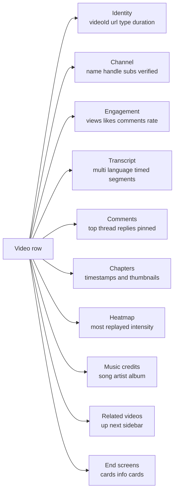

# YouTube Channel Intelligence Pro: Videos, Comments, Transcripts

Pull YouTube videos, channels, playlists, shorts, and live streams. Each row ships video metadata, channel intelligence, engagement metrics, transcripts in multiple languages, top comments with replies, chapters, most replayed heatmap, related videos, and music credits. 16 regions, 16 languages, no API quota. Pay per video.

**Built for** content marketers tracking competitor performance, brand teams monitoring mentions across creators, AI researchers harvesting transcripts for training data, journalists investigating viral content, sponsorship platforms benchmarking creator audiences, social listening tools, and BI teams piping YouTube catalog data into a warehouse.

**Keywords this actor ranks for:** youtube scraper, youtube api alternative, youtube data extractor, youtube video scraper, youtube channel scraper, youtube comments scraper, youtube transcript scraper, youtube shorts scraper, youtube playlist scraper, youtube hashtag scraper, youtube to JSON, youtube to CSV, youtube most replayed, youtube heatmap api, youtube chapters api.

---

## Why this actor

| Other YouTube scrapers | **This actor** |
|---|---|
| Search terms only | Five input modes: search terms, URLs, video IDs, channel handles, playlists |
| Title and view count only | Full engagement: likes, comments, engagement rate, view count |
| English transcripts only | Multi language transcripts with priority fallback |
| No comment data | Top comments with author handle, like count, pinned + hearted flags, replies |
| No heatmap | Most replayed segments (timestamp + intensity 0 to 1) |
| No chapters | Chapter timeline with start times and thumbnails |
| Single region | 16 regions, 16 interface languages |
| No channel enrichment | Subscriber count, video count, country, links, keywords |
| Skips music credits | Song title, artist, album, license from the music panel |
| Search filters lacking | Sort by recent / view count / rating, filter by 4K / live / HD / CC license |

---

## How it works



Pages render with Playwright behind rotating fingerprints. YouTube consent walls dismiss automatically. Channel stats resolve once per channel and cache across the run.

---

## What you get per row



Toggle on `extractStreamUrls` and the row carries the available video and audio stream URLs and bitrates.

---

## Quick start

**Pull a search with 4K filter, sorted by view count**

```json
{
  "searchTerms": ["drone footage iceland"],
  "maxVideosPerSearch": 50,
  "sortBy": "viewCount",
  "features": ["fourK"],
  "uploadDate": "year"
}
```

**Direct video IDs with transcripts and chapters**

```json
{
  "videoIds": ["arj7oStGLkU", "ZbZSe6N_BXs", "AKJfakEsgy0"],
  "extractTranscript": true,
  "transcriptLanguages": ["en", "es"],
  "extractChapters": true,
  "extractMostReplayed": true
}
```

**Track a creator's catalog with date range**

```json
{
  "channelHandles": ["@MrBeast"],
  "maxVideosPerChannel": 50,
  "dateFrom": "2026-01-01",
  "extractTopComments": true,
  "maxComments": 100
}
```

**Multi region listening (US + Brazil + Japan)**

```json
{
  "searchTerms": ["world cup highlights"],
  "region": "BR",
  "language": "pt",
  "maxVideosPerSearch": 30
}
```

**Playlist export with engagement and channel stats**

```json
{
  "startUrls": ["https://www.youtube.com/playlist?list=PLrAXtmRdnEQy6nuLMHjMZOz59Oq8B9oT9"],
  "maxVideosPerPlaylist": 200,
  "extractChannelStats": true,
  "extractRelatedVideos": true
}
```

---

## Sample output

```json
{
  "videoId": "arj7oStGLkU",
  "url": "https://www.youtube.com/watch?v=arj7oStGLkU",
  "embedUrl": "https://www.youtube.com/embed/arj7oStGLkU",
  "type": "video",
  "title": "Inside the Mind of a Master Procrastinator | Tim Urban | TED",
  "description": "Tim Urban knows that procrastination doesn't make sense...",
  "durationSeconds": 836,
  "durationText": "13:56",
  "publishDate": "2016-04-06T00:00:00-07:00",
  "category": "Education",
  "keywords": ["TED", "TED Talk", "Tim Urban", "procrastination"],
  "channel": {
    "name": "TED",
    "channelId": "UCAuUUnT6oDeKwE6v1NGQxug",
    "handle": "@TED",
    "url": "https://www.youtube.com/@TED",
    "subscriberCount": 25700000,
    "videoCount": 4521,
    "isVerified": true,
    "country": "US"
  },
  "engagement": {
    "viewCount": 61194372,
    "likeCount": 1372411,
    "commentCount": 32198,
    "engagementRate": 0.02243
  },
  "flags": {
    "isLive": false,
    "isShort": false,
    "isFamilySafe": true,
    "hasCaptions": true,
    "hasChapters": true,
    "hasMostReplayed": true
  },
  "thumbnails": {
    "default": "https://i.ytimg.com/vi/arj7oStGLkU/default.jpg",
    "high": "https://i.ytimg.com/vi/arj7oStGLkU/hqdefault.jpg",
    "maxres": "https://i.ytimg.com/vi/arj7oStGLkU/maxresdefault.jpg"
  },
  "chapters": [
    { "title": "The procrastinator's brain", "startSeconds": 142, "thumbnail": "https://..." },
    { "title": "The Panic Monster", "startSeconds": 412, "thumbnail": "https://..." }
  ],
  "mostReplayed": [
    { "startSeconds": 388.4, "durationSeconds": 8.36, "intensityScore": 1.0 },
    { "startSeconds": 412.7, "durationSeconds": 8.36, "intensityScore": 0.92 }
  ],
  "transcript": {
    "language": "en",
    "isAutogenerated": false,
    "segments": [
      { "start": 0.0, "duration": 4.2, "text": "So in college I was a government major..." }
    ],
    "text": "So in college I was a government major, which means..."
  },
  "topComments": [
    {
      "author": "@viewer123",
      "channelHandle": "@viewer123",
      "text": "This talk changed my life",
      "likeCount": "12K",
      "pinned": false,
      "hearted": true,
      "replyCountText": "48 replies"
    }
  ],
  "scrapedAt": "2026-04-26T08:00:00.000Z"
}
```

---

## Who uses this

| Role | Use case |
|---|---|
| Content marketer | Audit a competitor's channel. Pull every video with views, likes, engagement rate, and chapter topics. |
| Brand monitor | Search terms across mentions of your brand. Watch for sentiment shifts via comments. |
| AI / RAG team | Pull transcripts from a topic cluster. Each segment has timecodes for citation. |
| Sponsorship platform | Benchmark creator audiences. Subscriber count, country, video frequency, engagement rate. |
| News and research | Investigate viral patterns. Most replayed heatmap shows where viewers rewind. |
| Music labels | Track which shorts use a song. Music credits panel returns title, artist, album, license. |
| Educator / publisher | Export playlists with chapter timestamps for course mapping. |
| BI analyst | Pipe YouTube catalog data into Snowflake. Each row is API ready. |

---

## Input reference

| Field | Type | What it does |
|---|---|---|
| `searchTerms` | string[] | YouTube search queries. |
| `startUrls` | string[] | Mix watch, channel, playlist, shorts, hashtag, results URLs. |
| `videoIds` | string[] | Direct 11 character video IDs. Fastest input mode. |
| `channelHandles` | string[] | Channel handles like `@MrBeast`. |
| `maxVideosPerSearch` | integer | Cap on regular videos per search. |
| `maxShortsPerSearch` | integer | Cap on shorts per search. |
| `maxStreamsPerSearch` | integer | Cap on live streams per search. |
| `maxVideosPerChannel` | integer | Cap when pulling channel catalogs. |
| `maxVideosPerPlaylist` | integer | Cap when pulling playlists. |
| `uploadDate` | enum | hour, today, week, month, year, any. |
| `duration` | enum | short (<4m), medium (4-20m), long (>20m), any. |
| `sortBy` | enum | relevance, uploadDate, viewCount, rating. |
| `features` | string[] | live, fourK, hd, subtitles, creativeCommons, vr360, hdr. |
| `dateFrom`, `dateTo` | string | ISO date bounds for channel and playlist pulling. |
| `extractTranscript` | boolean | Multi language transcript with timecodes. |
| `transcriptLanguages` | string[] | Priority list of language codes. |
| `extractTopComments` | boolean | Top comment thread with author and like count. |
| `maxComments` | integer | Cap on top level comments per video. |
| `extractCommentReplies` | boolean | Walk into each thread and pull replies. |
| `extractChapters` | boolean | Chapter timestamps and thumbnails. |
| `extractRelatedVideos` | boolean | Up next sidebar suggestions. |
| `extractChannelStats` | boolean | Subscriber count, video count, country, links. |
| `extractMusicAndCredits` | boolean | Song title, artist, album, license. |
| `extractMostReplayed` | boolean | Heatmap segments with intensity scores. |
| `extractStreamUrls` | boolean | Direct video and audio stream URLs. |
| `extractEndScreens` | boolean | End screen elements and info cards. |
| `region` | enum | gl param. 16 regions including US, GB, JP, BR, IN, KR, DE. |
| `language` | enum | hl param. 16 interface languages. |
| `dedupe` | boolean | Skip video IDs already pushed across runs. |
| `concurrency` | integer | Parallel pages. Three to five is safe. |
| `proxyConfiguration` | object | Apify proxy. Datacenter is fine. Residential for high volume. |

---

## API call

```bash
curl -X POST \
  "https://api.apify.com/v2/acts/YOUR_USER~youtube-scraper/runs?token=YOUR_TOKEN" \
  -H "Content-Type: application/json" \
  -d '{
    "channelHandles": ["@MrBeast"],
    "maxVideosPerChannel": 20,
    "extractTranscript": true,
    "extractMostReplayed": true,
    "extractChapters": true
  }'
```

---

## Pricing

The first few videos per run are free so you can validate the output before paying. After that, one charge per video row. Chapters, channel stats, related videos, end screens, and most replayed are included at no extra cost. Transcripts and comments add modest extra processing.

---

## FAQ

### What is the difference between this and the YouTube Data API?

YouTube's official API has a 10,000 unit per day quota. One search costs 100 units, one comment fetch costs 1 unit. Realistically you get a few thousand videos per day. This actor has no quota and no API key. Plus you get fields the official API does not expose: most replayed heatmap, full transcripts, music credits, chapters with thumbnails, and end screen cards.

### Does it pull transcripts in non English languages?

Yes. Pass `transcriptLanguages: ["es", "en"]` to prefer Spanish and fall back to English. The actor walks the available caption tracks for the video and returns the first match. Auto generated tracks are flagged via `isAutogenerated: true`.

### How does the most replayed feature work?

YouTube ships an internal heatmap with `intensityScoreNormalized` values from 0 to 1 across video segments. The actor returns every segment so you can find the highest engagement moments programmatically. Useful for clip generation, viewer retention analysis, and content research.

### Can I pull comments?

Yes. Toggle on `extractTopComments` and the actor scrolls the comment thread and returns the top N comments. Each comment ships with author, channel handle, text, like count, posted time, pinned and hearted flags, and reply count. Toggle on `extractCommentReplies` for the first batch of replies per thread.

### How do you handle the YouTube consent wall?

The actor sets `CONSENT=YES+1` and `SOCS=CAI` cookies before navigation, which dismisses the EU consent banner without a click. If a consent dialog still renders, the actor clicks the accept button automatically.

### What if a video is age gated?

Age gated videos require a signed-in session. The actor logs a warning and skips them. For pre-shipping content audits, age gating is a small minority of cases.

### Can I filter by upload date and duration in search?

Yes. Pass `uploadDate: "month"` and `duration: "long"` and the actor builds the YouTube `sp=` filter parameter. Combine with `sortBy: "viewCount"` to find the highest performing month-old long form videos in any niche.

### Does it work for shorts?

Yes. Shorts are detected automatically and tagged with `type: "short"` and `flags.isShort: true`. The row carries both `url` and `shortsUrl`. Pass `maxShortsPerSearch` to control how many shorts come back per query.

### Is pulling YouTube allowed?

This actor reads HTML any anonymous viewer can see. Do not redistribute video files or transcripts you have no lawful basis to publish. Respect YouTube's terms.

---

## Related actors

- **Instagram Scraper**. Posts, reels, stories, comments, and follower data.
- **LinkedIn Jobs Scraper Pro**. Search URL, company URL, and recruiter contact extraction.
- **Website Content Scraper: Clean Markdown for AI and RAG**. Websites to clean Markdown with token counts and RAG ready chunks.
- **Google Maps Scraper**. Local business data with reviews.
