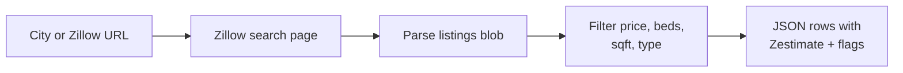
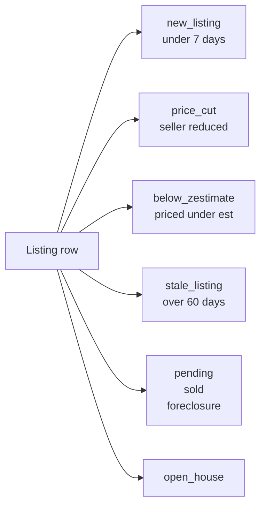

# Zillow Scraper: Home Prices, Sale History, Rentals

Scrape Zillow home listings by city, zip, or search URL. Every row has price, beds, baths, square feet, lot size, year built, Zestimate, rent Zestimate, days on market, and agent info. Works for for-sale, for-rent, and sold listings in every US market. Filter by price, beds, sqft, and property type. JSON output. Pay per row.

**Ranks for:** Zillow scraper, Zillow home price API, Zillow data export, real estate scraper, MLS alternative, Zestimate API, Zillow rental scraper, sold comps scraper, Zillow listings JSON.

---

## How it works



Paste a Zillow URL or a city name. One row per listing with the full property record.

---

## Who uses this

| Role | Use case |
|---|---|
| **Real estate investor** | Find undervalued listings priced below Zestimate in target zip codes. |
| **Wholesaler** | Track price cuts and stale listings for motivated seller outreach. |
| **Market researcher** | Pull daily for-sale inventory to chart supply by metro. |
| **Proptech startup** | Feed Zillow data into valuation models without MLS access. |
| **Agent** | Monitor new listings in a farm area the minute they hit Zillow. |
| **Rental operator** | Scrape for-rent inventory to benchmark rates by neighborhood. |

---

## Quick start

**Austin for-sale under 600k:**

```json
{
  "searchUrls": ["https://www.zillow.com/homes/Austin-TX_rb/"],
  "maxPrice": 600000,
  "minBeds": 3,
  "maxPages": 5
}
```

**Sold comps in a specific zip:**

```json
{
  "locations": ["78704"],
  "listingType": "sold",
  "propertyTypes": ["house", "condo"],
  "maxPages": 3
}
```

**Rental scan across multiple cities:**

```json
{
  "locations": ["Austin, TX", "Denver, CO", "Nashville, TN"],
  "listingType": "for_rent",
  "maxPrice": 3500,
  "minBeds": 2
}
```

**Price change tracking mode:**

```json
{
  "searchUrls": ["https://www.zillow.com/homes/Austin-TX_rb/"],
  "dedupe": false,
  "maxPages": 10
}
```

---

## Output flags



Flags make downstream filtering a one liner. No need to re parse titles or badges.

---

## Zillow scraper vs the alternatives

| | MLS IDX feed | Zillow API | **This actor** |
|---|---|---|---|
| Access | Broker license required | Closed since 2021 | Anyone |
| Setup | Weeks of paperwork | Not available | 60 seconds |
| Zestimate | No | Yes | Yes |
| Sold comps | Yes | Yes | Yes |
| Rental data | Partial | Yes | Yes |
| Price history | Yes | Yes | Yes via dedupe off |
| Schedule | Manual | N/A | Every 60s |
| Pricing | $500+ per month | Closed | Pay per item |

---

## Sample output

```json
{
  "source": "zillow",
  "zpid": "29444215",
  "listingType": "for_sale",
  "propertyType": "house",
  "address": "2101 E 9th St, Austin, TX 78702",
  "city": "Austin",
  "state": "TX",
  "zip": "78702",
  "lat": 30.265,
  "lng": -97.722,
  "price": 749000,
  "beds": 3,
  "baths": 2,
  "sqft": 1620,
  "lotSize": 6098,
  "yearBuilt": 1950,
  "zestimate": 781400,
  "rentZestimate": 3200,
  "daysOnMarket": 12,
  "priceCutAmount": 25000,
  "flags": ["new_listing", "price_cut", "below_zestimate"],
  "agentName": "Jane Doe",
  "brokerName": "Compass",
  "url": "https://www.zillow.com/homedetails/29444215_zpid/",
  "scrapedAt": "2026-04-24T10:30:00Z"
}
```

---

## Pricing

First 50 listings per run are free. After that pay per row. A daily snapshot of one metro at 200 listings runs under $3.

---

## Popular searches

| Search | URL to paste |
|---|---|
| Austin TX for sale | `https://www.zillow.com/homes/Austin-TX_rb/` |
| Miami FL for sale | `https://www.zillow.com/homes/Miami-FL_rb/` |
| Denver CO for rent | `https://www.zillow.com/homes/for_rent/Denver-CO_rb/` |
| Phoenix AZ sold | `https://www.zillow.com/homes/sold/Phoenix-AZ_rb/` |
| 78704 Austin zip | `https://www.zillow.com/homes/78704_rb/` |

Copy the URL from Zillow directly after you apply filters in the browser. All map and filter state is preserved.

---

## FAQ

**Do I need a Zillow API key?**
No. The Zillow public API has been closed since 2021. This actor reads the same HTML a browser sees.

**Can I track price changes over time?**
Yes. Set `dedupe: false` and schedule every day. Each run writes a fresh snapshot with a `scrapedAt` timestamp so you build your own price history table.

**Does it work for rentals?**
Yes. Set `listingType: "for_rent"` or paste a rental URL. Price is monthly rent.

**Does it work for sold comps?**
Yes. Set `listingType: "sold"` or paste a sold URL. You get last sale price and sale date per row.

**What is a zpid?**
Zillow Property ID. Stable unique identifier per listing. Used as the dedupe key.

**Why do some rows skip Zestimate?**
New listings and some rentals do not expose a Zestimate on the search page. The detail page would have it but this actor runs on search pages for cost.

**Does Zillow block scrapers?**
Yes, aggressively on datacenter IPs. The actor ships with residential proxy by default. Keep concurrency low if you run at scale.

**Can I get agent phone numbers?**
The search page exposes agent and broker name only. Phone numbers require the detail page which is a separate call.

**Is scraping Zillow allowed?**
This actor reads the same public HTML a browser sees. Respect the site's terms and rate limit sensibly.

---

## Related Scrapemint actors

- **Flight Price Tracker** for Google Flights fares by route
- **Viator Scraper** for tours and activities by city
- **TripAdvisor Review Intelligence** for hotel and restaurant reviews
- **Google Reviews Intelligence** for places reviews
- **Booking Review Intelligence** for hotel reviews by city

Stack these for full market and travel intelligence coverage across every public surface.
