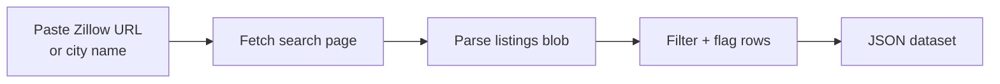
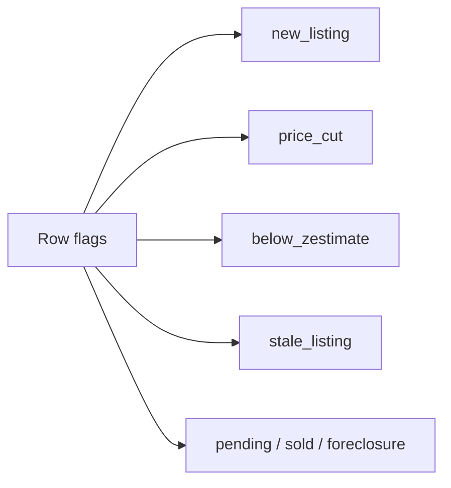

# Zillow Intelligence: Export Home Prices, Zestimates, and Rentals to JSON

Pull Zillow listings by city, zip code, or search URL. Get price, beds, baths, square feet, lot size, Zestimate, rent Zestimate, days on market, and agent name for every listing. Works on for sale, for rent, and sold pages in any US market. Pay per row.

**Ranks for:** Zillow intelligence, Zillow API alternative, Zestimate intelligence, Zillow data export, pull Zillow home prices, Zillow listings JSON, Zillow sold comps, Zillow rental data, real estate intelligence.

---

## What this does



One input, one clean dataset. No browser automation to write, no captcha to solve, no proxy to manage.

---

## Why people use it

| Role | Job it does |
|---|---|
| Real estate investor | Spot homes priced below Zestimate in target zips. |
| Wholesaler | Track price cuts and stale listings for outreach. |
| Market analyst | Pull daily inventory to chart supply by metro. |
| Proptech builder | Feed Zillow rows into a valuation model. |
| Agent | Watch new listings in a farm area the minute they hit. |
| Rental operator | Benchmark rents by neighborhood. |

---

## Quick start

Paste any Zillow search URL you see in your browser. That is the whole input.

```json
{
  "searchUrls": ["https://www.zillow.com/homes/Austin-TX_rb/"],
  "maxPages": 3
}
```

Three common variations:

```json
{ "locations": ["78704"], "listingType": "sold" }
```

```json
{ "locations": ["Denver, CO"], "listingType": "for_rent", "maxPrice": 3500 }
```

```json
{ "searchUrls": ["https://www.zillow.com/homes/Austin-TX_rb/"], "dedupe": false }
```

The last one turns off dedupe so you can run it on a schedule and build your own price history table.

---

## What you get back

```json
{
  "zpid": "331621763",
  "address": "14901 Ben Davis Dr, Austin, TX 78725",
  "city": "Austin",
  "state": "TX",
  "zip": "78725",
  "price": 299000,
  "beds": 4,
  "baths": 2,
  "sqft": 2047,
  "lotSize": 6930,
  "zestimate": 297700,
  "rentZestimate": 2174,
  "daysOnMarket": 3,
  "flags": ["new_listing", "below_zestimate"],
  "url": "https://www.zillow.com/homedetails/..."
}
```

Flags are the fastest way to filter downstream. No need to re read titles.



---

## Zillow intelligence vs the alternatives

|  | MLS IDX feed | Zillow public API | **This actor** |
|---|---|---|---|
| Who can use it | Licensed brokers | Closed since 2021 | Anyone |
| Setup | Weeks | Not available | 60 seconds |
| Zestimate | No | Yes | Yes |
| Sold comps | Yes | Yes | Yes |
| Rentals | Partial | Yes | Yes |
| Price history | Yes | Yes | Yes (dedupe off) |
| Cost | $500+ /mo | Closed | Pay per item |

---

## Pricing

First 2 rows per run are free. After that you pay per row. A daily snapshot of 200 Austin listings runs under $3.

---

## FAQ

**Is there a public Zillow API?**
No. Zillow closed the public API in 2021. This actor reads the same HTML a browser sees.

**Does it return the Zestimate?**
Yes. Every row that has a Zestimate on the search page returns one.

**Can I pull rentals?**
Yes. Set `listingType` to `for_rent` or paste a rental URL.

**Can I pull sold comps?**
Yes. Set `listingType` to `sold` or paste a sold URL.

**Can I track price changes over time?**
Yes. Set `dedupe: false` and schedule it daily. Each row stamps `scrapedAt` so you build your own history.

**Does Zillow block scrapers?**
Yes, aggressively on datacenter IPs. The actor uses residential proxy by default.

**What is a zpid?**
Zillow Property ID. A stable unique id per listing. Used as the dedupe key.

**Is pulling Zillow legal?**
This actor reads public HTML a browser can see. Respect the site terms and rate limit sensibly.

---

## Related actors

- **Flight Price Tracker** for Google Flights fares
- **TripAdvisor Review Intelligence** for hotel and restaurant reviews
- **Google Reviews Intelligence** for places reviews
- **Viator Intelligence** for tours and activities
